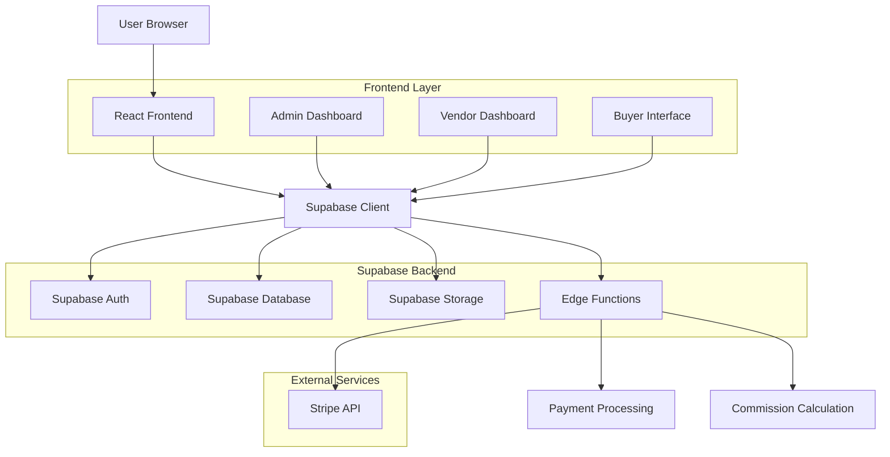
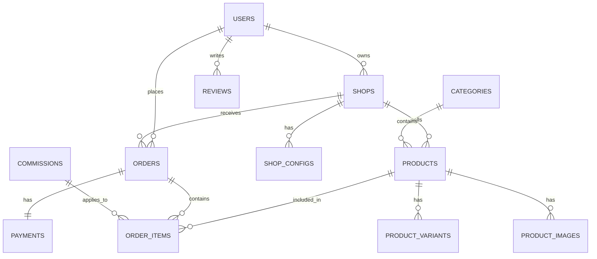

# Architecture Technique - Module Mini-Boutiques

## 1. Architecture Système



## 2. Stack Technique

- **Frontend**: React 18 + TypeScript + Vite
- **UI Framework**: Tailwind CSS + Headless UI
- **State Management**: React Context + Zustand
- **Backend**: Supabase (PostgreSQL, Auth, Storage, Edge Functions)
- **Paiements**: Stripe Connect (Marketplace)
- **Monitoring**: PostHog Analytics + Sentry Error Tracking
- **Testing**: Vitest + React Testing Library
- **Build**: Vite with PWA support

## 3. Modèles de Données

### 3.1 Schéma ERD



### 3.2 Définitions Tables

#### Table: shops
```sql
CREATE TABLE shops (
    id UUID PRIMARY KEY DEFAULT gen_random_uuid(),
    user_id UUID REFERENCES auth.users(id) ON DELETE CASCADE,
    name VARCHAR(255) NOT NULL,
    slug VARCHAR(255) UNIQUE NOT NULL,
    description TEXT,
    logo_url TEXT,
    banner_url TEXT,
    status VARCHAR(20) DEFAULT 'pending' CHECK (status IN ('pending', 'approved', 'rejected', 'suspended')),
    business_type VARCHAR(50),
    business_number VARCHAR(100),
    contact_email VARCHAR(255),
    contact_phone VARCHAR(50),
    address JSONB,
    social_links JSONB,
    policies JSONB, -- return_policy, shipping_policy, etc.
    settings JSONB, -- shop configuration
    commission_rate DECIMAL(5,2) DEFAULT 5.00,
    stripe_account_id VARCHAR(255),
    created_at TIMESTAMP WITH TIME ZONE DEFAULT NOW(),
    updated_at TIMESTAMP WITH TIME ZONE DEFAULT NOW()
);

CREATE INDEX idx_shops_user_id ON shops(user_id);
CREATE INDEX idx_shops_status ON shops(status);
CREATE INDEX idx_shops_slug ON shops(slug);
```

#### Table: products
```sql
CREATE TABLE products (
    id UUID PRIMARY KEY DEFAULT gen_random_uuid(),
    shop_id UUID REFERENCES shops(id) ON DELETE CASCADE,
    category_id UUID REFERENCES categories(id),
    name VARCHAR(255) NOT NULL,
    slug VARCHAR(255) NOT NULL,
    description TEXT,
    short_description VARCHAR(500),
    price DECIMAL(10,2) NOT NULL CHECK (price >= 0),
    compare_at_price DECIMAL(10,2),
    cost_price DECIMAL(10,2),
    sku VARCHAR(100),
    barcode VARCHAR(100),
    track_quantity BOOLEAN DEFAULT true,
    allow_backorder BOOLEAN DEFAULT false,
    weight DECIMAL(8,2),
    dimensions JSONB, -- length, width, height
    status VARCHAR(20) DEFAULT 'draft' CHECK (status IN ('draft', 'active', 'archived')),
    featured BOOLEAN DEFAULT false,
    seo_title VARCHAR(255),
    seo_description VARCHAR(500),
    tags TEXT[],
    attributes JSONB, -- custom product attributes
    created_at TIMESTAMP WITH TIME ZONE DEFAULT NOW(),
    updated_at TIMESTAMP WITH TIME ZONE DEFAULT NOW()
);

CREATE INDEX idx_products_shop_id ON products(shop_id);
CREATE INDEX idx_products_category_id ON products(category_id);
CREATE INDEX idx_products_status ON products(status);
CREATE INDEX idx_products_featured ON products(featured);
CREATE INDEX idx_products_price ON products(price);
```

#### Table: product_variants
```sql
CREATE TABLE product_variants (
    id UUID PRIMARY KEY DEFAULT gen_random_uuid(),
    product_id UUID REFERENCES products(id) ON DELETE CASCADE,
    name VARCHAR(255) NOT NULL,
    sku VARCHAR(100),
    barcode VARCHAR(100),
    price DECIMAL(10,2) NOT NULL CHECK (price >= 0),
    compare_at_price DECIMAL(10,2),
    cost_price DECIMAL(10,2),
    inventory_quantity INTEGER DEFAULT 0 CHECK (inventory_quantity >= 0),
    weight DECIMAL(8,2),
    dimensions JSONB,
    options JSONB, -- color, size, material, etc.
    image_url TEXT,
    position INTEGER DEFAULT 0,
    status VARCHAR(20) DEFAULT 'active' CHECK (status IN ('active', 'inactive')),
    created_at TIMESTAMP WITH TIME ZONE DEFAULT NOW(),
    updated_at TIMESTAMP WITH TIME ZONE DEFAULT NOW()
);

CREATE INDEX idx_product_variants_product_id ON product_variants(product_id);
CREATE INDEX idx_product_variants_sku ON product_variants(sku);
```

#### Table: orders
```sql
CREATE TABLE orders (
    id UUID PRIMARY KEY DEFAULT gen_random_uuid(),
    user_id UUID REFERENCES auth.users(id) ON DELETE CASCADE,
    order_number VARCHAR(50) UNIQUE NOT NULL,
    status VARCHAR(50) DEFAULT 'pending' CHECK (status IN ('pending', 'confirmed', 'processing', 'shipped', 'delivered', 'cancelled', 'refunded')),
    subtotal DECIMAL(10,2) NOT NULL CHECK (subtotal >= 0),
    tax_amount DECIMAL(10,2) DEFAULT 0 CHECK (tax_amount >= 0),
    shipping_amount DECIMAL(10,2) DEFAULT 0 CHECK (shipping_amount >= 0),
    commission_amount DECIMAL(10,2) DEFAULT 0 CHECK (commission_amount >= 0),
    total_amount DECIMAL(10,2) NOT NULL CHECK (total_amount >= 0),
    currency VARCHAR(3) DEFAULT 'EUR',
    shipping_address JSONB NOT NULL,
    billing_address JSONB NOT NULL,
    customer_notes TEXT,
    internal_notes TEXT,
    metadata JSONB,
    created_at TIMESTAMP WITH TIME ZONE DEFAULT NOW(),
    updated_at TIMESTAMP WITH TIME ZONE DEFAULT NOW()
);

CREATE INDEX idx_orders_user_id ON orders(user_id);
CREATE INDEX idx_orders_status ON orders(status);
CREATE INDEX idx_orders_order_number ON orders(order_number);
CREATE INDEX idx_orders_created_at ON orders(created_at DESC);
```

#### Table: order_items
```sql
CREATE TABLE order_items (
    id UUID PRIMARY KEY DEFAULT gen_random_uuid(),
    order_id UUID REFERENCES orders(id) ON DELETE CASCADE,
    product_id UUID REFERENCES products(id) ON DELETE CASCADE,
    product_variant_id UUID REFERENCES product_variants(id) ON DELETE CASCADE,
    shop_id UUID REFERENCES shops(id) ON DELETE CASCADE,
    product_name VARCHAR(255) NOT NULL,
    product_variant_name VARCHAR(255),
    sku VARCHAR(100),
    price DECIMAL(10,2) NOT NULL CHECK (price >= 0),
    quantity INTEGER NOT NULL CHECK (quantity > 0),
    subtotal DECIMAL(10,2) NOT NULL CHECK (subtotal >= 0),
    commission_rate DECIMAL(5,2) NOT NULL CHECK (commission_rate >= 0),
    commission_amount DECIMAL(10,2) NOT NULL CHECK (commission_amount >= 0),
    seller_amount DECIMAL(10,2) NOT NULL CHECK (seller_amount >= 0),
    metadata JSONB,
    created_at TIMESTAMP WITH TIME ZONE DEFAULT NOW()
);

CREATE INDEX idx_order_items_order_id ON order_items(order_id);
CREATE INDEX idx_order_items_product_id ON order_items(product_id);
CREATE INDEX idx_order_items_shop_id ON order_items(shop_id);
```

## 4. API et Endpoints

### 4.1 TypeScript Types

```typescript
// Core Types
export interface Shop {
  id: string;
  user_id: string;
  name: string;
  slug: string;
  description?: string;
  logo_url?: string;
  banner_url?: string;
  status: 'pending' | 'approved' | 'rejected' | 'suspended';
  commission_rate: number;
  stripe_account_id?: string;
  created_at: string;
  updated_at: string;
}

export interface Product {
  id: string;
  shop_id: string;
  category_id?: string;
  name: string;
  slug: string;
  description?: string;
  price: number;
  compare_at_price?: number;
  sku?: string;
  status: 'draft' | 'active' | 'archived';
  featured: boolean;
  images: ProductImage[];
  variants: ProductVariant[];
  created_at: string;
  updated_at: string;
}

export interface ProductVariant {
  id: string;
  product_id: string;
  name: string;
  sku?: string;
  price: number;
  inventory_quantity: number;
  options: Record<string, string>;
  image_url?: string;
  status: 'active' | 'inactive';
}

export interface Order {
  id: string;
  user_id: string;
  order_number: string;
  status: OrderStatus;
  subtotal: number;
  tax_amount: number;
  shipping_amount: number;
  commission_amount: number;
  total_amount: number;
  items: OrderItem[];
  shipping_address: Address;
  billing_address: Address;
  created_at: string;
  updated_at: string;
}

export type OrderStatus = 
  | 'pending'
  | 'confirmed' 
  | 'processing'
  | 'shipped'
  | 'delivered'
  | 'cancelled'
  | 'refunded';
```

### 4.2 API Endpoints

#### Shops API
```typescript
// Create Shop
POST /api/shops
{
  name: string;
  description?: string;
  business_type: string;
  business_number?: string;
  contact_email: string;
  contact_phone?: string;
  address: Address;
}

// Get Shop
GET /api/shops/:id

// Update Shop
PUT /api/shops/:id
{
  name?: string;
  description?: string;
  logo_url?: string;
  banner_url?: string;
  policies?: ShopPolicies;
  settings?: ShopSettings;
}

// Get Shop by Slug
GET /api/shops/slug/:slug

// Get User Shops
GET /api/users/:userId/shops
```

#### Products API
```typescript
// Create Product
POST /api/shops/:shopId/products
{
  name: string;
  description?: string;
  price: number;
  category_id?: string;
  variants: ProductVariantInput[];
  images: ProductImageInput[];
  status: 'draft' | 'active';
  seo_title?: string;
  seo_description?: string;
  tags?: string[];
}

// Get Products with Filters
GET /api/products?shop_id=uuid&category_id=uuid&min_price=number&max_price=number&search=string&status=string&page=number&limit=number

// Update Product
PUT /api/products/:id

// Delete Product
DELETE /api/products/:id

// Get Product Variants
GET /api/products/:productId/variants
```

#### Orders API
```typescript
// Create Order
POST /api/orders
{
  items: {
    product_variant_id: string;
    quantity: number;
  }[];
  shipping_address: Address;
  billing_address: Address;
  customer_notes?: string;
}

// Get Orders
GET /api/orders?status=string&shop_id=uuid&from=date&to=date&page=number&limit=number

// Update Order Status
PUT /api/orders/:id/status
{
  status: OrderStatus;
  tracking_number?: string;
  notes?: string;
}

// Get Order by Number
GET /api/orders/number/:orderNumber
```

## 5. Edge Functions

### 5.1 Create Order Function
```typescript
// supabase/functions/create-order/index.ts
import { serve } from 'https://deno.land/std@0.168.0/http/server.ts'
import { createClient } from 'https://esm.sh/@supabase/supabase-js@2'

const supabase = createClient(
  Deno.env.get('SUPABASE_URL')!,
  Deno.env.get('SUPABASE_SERVICE_ROLE_KEY')!
)

serve(async (req) => {
  try {
    const { user_id, items, shipping_address, billing_address } = await req.json()
    
    // Validate items and calculate totals
    const validationResult = await validateOrderItems(items)
    if (!validationResult.valid) {
      return new Response(JSON.stringify({ error: validationResult.error }), {
        status: 400,
        headers: { 'Content-Type': 'application/json' }
      })
    }
    
    // Create order with calculated totals
    const orderData = {
      user_id,
      order_number: generateOrderNumber(),
      subtotal: validationResult.subtotal,
      tax_amount: validationResult.tax_amount,
      shipping_amount: validationResult.shipping_amount,
      commission_amount: validationResult.commission_amount,
      total_amount: validationResult.total_amount,
      shipping_address,
      billing_address
    }
    
    const { data: order, error: orderError } = await supabase
      .from('orders')
      .insert(orderData)
      .select()
      .single()
    
    if (orderError) throw orderError
    
    // Create order items
    const orderItems = validationResult.items.map(item => ({
      order_id: order.id,
      ...item
    }))
    
    const { error: itemsError } = await supabase
      .from('order_items')
      .insert(orderItems)
    
    if (itemsError) throw itemsError
    
    // Update inventory
    await updateInventoryQuantities(items)
    
    // Create payment intent with Stripe
    const paymentIntent = await createPaymentIntent(order)
    
    return new Response(JSON.stringify({ 
      order, 
      payment_intent: paymentIntent 
    }), {
      headers: { 'Content-Type': 'application/json' }
    })
    
  } catch (error) {
    return new Response(JSON.stringify({ error: error.message }), {
      status: 500,
      headers: { 'Content-Type': 'application/json' }
    })
  }
})

async function validateOrderItems(items: any[]) {
  // Implementation for validating items, checking stock, calculating totals
  // Returns validation result with calculated amounts
}

async function updateInventoryQuantities(items: any[]) {
  // Implementation for updating product variant quantities
}

async function createPaymentIntent(order: any) {
  // Implementation for creating Stripe payment intent
  // Handles split payments for marketplace
}
```

### 5.2 Commission Calculation Function
```typescript
// supabase/functions/calculate-commission/index.ts
import { serve } from 'https://deno.land/std@0.168.0/http/server.ts'

serve(async (req) => {
  try {
    const { shop_id, category_id, subtotal } = await req.json()
    
    // Get shop-specific commission rate
    const { data: shop } = await supabase
      .from('shops')
      .select('commission_rate')
      .eq('id', shop_id)
      .single()
    
    // Get category-specific commission if exists
    const { data: category } = await supabase
      .from('categories')
      .select('commission_rate')
      .eq('id', category_id)
      .single()
    
    // Calculate commission (use category rate if lower than shop rate)
    const commissionRate = category?.commission_rate && category.commission_rate < shop.commission_rate 
      ? category.commission_rate 
      : shop.commission_rate
    
    const commissionAmount = (subtotal * commissionRate) / 100
    
    return new Response(JSON.stringify({
      commission_rate: commissionRate,
      commission_amount: commissionAmount,
      seller_amount: subtotal - commissionAmount
    }), {
      headers: { 'Content-Type': 'application/json' }
    })
    
  } catch (error) {
    return new Response(JSON.stringify({ error: error.message }), {
      status: 500,
      headers: { 'Content-Type': 'application/json' }
    })
  }
})
```

## 6. Sécurité et Performance

### 6.1 Row Level Security (RLS) Policies

```sql
-- Shops RLS Policies
ALTER TABLE shops ENABLE ROW LEVEL SECURITY;

-- Users can only see approved shops
CREATE POLICY "shops_visible_to_public" ON shops
    FOR SELECT
    USING (status = 'approved');

-- Users can only manage their own shops
CREATE POLICY "users_manage_own_shops" ON shops
    FOR ALL
    USING (auth.uid() = user_id);

-- Admin can manage all shops
CREATE POLICY "admin_manage_all_shops" ON shops
    FOR ALL
    USING (auth.jwt() ->> 'role' = 'admin');

-- Products RLS Policies
ALTER TABLE products ENABLE ROW LEVEL SECURITY;

-- Public can see active products from approved shops
CREATE POLICY "products_visible_to_public" ON products
    FOR SELECT
    USING (
        status = 'active' AND 
        EXISTS (
            SELECT 1 FROM shops 
            WHERE shops.id = products.shop_id 
            AND shops.status = 'approved'
        )
    );

-- Shop owners can manage their products
CREATE POLICY "shop_owners_manage_products" ON products
    FOR ALL
    USING (
        EXISTS (
            SELECT 1 FROM shops 
            WHERE shops.id = products.shop_id 
            AND shops.user_id = auth.uid()
        )
    );
```

### 6.2 Performance Optimization

#### Indexes
```sql
-- Performance indexes
CREATE INDEX idx_products_search ON products USING gin(to_tsvector('french', name || ' ' || description));
CREATE INDEX idx_products_shop_category ON products(shop_id, category_id) WHERE status = 'active';
CREATE INDEX idx_products_price_range ON products(price) WHERE status = 'active';
CREATE INDEX idx_orders_user_created ON orders(user_id, created_at DESC);
CREATE INDEX idx_order_items_shop_date ON order_items(shop_id, created_at DESC);
```

#### Caching Strategy
```typescript
// Redis caching implementation
export class CacheService {
  private redis: RedisClient;
  
  async getProduct(productId: string): Promise<Product | null> {
    const cacheKey = `product:${productId}`;
    const cached = await this.redis.get(cacheKey);
    
    if (cached) {
      return JSON.parse(cached);
    }
    
    const { data: product } = await supabase
      .from('products')
      .select('*')
      .eq('id', productId)
      .single();
    
    if (product) {
      await this.redis.setex(cacheKey, 300, JSON.stringify(product)); // 5min TTL
    }
    
    return product;
  }
  
  async invalidateProduct(productId: string): Promise<void> {
    await this.redis.del(`product:${productId}`);
    await this.redis.del(`shop:${productId}:products`);
  }
}
```

### 6.3 Monitoring and Analytics

```typescript
// Analytics tracking
export class AnalyticsService {
  async trackEvent(event: string, properties: Record<string, any>): Promise<void> {
    // PostHog tracking
    await posthog.capture({
      distinctId: properties.userId,
      event,
      properties
    });
    
    // Custom analytics table for business metrics
    await supabase.from('analytics_events').insert({
      event_name: event,
      user_id: properties.userId,
      properties,
      timestamp: new Date().toISOString()
    });
  }
  
  async trackOrderCompletion(order: Order): Promise<void> {
    await this.trackEvent('order_completed', {
      orderId: order.id,
      orderNumber: order.order_number,
      totalAmount: order.total_amount,
      itemCount: order.items.length,
      shopCount: new Set(order.items.map(item => item.shop_id)).size,
      commissionAmount: order.commission_amount
    });
  }
}
```

## 7. Déploiement et CI/CD

### 7.1 GitHub Actions Workflow
```yaml
name: Deploy Mini-Boutiques

on:
  push:
    branches: [main]
  pull_request:
    branches: [main]

jobs:
  test:
    runs-on: ubuntu-latest
    steps:
      - uses: actions/checkout@v3
      - uses: actions/setup-node@v3
        with:
          node-version: '18'
          cache: 'npm'
      
      - name: Install dependencies
        run: npm ci
      
      - name: Run tests
        run: npm run test:ci
      
      - name: Run E2E tests
        run: npm run test:e2e
      
      - name: Upload coverage
        uses: codecov/codecov-action@v3

  deploy:
    needs: test
    runs-on: ubuntu-latest
    if: github.ref == 'refs/heads/main'
    
    steps:
      - uses: actions/checkout@v3
      
      - name: Deploy to Supabase
        run: |
          npx supabase db push
          npx supabase functions deploy
        env:
          SUPABASE_ACCESS_TOKEN: ${{ secrets.SUPABASE_ACCESS_TOKEN }}
          
      - name: Deploy to Vercel
        uses: amondnet/vercel-action@v25
        with:
          vercel-token: ${{ secrets.VERCEL_TOKEN }}
          vercel-org-id: ${{ secrets.VERCEL_ORG_ID }}
          vercel-project-id: ${{ secrets.VERCEL_PROJECT_ID }}
```

### 7.2 Environment Variables
```bash
# Production Environment
VITE_SUPABASE_URL=https://your-project.supabase.co
VITE_SUPABASE_ANON_KEY=your-anon-key

VITE_STRIPE_PUBLISHABLE_KEY=pk_live_...
STRIPE_SECRET_KEY=sk_live_...
STRIPE_WEBHOOK_SECRET=whsec_...

SUPABASE_SERVICE_ROLE_KEY=your-service-role-key
SUPABASE_JWT_SECRET=your-jwt-secret

POSTHOG_API_KEY=phc_...
SENTRY_DSN=https://...

REDIS_URL=redis://...
```

## 8. Tests et Qualité

### 8.1 Test Structure
```typescript
// Example test for shop creation
describe('Shop Creation', () => {
  it('should create a shop for premium user', async () => {
    const premiumUser = await createTestUser('premium');
    const shopData = {
      name: 'Test Boutique',
      description: 'Une boutique de test',
      business_type: 'individual'
    };
    
    const response = await request(app)
      .post('/api/shops')
      .set('Authorization', `Bearer ${premiumUser.token}`)
      .send(shopData)
      .expect(201);
    
    expect(response.body).toMatchObject({
      name: shopData.name,
      status: 'pending',
      user_id: premiumUser.id
    });
  });
  
  it('should reject shop creation for free user', async () => {
    const freeUser = await createTestUser('free');
    
    await request(app)
      .post('/api/shops')
      .set('Authorization', `Bearer ${freeUser.token}`)
      .send({ name: 'Test Shop' })
      .expect(403);
  });
});
```

### 8.2 Performance Testing
```typescript
// Load testing with k6
import http from 'k6/http';
import { check, sleep } from 'k6';

export const options = {
  stages: [
    { duration: '2m', target: 100 }, // Ramp up
    { duration: '5m', target: 100 }, // Stay at 100 users
    { duration: '2m', target: 200 }, // Ramp up to 200
    { duration: '5m', target: 200 }, // Stay at 200 users
    { duration: '2m', target: 0 }, // Ramp down
  ],
  thresholds: {
    http_req_duration: ['p(95)<500'], // 95% of requests under 500ms
    http_req_failed: ['rate<0.1'], // Error rate under 10%
  },
};

export default function () {
  const response = http.get('https://api.mangoo-tech.com/api/products?limit=20');
  
  check(response, {
    'status is 200': (r) => r.status === 200,
    'response time < 500ms': (r) => r.timings.duration < 500,
  });
  
  sleep(1);
}
```

Cette architecture technique fournit une base solide et scalable pour implémenter le module Mini-Boutiques avec toutes les fonctionnalités nécessaires pour un marketplace professionnel.