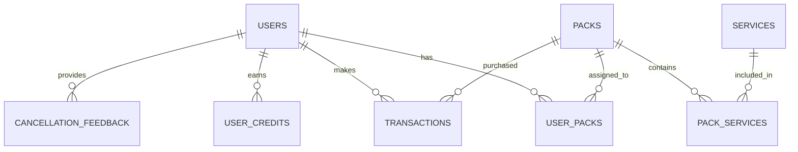

# Documentation Technique - MangooTech

## 🏗️ Architecture Système

### Stack Technologique Complète

#### Frontend
- **React 18.2.0** avec hooks et context API
- **Vite 5.0.8** pour le build et le développement
- **Tailwind CSS 3.3.6** pour le styling
- **Framer Motion** pour les animations
- **React Router DOM v6** pour la navigation
- **React i18next** pour l'internationalisation

#### Backend & Infrastructure
- **Supabase** Backend-as-a-Service
- **PostgreSQL** base de données relationnelle
- **Edge Functions** pour la logique métier serverless
- **Row Level Security (RLS)** pour la sécurité
- **Real-time subscriptions** pour les mises à jour en temps réel

#### Services de Paiement
- **Stripe** pour les cartes de crédit
- **PayPal** pour les paiements alternatifs
- **Webhooks** pour la gestion des événements

### Structure du Projet

```
MangooTech/
├── src/                          # Code source principal
│   ├── components/              # Composants React
│   │   ├── auth/                 # Authentification
│   │   ├── layout/               # Layout components
│   │   ├── ui/                   # UI components
│   │   ├── admin/                # Admin interface
│   │   ├── payment/              # Payment components
│   │   └── subscription/         # Subscription management
│   ├── contexts/                # React contexts
│   │   ├── AuthContext.jsx      # Authentication state
│   │   ├── ServicesContext.tsx  # Services management
│   │   └── ThemeContext.jsx     # Theme management
│   ├── hooks/                   # Custom hooks
│   │   ├── useAuthError.js      # Auth error handling
│   │   └── useCreditNotification.js # Credit notifications
│   ├── pages/                   # Page components
│   ├── lib/                     # Libraries and utilities
│   ├── utils/                   # Utility functions
│   └── types/                   # TypeScript definitions
├── supabase/                    # Supabase configuration
│   ├── functions/               # Edge functions
│   └── migrations/              # Database migrations
├── scripts/                     # Build and deployment scripts
└── docs/                       # Documentation
```

## 🔧 Configuration du Développement

### Prérequis
```bash
Node.js >= 18.0.0
npm >= 9.0.0
Git
Compte Supabase
```

### Installation
```bash
# Cloner le repository
git clone https://github.com/Fode1960/MangooTech.git
cd MangooTech

# Installer les dépendances
npm install

# Copier et configurer les variables d'environnement
cp .env.example .env.local
```

### Variables d'Environnement
```env
# Supabase Configuration
VITE_SUPABASE_URL=https://your-project.supabase.co
VITE_SUPABASE_ANON_KEY=your-anon-key
SUPABASE_SERVICE_ROLE_KEY=your-service-role-key

# Application Configuration
VITE_APP_URL=https://your-username.github.io/MangooTech
VITE_STRIPE_PUBLISHABLE_KEY=pk_test_...
VITE_PAYPAL_CLIENT_ID=your-paypal-client-id
```

## 🗄️ Schéma de Base de Données

### Tables Principales

#### users
```sql
CREATE TABLE users (
  id UUID PRIMARY KEY DEFAULT gen_random_uuid(),
  email VARCHAR(255) UNIQUE NOT NULL,
  first_name VARCHAR(100),
  last_name VARCHAR(100),
  phone VARCHAR(20),
  company VARCHAR(200),
  account_type VARCHAR(20) DEFAULT 'individual',
  role VARCHAR(20) DEFAULT 'user',
  selected_pack VARCHAR(50) DEFAULT 'free',
  created_at TIMESTAMP WITH TIME ZONE DEFAULT NOW(),
  updated_at TIMESTAMP WITH TIME ZONE DEFAULT NOW()
);
```

#### packs
```sql
CREATE TABLE packs (
  id UUID PRIMARY KEY DEFAULT gen_random_uuid(),
  name VARCHAR(100) NOT NULL,
  slug VARCHAR(100) UNIQUE NOT NULL,
  description TEXT,
  price INTEGER DEFAULT 0,
  billing_cycle VARCHAR(20) DEFAULT 'monthly',
  is_active BOOLEAN DEFAULT true,
  created_at TIMESTAMP WITH TIME ZONE DEFAULT NOW()
);
```

#### services
```sql
CREATE TABLE services (
  id UUID PRIMARY KEY DEFAULT gen_random_uuid(),
  name VARCHAR(100) NOT NULL,
  slug VARCHAR(100) UNIQUE NOT NULL,
  description TEXT,
  category VARCHAR(50),
  icon VARCHAR(50),
  is_active BOOLEAN DEFAULT true,
  created_at TIMESTAMP WITH TIME ZONE DEFAULT NOW()
);
```

#### user_packs
```sql
CREATE TABLE user_packs (
  id UUID PRIMARY KEY DEFAULT gen_random_uuid(),
  user_id UUID REFERENCES auth.users(id) ON DELETE CASCADE,
  pack_id UUID REFERENCES packs(id) ON DELETE CASCADE,
  status VARCHAR(20) DEFAULT 'active',
  started_at TIMESTAMP WITH TIME ZONE DEFAULT NOW(),
  next_billing_date TIMESTAMP WITH TIME ZONE,
  cancelled_at TIMESTAMP WITH TIME ZONE,
  created_at TIMESTAMP WITH TIME ZONE DEFAULT NOW()
);
```

#### transactions
```sql
CREATE TABLE transactions (
  id UUID PRIMARY KEY DEFAULT gen_random_uuid(),
  user_id UUID REFERENCES auth.users(id) ON DELETE CASCADE,
  pack_id UUID REFERENCES packs(id) ON DELETE CASCADE,
  amount INTEGER NOT NULL,
  currency VARCHAR(3) DEFAULT 'XOF',
  status VARCHAR(20) DEFAULT 'pending',
  payment_method VARCHAR(20),
  stripe_session_id VARCHAR(255),
  paypal_order_id VARCHAR(255),
  created_at TIMESTAMP WITH TIME ZONE DEFAULT NOW()
);
```

### Relations


## 🔐 Système d'Authentification

### Configuration Supabase Auth
```javascript
// src/lib/supabase.js
export const supabase = createClient(supabaseUrl, supabaseAnonKey, {
  auth: {
    storage: window.localStorage,
    storageKey: 'mangoo-tech-auth',
    autoRefreshToken: true,
    persistSession: true,
    detectSessionInUrl: true
  }
})
```

### Contexte d'Authentification
```javascript
// src/contexts/AuthContext.jsx
const AuthContext = createContext({
  user: null,
  userProfile: null,
  loading: true,
  error: null,
  signUp: async (email, password, userData) => {},
  signIn: async (email, password) => {},
  signOut: async () => {},
  updateProfile: async (updates) => {},
  isAdmin: () => boolean,
  isSuperAdmin: () => boolean,
  isProfessional: () => boolean
})
```

### Gestion des Rôles
```javascript
// Vérification des permissions
const isAdmin = () => {
  return userProfile?.role === 'admin' || userProfile?.role === 'super_admin'
}

const isSuperAdmin = () => {
  return userProfile?.role === 'super_admin'
}

const hasPermission = (permission) => {
  return userProfile?.permissions?.includes(permission)
}
```

## 💳 Système de Paiement

### Intégration Stripe

#### Création de Session de Paiement
```javascript
// supabase/functions/create-checkout-session/index.ts
const session = await stripe.checkout.sessions.create({
  customer_email: userEmail,
  payment_method_types: ['card'],
  line_items: [{
    price_data: {
      currency: 'xof',
      product_data: {
        name: packName,
      },
      unit_amount: amount,
    },
    quantity: 1,
  }],
  mode: 'payment',
  success_url: `${origin}/dashboard?payment=success&pack=${packId}`,
  cancel_url: `${origin}/dashboard?payment=cancelled`,
  metadata: {
    userId: userId,
    packId: packId,
    changeType: changeType
  }
})
```

#### Webhook Stripe
```javascript
// supabase/functions/stripe-webhook/index.ts
const event = stripe.webhooks.constructEvent(
  body,
  signature,
  webhookSecret
)

switch (event.type) {
  case 'checkout.session.completed':
    await handleSuccessfulPayment(event.data.object)
    break
  case 'payment_intent.payment_failed':
    await handleFailedPayment(event.data.object)
    break
}
```

### Logique de Changement de Pack

#### Calcul de la Différence
```javascript
// supabase/functions/calculate-pack-difference/index.ts
const calculatePackDifference = (currentPack, newPack, remainingDays) => {
  const dailyRateCurrent = currentPack.price / 30
  const dailyRateNew = newPack.price / 30
  const remainingValue = dailyRateCurrent * remainingDays
  const newValue = dailyRateNew * remainingDays
  
  return {
    difference: newValue - remainingValue,
    credit: remainingValue - newValue,
    proratedAmount: Math.max(0, newValue - remainingValue)
  }
}
```

#### Processus de Migration
```javascript
// src/lib/packChangeUtils.js
export const changePackSmart = async (newPackId, options) => {
  try {
    // Vérifier le pack actuel
    const currentPack = await getUserPack(user.id)
    
    // Calculer la différence
    const { difference, credit } = await calculatePackDifference(
      currentPack,
      newPack,
      remainingDays
    )
    
    if (difference > 0) {
      // Upgrade - paiement requis
      return await processPayment(difference, newPackId)
    } else if (credit > 0) {
      // Downgrade - crédit utilisateur
      return await processCredit(credit, newPackId)
    } else {
      // Changement gratuit
      return await immediateChange(newPackId)
    }
  } catch (error) {
    return { success: false, error: error.message }
  }
}
```

## 🧪 Tests et Qualité

### Configuration Vitest
```javascript
// vitest.config.js
export default defineConfig({
  test: {
    globals: true,
    environment: 'jsdom',
    setupFiles: ['./src/test/setup.js'],
    coverage: {
      provider: 'v8',
      reporter: ['text', 'json', 'html'],
      exclude: [
        'node_modules/',
        'src/test/',
        '**/*.test.{js,jsx}',
        '**/*.spec.{js,jsx}'
      ]
    }
  }
})
```

### Tests d'Authentification
```javascript
// src/contexts/AuthContext.test.jsx
describe('AuthContext', () => {
  it('should handle user sign up', async () => {
    const { result } = renderHook(() => useAuth(), {
      wrapper: AuthProvider
    })
    
    const userData = {
      email: 'test@example.com',
      password: 'password123',
      firstName: 'Test',
      lastName: 'User'
    }
    
    await act(async () => {
      await result.current.signUp(userData.email, userData.password, userData)
    })
    
    expect(result.current.user).toBeDefined()
    expect(result.current.user.email).toBe(userData.email)
  })
})
```

### Tests de Paiement
```javascript
// Test de création de session Stripe
describe('Payment Integration', () => {
  it('should create checkout session', async () => {
    const mockSession = { id: 'cs_test_123', url: 'https://checkout.stripe.com/...' }
    
    global.fetch = jest.fn(() =>
      Promise.resolve({
        ok: true,
        json: () => Promise.resolve({ session: mockSession })
      })
    )
    
    const result = await createCheckoutSession({
      packId: 'pack_123',
      userId: 'user_123',
      amount: 10000
    })
    
    expect(result.session).toEqual(mockSession)
  })
})
```

## 🚀 Optimisations de Performance

### Lazy Loading des Composants
```javascript
// src/utils/performance.js
export const LazyPages = {
  Home: lazy(() => import('../pages/Home.jsx')),
  Dashboard: lazy(() => import('../pages/Dashboard.jsx')),
  Services: lazy(() => import('../pages/Services.jsx')),
  // ... autres pages
}

export const RoutePreloader = ({ routes }) => {
  useEffect(() => {
    const preloadRoutes = async () => {
      for (const route of routes) {
        try {
          await LazyPages[route]
        } catch (error) {
          console.warn(`Failed to preload ${route}:`, error)
        }
      }
    }
    
    const timer = setTimeout(preloadRoutes, 1000)
    return () => clearTimeout(timer)
  }, [routes])
  
  return null
}
```

### Configuration Vite Optimisée
```javascript
// vite.config.js
export default defineConfig({
  build: {
    rollupOptions: {
      output: {
        manualChunks: {
          'react-vendor': ['react', 'react-dom'],
          'router-vendor': ['react-router-dom'],
          'ui-vendor': ['framer-motion', '@headlessui/react'],
          'supabase-vendor': ['@supabase/supabase-js'],
          'auth': ['./src/contexts/AuthContext.jsx'],
          'admin': ['./src/pages/admin/AdminDashboard.jsx']
        }
      }
    },
    terserOptions: {
      compress: {
        drop_console: process.env.NODE_ENV === 'production',
        drop_debugger: true
      }
    }
  }
})
```

### Cache et Service Worker
```javascript
// Configuration PWA
VitePWA({
  registerType: 'autoUpdate',
  workbox: {
    globPatterns: ['**/*.{js,css,html,ico,png,svg}'],
    runtimeCaching: [{
      urlPattern: /^https:\/\/api\.supabase\.co/,
      handler: 'NetworkFirst',
      options: {
        cacheName: 'supabase-api',
        expiration: {
          maxEntries: 50,
          maxAgeSeconds: 60 * 60 * 24 // 24 hours
        }
      }
    }]
  }
})
```

## 🔍 Monitoring et Debugging

### Logs et Erreurs
```javascript
// src/utils/errorHandling.jsx
export const logError = (error, context) => {
  const errorInfo = {
    message: error.message,
    stack: error.stack,
    context,
    timestamp: new Date().toISOString(),
    userAgent: navigator.userAgent,
    url: window.location.href
  }
  
  // Send to error tracking service
  if (window.gtag) {
    window.gtag('event', 'exception', {
      description: error.message,
      fatal: false
    })
  }
  
  console.error('Error logged:', errorInfo)
}
```

### Performance Monitoring
```javascript
// src/utils/performance.js
export const measurePerformance = () => {
  if ('performance' in window) {
    window.addEventListener('load', () => {
      const perfData = window.performance.timing
      const pageLoadTime = perfData.loadEventEnd - perfData.navigationStart
      const connectTime = perfData.responseEnd - perfData.requestStart
      
      console.log('Performance metrics:', {
        pageLoadTime,
        connectTime,
        domContentLoaded: perfData.domContentLoadedEventEnd - perfData.navigationStart
      })
      
      // Send to analytics
      if (window.gtag) {
        window.gtag('event', 'timing_complete', {
          name: 'page_load',
          value: pageLoadTime
        })
      }
    })
  }
}
```

## 🛠️ Scripts de Maintenance

### Scripts de Diagnostic
```bash
# Vérifier la synchronisation des packs
node diagnostic-pack-sync.js

# Déboguer les problèmes utilisateur-pack
node debug-user-pack.js

# Analyser les logs de webhooks
node check-webhook-logs.js

# Vérifier l'état de la base de données
node verify-supabase-pack-state.js
```

### Scripts de Correction
```bash
# Correction automatique des packs multiples
node auto-fix-pack-sync.js

# Synchronisation des packs après paiement
node auto-fix-pack-sync-after-payment.js

# Mise à jour des timestamps de pack
node update-pack-timestamps.js
```

## 📚 Références API

### Endpoints Supabase Edge Functions

#### Créer une Session de Paiement
```http
POST https://your-project.supabase.co/functions/v1/create-checkout-session
Content-Type: application/json

{
  "packId": "pack_uuid",
  "userId": "user_uuid",
  "changeType": "upgrade"
}
```

#### Changer de Pack
```http
POST https://your-project.supabase.co/functions/v1/smart-pack-change
Content-Type: application/json

{
  "targetPackId": "new_pack_uuid",
  "userId": "user_uuid"
}
```

#### Annuler un Abonnement
```http
POST https://your-project.supabase.co/functions/v1/cancel-subscription
Content-Type: application/json

{
  "cancelImmediately": false,
  "reason": "User requested cancellation"
}
```

---

**Cette documentation technique est régulièrement mise à jour. Pour toute question technique, veuillez consulter l'équipe de développe