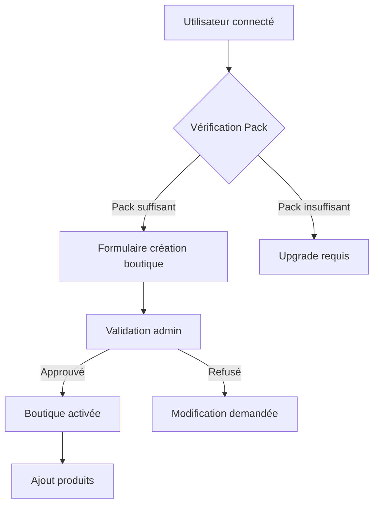
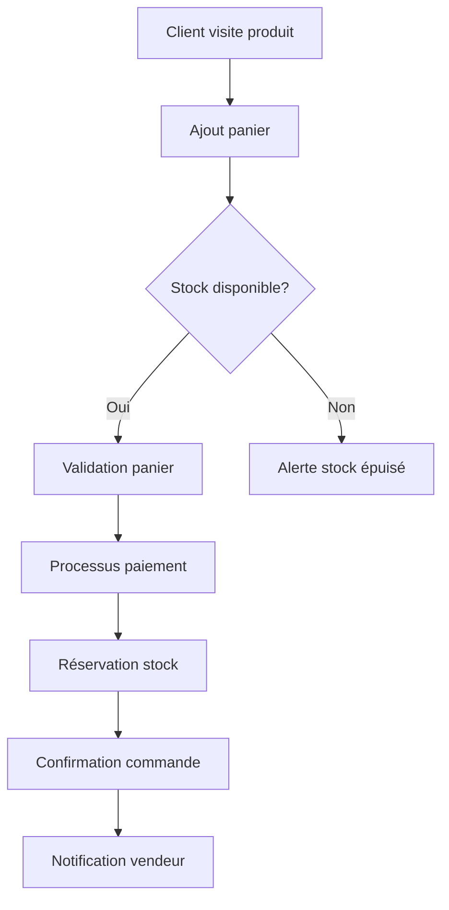
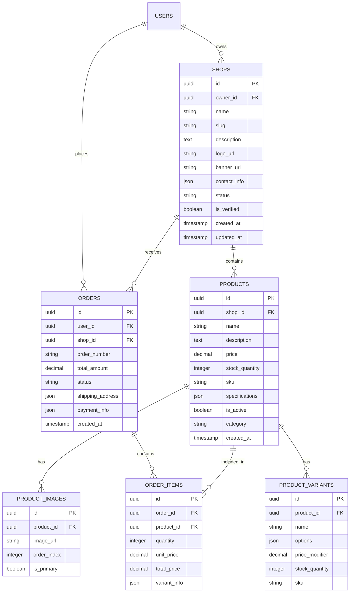

# Documentation d'Implémentation - Module Mini-Boutiques

## 1. Vue d'Ensemble du Projet

Le module **Mini-Boutiques** permet aux utilisateurs de MangooTech de créer et gérer leur propre boutique en ligne en fonction de leur pack d'abonnement. Ce module s'intègre parfaitement au système existant avec gestion des stocks, paiements, et tableau de bord vendeur.

**Objectifs principaux :**
- Permettre aux utilisateurs de créer leur boutique personnelle
- Gérer les produits, stocks et commandes
- Intégrer le système de paiement existant
- Fournir des analytics de vente détaillés
- Respecter les limitations des packs d'abonnement

## 2. Spécifications Fonctionnelles

### 2.1 Rôles Utilisateurs

| Rôle | Méthode d'Accès | Permissions Mini-Boutiques |
|------|------------------|---------------------------|
| Visiteur | Navigation publique | Consulter boutiques et produits |
| Client | Inscription email | Acheter des produits, suivre commandes |
| Vendeur (Découverte) | Pack Découverte | 10 produits max, 1 boutique |
| Vendeur (Visibilité) | Pack Visibilité | 50 produits max, 1 boutique, stats basiques |
| Vendeur (Professionnel) | Pack Professionnel | 200 produits max, 2 boutiques, stats avancées |
| Vendeur (Premium) | Pack Premium | Produits illimités, 5 boutiques, stats complètes |
| Administrateur | Backoffice | Gérer toutes les boutiques |

### 2.2 Modules Principaux

**Pages essentielles du module Mini-Boutiques :**

1. **Marketplace** : Liste des boutiques, recherche de produits, filtres par catégorie
2. **Boutique Vendeur** : Page vitrine de la boutique avec tous ses produits
3. **Gestion Produit** : CRUD produits avec gestion des stocks et images
4. **Gestion Commandes** : Suivi des commandes, statuts, expédition
5. **Tableau de Bord Vendeur** : Analytics, ventes, performance boutique
6. **Administration** : Gestion globale des boutiques pour l'admin

### 2.3 Détail des Fonctionnalités par Page

| Page | Module | Description Fonctionnelle |
|------|--------|--------------------------|
| Marketplace | Recherche | Filtrer produits par nom, catégorie, prix, boutique |
| Marketplace | Catégories | Navigation par catégories avec compteur de produits |
| Marketplace | Favoris | Système de favoris pour produits et boutiques |
| Boutique Vendeur | Présentation | Header personnalisé, description, coordonnées |
| Boutique Vendeur | Produits | Grille produits avec pagination, tri par prix/date |
| Gestion Produit | CRUD | Créer, modifier, supprimer produits avec validation |
| Gestion Produit | Images | Upload multiple, redimensionnement automatique |
| Gestion Produit | Stock | Gestion en temps réel, alertes stock faible |
| Commandes | Listing | Vue des commandes avec filtres par statut/date |
| Commandes | Détail | Informations client, produits, statut, suivi |
| Commandes | Statuts | Gestion workflow : en attente → préparé → expédié → livré |
| Dashboard | Analytics | Graphiques ventes, produits populaires, chiffre d'affaires |
| Dashboard | Performance | Taux conversion, panier moyen, meilleurs clients |
| Admin | Modération | Approuver/refuser boutiques, gérer litiges |

## 3. Processus Métiers

### 3.1 Flux de Création d'une Boutique



### 3.2 Flux d'Achat Produit



## 4. Design Interface Utilisateur

### 4.1 Style Visuel

**Palette de couleurs :**
- Primaire : `#3B82F6` (bleu MangooTech)
- Secondaire : `#10B981` (vert validation)
- Accent : `#F59E0B` (orange actions)
- Neutres : `#F3F4F6`, `#6B7280`, `#1F2937`

**Composants UI :**
- Cards avec ombres subtiles
- Boutons arrondis (8px border-radius)
- Icons Feather Icons
- Typographie : Inter, 14px base
- Layout responsive grid-based

### 4.2 Spécifications par Page

| Page | Éléments UI | Spécifications Design |
|------|-------------|----------------------|
| Marketplace | Header | Hero section avec recherche principale |
| Marketplace | Filtres | Sidebar collapsible, badges nombre résultats |
| Marketplace | Cards produit | Image 16:9, hover effects, prix en gras |
| Boutique | Header boutique | Bannière personnalisée, logo rond, stats |
| Boutique | Grille produits | Masonry layout, lazy loading images |
| Gestion | Tableau produits | Table avec actions inline, status badges |
| Commandes | Timeline | Étape par étape avec icônes et dates |
| Dashboard | Graphiques | Charts Chart.js, palettes cohérentes |

## 5. Architecture Technique

### 5.1 Stack Technique

- **Frontend** : React 18 + TypeScript + Vite
- **Backend** : Supabase (PostgreSQL + Edge Functions)
- **Authentification** : Supabase Auth
- **Stockage** : Supabase Storage pour images
- **Paiements** : Stripe (déjà intégré)
- **Realtime** : Supabase Realtime pour stocks
- **UI** : Tailwind CSS + HeadlessUI

### 5.2 Structure des Composants React

```
src/
├── components/
│   ├── marketplace/
│   │   ├── ProductGrid.tsx
│   │   ├── ProductCard.tsx
│   │   ├── SearchFilters.tsx
│   │   └── CategorySidebar.tsx
│   ├── boutique/
│   │   ├── ShopHeader.tsx
│   │   ├── ShopProducts.tsx
│   │   ├── ShopInfo.tsx
│   │   └── ShopReviews.tsx
│   ├── products/
│   │   ├── ProductForm.tsx
│   │   ├── ProductImages.tsx
│   │   ├── StockManager.tsx
│   │   └── ProductVariants.tsx
│   ├── orders/
│   │   ├── OrderList.tsx
│   │   ├── OrderDetail.tsx
│   │   ├── OrderStatus.tsx
│   │   └── ShippingForm.tsx
│   └── dashboard/
│       ├── SalesChart.tsx
│       ├── ProductPerformance.tsx
│       ├── CustomerStats.tsx
│       └── RevenueMetrics.tsx
```

### 5.3 Routes Frontend

| Route | Composant | Description |
|-------|-----------|-------------|
| `/marketplace` | MarketplacePage | Page principale marketplace |
| `/boutique/:slug` | ShopPage | Page d'une boutique vendeur |
| `/produit/:id` | ProductPage | Détail produit avec CTA achat |
| `/vendeur/produits` | SellerProducts | Gestion produits vendeur |
| `/vendeur/commandes` | SellerOrders | Gestion commandes vendeur |
| `/vendeur/dashboard` | SellerDashboard | Analytics vendeur |
| `/vendeur/parametres` | ShopSettings | Configuration boutique |
| `/admin/boutiques` | AdminShops | Gestion toutes les boutiques |

## 6. Modèles de Données

### 6.1 Schéma Base de Données



### 6.2 Scripts SQL de Création

```sql
-- Table des boutiques
CREATE TABLE shops (
    id UUID PRIMARY KEY DEFAULT gen_random_uuid(),
    owner_id UUID REFERENCES auth.users(id) ON DELETE CASCADE,
    name VARCHAR(100) NOT NULL,
    slug VARCHAR(100) UNIQUE NOT NULL,
    description TEXT,
    logo_url TEXT,
    banner_url TEXT,
    contact_info JSONB DEFAULT '{}',
    status VARCHAR(20) DEFAULT 'pending' CHECK (status IN ('pending', 'approved', 'rejected', 'suspended')),
    is_verified BOOLEAN DEFAULT false,
    created_at TIMESTAMP WITH TIME ZONE DEFAULT NOW(),
    updated_at TIMESTAMP WITH TIME ZONE DEFAULT NOW()
);

-- Table des produits
CREATE TABLE products (
    id UUID PRIMARY KEY DEFAULT gen_random_uuid(),
    shop_id UUID REFERENCES shops(id) ON DELETE CASCADE,
    name VARCHAR(200) NOT NULL,
    description TEXT,
    price DECIMAL(10,2) NOT NULL CHECK (price >= 0),
    stock_quantity INTEGER DEFAULT 0 CHECK (stock_quantity >= 0),
    sku VARCHAR(50) UNIQUE,
    specifications JSONB DEFAULT '{}',
    is_active BOOLEAN DEFAULT true,
    category VARCHAR(50),
    created_at TIMESTAMP WITH TIME ZONE DEFAULT NOW(),
    updated_at TIMESTAMP WITH TIME ZONE DEFAULT NOW()
);

-- Table des images produits
CREATE TABLE product_images (
    id UUID PRIMARY KEY DEFAULT gen_random_uuid(),
    product_id UUID REFERENCES products(id) ON DELETE CASCADE,
    image_url TEXT NOT NULL,
    order_index INTEGER DEFAULT 0,
    is_primary BOOLEAN DEFAULT false,
    created_at TIMESTAMP WITH TIME ZONE DEFAULT NOW()
);

-- Table des commandes
CREATE TABLE orders (
    id UUID PRIMARY KEY DEFAULT gen_random_uuid(),
    user_id UUID REFERENCES auth.users(id) ON DELETE CASCADE,
    shop_id UUID REFERENCES shops(id) ON DELETE CASCADE,
    order_number VARCHAR(20) UNIQUE NOT NULL,
    total_amount DECIMAL(10,2) NOT NULL CHECK (total_amount >= 0),
    status VARCHAR(20) DEFAULT 'pending' CHECK (status IN ('pending', 'processing', 'shipped', 'delivered', 'cancelled')),
    shipping_address JSONB NOT NULL,
    payment_info JSONB DEFAULT '{}',
    created_at TIMESTAMP WITH TIME ZONE DEFAULT NOW(),
    updated_at TIMESTAMP WITH TIME ZONE DEFAULT NOW()
);

-- Table des articles de commande
CREATE TABLE order_items (
    id UUID PRIMARY KEY DEFAULT gen_random_uuid(),
    order_id UUID REFERENCES orders(id) ON DELETE CASCADE,
    product_id UUID REFERENCES products(id) ON DELETE CASCADE,
    quantity INTEGER NOT NULL CHECK (quantity > 0),
    unit_price DECIMAL(10,2) NOT NULL CHECK (unit_price >= 0),
    total_price DECIMAL(10,2) NOT NULL CHECK (total_price >= 0),
    variant_info JSONB DEFAULT '{}',
    created_at TIMESTAMP WITH TIME ZONE DEFAULT NOW()
);

-- Index pour performances
CREATE INDEX idx_shops_owner ON shops(owner_id);
CREATE INDEX idx_shops_status ON shops(status);
CREATE INDEX idx_shops_slug ON shops(slug);
CREATE INDEX idx_products_shop ON products(shop_id);
CREATE INDEX idx_products_active ON products(is_active);
CREATE INDEX idx_products_category ON products(category);
CREATE INDEX idx_orders_user ON orders(user_id);
CREATE INDEX idx_orders_shop ON orders(shop_id);
CREATE INDEX idx_orders_status ON orders(status);
CREATE INDEX idx_order_items_order ON order_items(order_id);
CREATE INDEX idx_order_items_product ON order_items(product_id);

-- RLS Policies
ALTER TABLE shops ENABLE ROW LEVEL SECURITY;
ALTER TABLE products ENABLE ROW LEVEL SECURITY;
ALTER TABLE orders ENABLE ROW LEVEL SECURITY;
ALTER TABLE order_items ENABLE ROW LEVEL SECURITY;

-- Politiques de base
CREATE POLICY "Users can view active shops" ON shops FOR SELECT USING (status = 'approved');
CREATE POLICY "Shop owners can manage their shops" ON shops FOR ALL USING (auth.uid() = owner_id);
CREATE POLICY "Anyone can view active products" ON products FOR SELECT USING (is_active = true);
CREATE POLICY "Shop owners can manage their products" ON products FOR ALL USING (
    EXISTS (SELECT 1 FROM shops WHERE shops.id = products.shop_id AND shops.owner_id = auth.uid())
);
```

## 7. API et Endpoints

### 7.1 API Frontend (Supabase Client)

```typescript
// Types API
interface Shop {
  id: string;
  name: string;
  slug: string;
  description?: string;
  logo_url?: string;
  banner_url?: string;
  contact_info: ContactInfo;
  status: 'pending' | 'approved' | 'rejected' | 'suspended';
  is_verified: boolean;
  created_at: string;
}

interface Product {
  id: string;
  shop_id: string;
  name: string;
  description?: string;
  price: number;
  stock_quantity: number;
  sku?: string;
  specifications: Record<string, any>;
  is_active: boolean;
  category?: string;
  images?: ProductImage[];
  variants?: ProductVariant[];
}

interface Order {
  id: string;
  order_number: string;
  user_id: string;
  shop_id: string;
  total_amount: number;
  status: 'pending' | 'processing' | 'shipped' | 'delivered' | 'cancelled';
  shipping_address: Address;
  payment_info: PaymentInfo;
  items: OrderItem[];
  created_at: string;
}

// Services API
class MiniBoutiquesService {
  // Boutiques
  async getShops(filters?: ShopFilters): Promise<Shop[]>;
  async getShopBySlug(slug: string): Promise<Shop | null>;
  async createShop(shop: CreateShopDto): Promise<Shop>;
  async updateShop(id: string, updates: Partial<Shop>): Promise<Shop>;
  
  // Produits
  async getProducts(filters?: ProductFilters): Promise<Product[]>;
  async getProductById(id: string): Promise<Product | null>;
  async getShopProducts(shopId: string): Promise<Product[]>;
  async createProduct(product: CreateProductDto): Promise<Product>;
  async updateProduct(id: string, updates: Partial<Product>): Promise<Product>;
  async deleteProduct(id: string): Promise<void>;
  
  // Commandes
  async createOrder(order: CreateOrderDto): Promise<Order>;
  async getOrderById(id: string): Promise<Order | null>;
  async getUserOrders(userId: string): Promise<Order[]>;
  async getShopOrders(shopId: string): Promise<Order[]>;
  async updateOrderStatus(id: string, status: OrderStatus): Promise<Order>;
  
  // Dashboard
  async getShopAnalytics(shopId: string, period: string): Promise<ShopAnalytics>;
  async getProductPerformance(shopId: string): Promise<ProductPerformance[]>;
}
```

### 7.2 Edge Functions (Supabase)

```typescript
// functions/create-shop/index.ts
import { serve } from 'https://deno.land/std@0.168.0/http/server.ts'
import { createClient } from 'https://esm.sh/@supabase/supabase-js@2'

serve(async (req) => {
  const supabase = createClient(
    Deno.env.get('SUPABASE_URL')!,
    Deno.env.get('SUPABASE_SERVICE_ROLE_KEY')!
  )
  
  const { name, description, contact_info } = await req.json()
  const authHeader = req.headers.get('Authorization')!
  const token = authHeader.replace('Bearer ', '')
  
  // Vérifier l'utilisateur et son pack
  const { data: { user } } = await supabase.auth.getUser(token)
  
  // Vérifier les limitations du pack
  const { data: userPack } = await supabase
    .from('user_packs')
    .select('pack_type, shops_count')
    .eq('user_id', user.id)
    .single()
  
  const packLimits = {
    'Découverte': { maxShops: 1, maxProducts: 10 },
    'Visibilité': { maxShops: 1, maxProducts: 50 },
    'Professionnel': { maxShops: 2, maxProducts: 200 },
    'Premium': { maxShops: 5, maxProducts: null }
  }
  
  if (userPack.shops_count >= packLimits[userPack.pack_type].maxShops) {
    return new Response(JSON.stringify({ error: 'Limite de boutiques atteinte' }), {
      status: 400,
      headers: { 'Content-Type': 'application/json' }
    })
  }
  
  // Créer la boutique
  const slug = name.toLowerCase().replace(/[^a-z0-9]+/g, '-')
  const { data: shop, error } = await supabase
    .from('shops')
    .insert({
      owner_id: user.id,
      name,
      slug,
      description,
      contact_info,
      status: 'pending'
    })
    .single()
  
  if (error) {
    return new Response(JSON.stringify({ error: error.message }), {
      status: 400,
      headers: { 'Content-Type': 'application/json' }
    })
  }
  
  // Mettre à jour le compteur de boutiques
  await supabase
    .from('user_packs')
    .update({ shops_count: userPack.shops_count + 1 })
    .eq('user_id', user.id)
  
  return new Response(JSON.stringify(shop), {
    headers: { 'Content-Type': 'application/json' }
  })
})
```

## 8. Gestion des Stocks et Commandes

### 8.1 Système de Stock

```typescript
// Stock management service
class StockService {
  async reserveStock(productId: string, quantity: number): Promise<boolean> {
    const { data: product } = await supabase
      .from('products')
      .select('stock_quantity')
      .eq('id', productId)
      .single()
    
    if (product.stock_quantity < quantity) {
      return false
    }
    
    // Réserver le stock
    await supabase
      .from('products')
      .update({ 
        stock_quantity: product.stock_quantity - quantity 
      })
      .eq('id', productId)
    
    return true
  }
  
  async releaseStock(productId: string, quantity: number): Promise<void> {
    await supabase
      .from('products')
      .update({ 
        stock_quantity: supabase.sql`stock_quantity + ${quantity}` 
      })
      .eq('id', productId)
  }
  
  async updateStock(productId: string, newQuantity: number): Promise<void> {
    await supabase
      .from('products')
      .update({ stock_quantity: newQuantity })
      .eq('id', productId)
  }
}
```

### 8.2 Workflow Commande

```typescript
// Order processing service
class OrderService {
  async processOrder(orderData: CreateOrderDto): Promise<Order> {
    // 1. Vérifier le stock pour tous les produits
    const stockChecks = await Promise.all(
      orderData.items.map(item => this.checkStock(item.productId, item.quantity))
    )
    
    if (stockChecks.some(check => !check.available)) {
      throw new Error('Stock insuffisant')
    }
    
    // 2. Créer la commande
    const order = await this.createOrder(orderData)
    
    // 3. Réserver le stock
    await Promise.all(
      orderData.items.map(item => 
        this.stockService.reserveStock(item.productId, item.quantity)
      )
    )
    
    // 4. Traiter le paiement via Stripe
    const paymentIntent = await this.processPayment(order)
    
    // 5. Mettre à jour la commande avec les infos de paiement
    await this.updateOrderPayment(order.id, paymentIntent)
    
    // 6. Envoyer les notifications
    await this.sendOrderNotifications(order)
    
    return order
  }
  
  async updateOrderStatus(orderId: string, newStatus: OrderStatus): Promise<Order> {
    const { data: order } = await supabase
      .from('orders')
      .update({ status: newStatus })
      .eq('id', orderId)
      .single()
    
    // Gérer les transitions de statut
    switch (newStatus) {
      case 'cancelled':
        // Restituer le stock
        await this.restoreStockForCancelledOrder(orderId)
        break
      case 'shipped':
        // Envoyer email de suivi
        await this.sendShippingNotification(orderId)
        break
    }
    
    return order
  }
}
```

## 9. Paiements et Facturation

### 9.1 Intégration Stripe

```typescript
// Payment service
class PaymentService {
  private stripe: Stripe
  
  constructor() {
    this.stripe = new Stripe(Deno.env.get('STRIPE_SECRET_KEY')!)
  }
  
  async createPaymentIntent(order: Order): Promise<PaymentIntent> {
    return await this.stripe.paymentIntents.create({
      amount: Math.round(order.total_amount * 100), // Centimes
      currency: 'eur',
      metadata: {
        orderId: order.id,
        shopId: order.shop_id,
        userId: order.user_id
      }
    })
  }
  
  async confirmPayment(paymentIntentId: string): Promise<boolean> {
    const paymentIntent = await this.stripe.paymentIntents.retrieve(paymentIntentId)
    return paymentIntent.status === 'succeeded'
  }
  
  async processSellerPayout(order: Order): Promise<void> {
    // Calculer la commission MangooTech selon le pack
    const commissionRate = await this.getCommissionRate(order.shop_id)
    const commission = order.total_amount * commissionRate
    const sellerAmount = order.total_amount - commission
    
    // Créer le transfert vers le vendeur
    await this.stripe.transfers.create({
      amount: Math.round(sellerAmount * 100),
      currency: 'eur',
      destination: await this.getSellerAccount(order.shop_id),
      metadata: {
        orderId: order.id,
        commission: commission
      }
    })
  }
}
```

### 9.2 Génération de Factures

```typescript
// Invoice service
class InvoiceService {
  async generateInvoice(order: Order): Promise<Buffer> {
    const shop = await this.getShop(order.shop_id)
    const items = await this.getOrderItems(order.id)
    
    const invoiceData = {
      invoiceNumber: `INV-${order.order_number}`,
      date: new Date(),
      dueDate: new Date(),
      seller: {
        name: shop.name,
        address: shop.contact_info.address,
        siret: shop.contact_info.siret
      },
      buyer: {
        name: order.shipping_address.name,
        address: order.shipping_address
      },
      items: items.map(item => ({
        description: item.product_name,
        quantity: item.quantity,
        unitPrice: item.unit_price,
        totalPrice: item.total_price
      })),
      total: order.total_amount,
      commission: order.commission_amount
    }
    
    return await this.generatePDF(invoiceData)
  }
}
```

## 10. Administration et Modération

### 10.1 Tableau de Bord Admin

```typescript
// Admin dashboard component
const AdminDashboard: React.FC = () => {
  const { data: stats } = useQuery('admin-stats', fetchAdminStats)
  const { data: pendingShops } = useQuery('pending-shops', fetchPendingShops)
  
  return (
    <div className="space-y-6">
      <StatsGrid stats={stats} />
      
      <div className="grid grid-cols-1 lg:grid-cols-2 gap-6">
        <PendingShopsTable shops={pendingShops} />
        <RecentOrders orders={stats.recentOrders} />
      </div>
      
      <div className="grid grid-cols-1 lg:grid-cols-3 gap-6">
        <TopShops shops={stats.topShops} />
        <CategoryDistribution data={stats.categories} />
        <RevenueChart data={stats.revenue} />
      </div>
    </div>
  )
}
```

### 10.2 Système de Modération

```typescript
// Moderation service
class ModerationService {
  async reviewShop(shopId: string, action: 'approve' | 'reject', reason?: string): Promise<void> {
    const { data: shop } = await supabase
      .from('shops')
      .select('*')
      .eq('id', shopId)
      .single()
    
    if (action === 'approve') {
      await this.approveShop(shopId)
      await this.sendApprovalNotification(shop.owner_id)
    } else {
      await this.rejectShop(shopId, reason)
      await this.sendRejectionNotification(shop.owner_id, reason)
    }
  }
  
  async flagProduct(productId: string, reason: string): Promise<void> {
    await supabase
      .from('product_flags')
      .insert({
        product_id: productId,
        reason,
        status: 'pending'
      })
    
    // Notifier l'équipe de modération
    await this.notifyModerationTeam(productId, reason)
  }
}
```

## 11. Tests et Qualité

### 11.1 Stratégie de Test

```typescript
// Test examples
import { render, screen, fireEvent, waitFor } from '@testing-library/react'
import userEvent from '@testing-library/user-event'

describe('ProductForm', () => {
  it('should create a new product', async () => {
    const user = userEvent.setup()
    
    render(<ProductForm />)
    
    // Fill form fields
    await user.type(screen.getByLabelText('Nom du produit'), 'Test Product')
    await user.type(screen.getByLabelText('Description'), 'Test description')
    await user.type(screen.getByLabelText('Prix'), '29.99')
    await user.type(screen.getByLabelText('Stock'), '10')
    
    // Submit form
    fireEvent.click(screen.getByText('Créer le produit'))
    
    // Wait for success
    await waitFor(() => {
      expect(screen.getByText('Produit créé avec succès')).toBeInTheDocument()
    })
  })
  
  it('should validate required fields', async () => {
    render(<ProductForm />)
    
    fireEvent.click(screen.getByText('Créer le produit'))
    
    await waitFor(() => {
      expect(screen.getByText('Le nom est requis')).toBeInTheDocument()
      expect(screen.getByText('Le prix est requis')).toBeInTheDocument()
    })
  })
})

describe('StockService', () => {
  it('should reserve stock successfully', async () => {
    const service = new StockService()
    
    // Mock product with sufficient stock
    supabase.from('products').select().resolves({
      data: { stock_quantity: 10 }
    })
    
    supabase.from('products').update().resolves({ data: {} })
    
    const result = await service.reserveStock('product-123', 5)
    
    expect(result).toBe(true)
  })
  
  it('should fail when insufficient stock', async () => {
    const service = new StockService()
    
    supabase.from('products').select().resolves({
      data: { stock_quantity: 3 }
    })
    
    const result = await service.reserveStock('product-123', 5)
    
    expect(result).toBe(false)
  })
})
```

### 11.2 Tests d'Intégration

```typescript
// Integration tests
import { setup, teardown } from '../test-utils'

describe('Order Flow Integration', () => {
  beforeEach(async () => {
    await setup()
  })
  
  afterEach(async () => {
    await teardown()
  })
  
  it('should complete full order process', async () => {
    // Create test data
    const shop = await createTestShop()
    const product = await createTestProduct(shop.id, { stock_quantity: 10 })
    const user = await createTestUser()
    
    // Create order
    const orderData = {
      user_id: user.id,
      shop_id: shop.id,
      items: [{
        product_id: product.id,
        quantity: 2,
        unit_price: product.price
      }],
      shipping_address: {
        name: 'Test User',
        address: '123 Test St',
        city: 'Test City',
        postal_code: '12345'
      }
    }
    
    const order = await orderService.processOrder(orderData)
    
    // Verify order created
    expect(order).toBeDefined()
    expect(order.status).toBe('pending')
    expect(order.total_amount).toBe(product.price * 2)
    
    // Verify stock updated
    const updatedProduct = await getProduct(product.id)
    expect(updatedProduct.stock_quantity).toBe(8)
    
    // Verify payment intent created
    expect(order.payment_info.payment_intent_id).toBeDefined()
  })
})
```

## 12. Déploiement et Monitoring

### 12.1 Configuration Déploiement

```yaml
# .github/workflows/deploy-mini-boutiques.yml
name: Deploy Mini-Boutiques Module

on:
  push:
    branches: [main]
    paths:
      - 'src/components/marketplace/**'
      - 'src/components/products/**'
      - 'src/components/orders/**'
      - 'supabase/migrations/mini-boutiques/**'

jobs:
  deploy:
    runs-on: ubuntu-latest
    
    steps:
      - uses: actions/checkout@v3
      
      - name: Setup Node.js
        uses: actions/setup-node@v3
        with:
          node-version: '18'
          cache: 'npm'
      
      - name: Install dependencies
        run: npm ci
      
      - name: Run tests
        run: npm run test:mini-boutiques
      
      - name: Build marketplace module
        run: npm run build:marketplace
      
      - name: Deploy to Supabase
        run: |
          npx supabase db push
          npx supabase functions deploy create-shop
          npx supabase functions deploy process-order
          npx supabase functions deploy update-stock
```

### 12.2 Monitoring et Alertes

```typescript
// Monitoring service
class MonitoringService {
  async trackShopCreation(shopId: string, userId: string): Promise<void> {
    await this.analytics.track('shop_created', {
      shop_id: shopId,
      user_id: userId,
      timestamp: new Date().toISOString()
    })
  }
  
  async trackOrderCompletion(orderId: string, amount: number): Promise<void> {
    await this.analytics.track('order_completed', {
      order_id: orderId,
      revenue: amount,
      timestamp: new Date().toISOString()
    })
  }
  
  async alertLowStock(productId: string, currentStock: number): Promise<void> {
    await this.notifications.send({
      type: 'low_stock',
      product_id: productId,
      current_stock: currentStock,
      severity: currentStock < 5 ? 'critical' : 'warning'
    })
  }
  
  async monitorSystemHealth(): Promise<SystemHealth> {
    const metrics = await Promise.all([
      this.checkDatabaseConnection(),
      this.checkStripeAPI(),
      this.checkStorageUsage(),
      this.checkOrderQueue()
    ])
    
    return {
      status: metrics.every(m => m.status === 'healthy') ? 'healthy' : 'degraded',
      metrics,
      timestamp: new Date().toISOString()
    }
  }
}
```

## 13. Migration depuis le Système Actuel

### 13.1 Plan de Migration

```typescript
// Migration script
class MigrationService {
  async migrateExistingUsers(): Promise<void> {
    // Étape 1 : Créer les tables
    await this.createMiniBoutiquesTables()
    
    // Étape 2 : Migrer les données utilisateur
    await this.migrateUserData()
    
    // Étape 3 : Configurer les permissions
    await this.setupRLSPolicies()
    
    // Étape 4 : Créer les fonctions Edge
    await this.deployEdgeFunctions()
    
    // Étape 5 : Mettre à jour l'interface
    await this.updateFrontendRoutes()
  }
  
  async rollback(): Promise<void> {
    // Script de rollback en cas de problème
    await this.backupCurrentData()
    await this.dropNewTables()
    await this.restorePreviousVersion()
  }
}
```

### 13.2 Script de Migration SQL

```sql
-- Migration script
BEGIN;

-- Créer les nouvelles tables
-- (Les scripts de création sont déjà fournis plus haut)

-- Migrer les données existantes
INSERT INTO shops (owner_id, name, slug, description, status, is_verified, created_at)
SELECT 
  u.id as owner_id,
  COALESCE(u.user_metadata->>'business_name', u.email) as name,
  slugify(COALESCE(u.user_metadata->>'business_name', u.email)) as slug,
  u.user_metadata->>'business_description' as description,
  'approved' as status,
  true as is_verified,
  NOW() as created_at
FROM auth.users u
WHERE u.user_metadata->>'wants_shop' = 'true';

-- Mettre à jour les packs utilisateurs
UPDATE user_packs 
SET shops_count = (
  SELECT COUNT(*) FROM shops WHERE shops.owner_id = user_packs.user_id
);

COMMIT;
```

## 14. Maintenance et Support

### 14.1 Maintenance Routines

```bash
#!/bin/bash
# maintenance.sh - Script de maintenance hebdomadaire

echo "Début maintenance Mini-Boutiques..."

# 1. Nettoyer les commandes anciennes
echo "Nettoyage des commandes anciennes..."
supabase sql << EOF
DELETE FROM orders 
WHERE status = 'cancelled' 
AND created_at < NOW() - INTERVAL '6 months';
EOF

# 2. Mettre à jour les statistiques
echo "Mise à jour des statistiques..."
supabase sql << EOF
UPDATE shops 
SET total_sales = (
  SELECT COALESCE(SUM(total_amount), 0) 
  FROM orders 
  WHERE orders.shop_id = shops.id 
  AND status = 'delivered'
),
total_orders = (
  SELECT COUNT(*) 
  FROM orders 
  WHERE orders.shop_id = shops.id 
  AND status = 'delivered'
);
EOF

# 3. Vérifier l'intégrité des données
echo "Vérification intégrité..."
supabase sql << EOF
-- Produits sans boutique
SELECT COUNT(*) as orphaned_products 
FROM products 
WHERE shop_id NOT IN (SELECT id FROM shops);

-- Commandes sans articles
SELECT COUNT(*) as empty_orders 
FROM orders 
WHERE id NOT IN (SELECT order_id FROM order_items);
EOF

echo "Maintenance terminée!"
```

### 14.2 Support Client

```typescript
// Support service
class SupportService {
  async createTicket(ticketData: SupportTicket): Promise<SupportTicket> {
    const ticket = await supabase
      .from('support_tickets')
      .insert({
        ...ticketData,
        status: 'open',
        priority: this.calculatePriority(ticketData)
      })
      .single()
    
    // Notifier l'équipe support
    await this.notifySupportTeam(ticket)
    
    return ticket
  }
  
  async getShopIssues(shopId: string): Promise<SupportTicket[]> {
    return await supabase
      .from('support_tickets')
      .select('*')
      .eq('shop_id', shopId)
      .order('created_at', { ascending: false })
  }
  
  async resolveTicket(ticketId: string, resolution: string): Promise<void> {
    await supabase
      .from('support_tickets')
      .update({
        status: 'resolved',
        resolution,
        resolved_at: new Date().toISOString()
      })
      .eq('id', ticketId)
  }
}
```

## Conclusion

Ce document fournit une base complète pour l'implémentation du module Mini-Boutiques dans MangooTech. Il est conçu pour être utilisé par :

- **Business Analystes** : Pour comprendre les flux métiers et spécifications
- **Développeurs** : Pour implémenter les fonctionnalités techniques
- **Chefs de Projet** : Pour planifier le développement et le déploiement

Le module est conçu pour s'intégrer parfaitement au système existant tout en apportant des fonctionnalités puissantes de e-commerce multi-vende