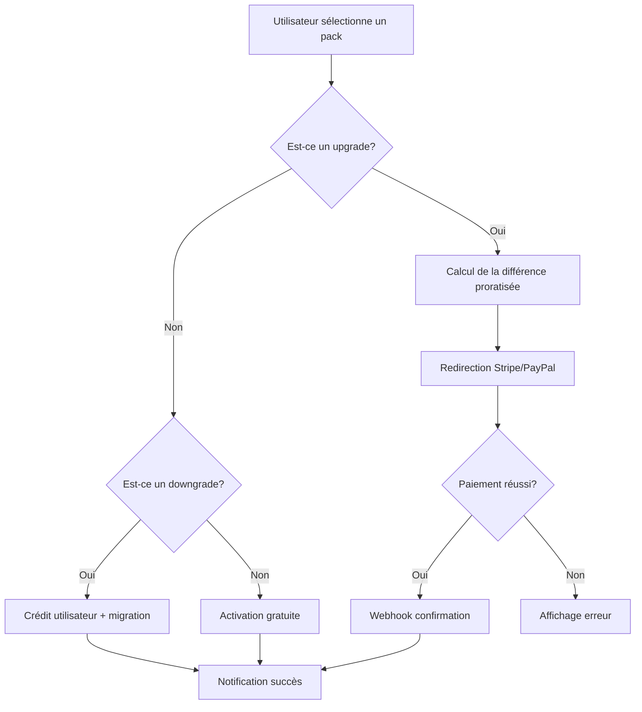

# Spécifications Fonctionnelles - MangooTech

## 📋 Vue d'ensemble Produit

### Contexte Métier
MangooTech est une plateforme de solutions technologiques modulaires conçue pour répondre aux besoins de digitalisation des entreprises africaines. L'application propose un système d'abonnement par packs permettant aux utilisateurs d'accéder à des services numériques adaptés à leur niveau de croissance.

### Objectifs Business
- **Démocratiser l'accès** aux solutions numériques en Afrique
- **Générer des revenus récurrents** via le modèle d'abonnement
- **Fidéliser les clients** grâce à une progression de pack adaptée
- **Réduire le churn** par une expérience utilisateur optimale

## 🎯 Système de Packs - Spécifications Détaillées

### 4.1 Pack Découverte (Gratuit)

#### Objectif Business
Acquisition et onboarding des nouveaux utilisateurs, démonstration de la valeur de la plateforme.

#### Fonctionnalités Incluses
| Module | Description | Critères d'Acceptation |
|--------|-------------|----------------------|
| **Mini-site** | Création d'un site web professionnel (3 pages max) | - Templates responsive disponibles<br>- Personnalisation couleurs/logo<br>- Domaine sous mangoo.tech |
| **Mini-boutique** | Catalogue produits simple (10 produits max) | - Ajout/modification produits<br>- Gestion stock basique<br>- Pas de paiement en ligne |
| **Espace personnel** | Dashboard utilisateur basique | - Vue des statistiques simples<br>- Gestion du profil<br>- Accès aux paramètres |
| **Fiche visible** | Présence dans l'annuaire Mangoo | - Fiche publique accessible<br>- Contact masqué par défaut |
| **Connect+** | Messagerie interne | - Envoi/réception messages<br>- Historique des conversations |

#### Restrictions
- Aucun coût pour l'utilisateur
- Publicité MangooTech visible
- Limitations techniques : stockage 100MB, bande passante 1GB/mois
- Support communautaire uniquement

### 4.2 Pack Visibilité (5 000 FCFA/mois)

#### Objectif Business
Monétisation des utilisateurs actifs, amélioration de la visibilité commerciale.

#### Fonctionnalités Supplémentaires
| Module | Description | Business Value |
|--------|-------------|----------------|
| **Référencement Market** | Positionnement dans les résultats de recherche | Augmente la visibilité de 300% |
| **Showroom360 simplifié** | Visite virtuelle basique (5 points de vue) | Différenciation concurrentielle |
| **Analytics avancés** | Statistiques détaillées | Data-driven decisions |

#### KPIs de Succès
- Taux de conversion Découverte → Visibilité : > 15%
- Churn rate mensuel : < 5%
- NPS (Net Promoter Score) : > 7

### 4.3 Pack Professionnel (10 000 FCFA/mois)

#### Objectif Business
Captation des PME et entrepreneurs en phase de croissance, augmentation du ARPU.

#### Fonctionnalités Clés
| Module | Description | Impact Business |
|--------|-------------|-----------------|
| **Mangoo Express** | Plateforme de livraison intégrée | Nouveau canal de revenus (commission 5%) |
| **Référencement Pro** | Positionnement premium dans les résultats | Augmentation du traffic de 500% |
| **Support prioritaire** | Réponse sous 4h ouvrées | Réduction churn de 40% |

#### Métriques de Performance
- Panier moyen : 12 000 FCFA
- Lifetime Value (LTV) : 180 000 FCFA
- Coût d'acquisition client (CAC) : 25 000 FCFA

### 4.4 Pack Premium (15 000 FCFA/mois)

#### Objectif Business
Maximisation du revenu par client, fidélisation des gros comptes.

#### Fonctionnalités Premium
| Module | Description | Valeur Ajoutée |
|--------|-------------|----------------|
| **CRM/ERP simplifié** | Gestion complète de la relation client | Productivité +40% |
| **Showroom360 complet** | Visite virtuelle immersive | Taux de conversion +25% |
| **Support personnalisé** | Account manager dédié | Satisfaction client > 9/10 |

## 💳 Système de Paiement - Spécifications

### 5.1 Processus de Souscription

#### Flux Normal d'Achat


#### Règles de Proratisation
- **Calcul** : `(Prix nouveau pack - Prix ancien pack) × Jours restants / 30`
- **Arrondi** : Au centime supérieur
- **Crédit** : Valide 12 mois, transférable

### 5.2 Gestion des Échecs de Paiement

#### Scénarios et Actions
| Échec | Cause | Action Système | Action Business |
|-------|--------|----------------|-----------------|
| **Carte refusée** | Fonds insuffisants | Retry automatique J+1, J+3, J+7 | Email assistance financière |
| **Carte expirée** | Date invalide | Demande mise à jour carte | Email rappel avec lien sécurisé |
| **Fraude détectée** | Suspicion fraude | Blocage immédiat | Review manuel obligatoire |

#### Processus de Retry
1. **J+1** : Premier retry automatique
2. **J+3** : Deuxième retry avec email notification
3. **J+7** : Dernier retry avant suspension
4. **J+10** : Suspension du pack avec grace period de 7 jours

## 📊 Tableaux de Bord - Spécifications

### 6.1 Dashboard Utilisateur

#### Widgets Principaux
| Widget | Données Affichées | Source | Fréquence MAJ |
|--------|-------------------|--------|---------------|
| **Statistiques** | Visites, conversions, revenus | Analytics API | Temps réel |
| **Pack Actuel** | Nom, prix, date échéance | user_packs table | 5 minutes |
| **Services Actifs** | Liste avec statut | user_services table | Temps réel |
| **Notifications** | Messages système | notifications table | Temps réel |

#### KPIs Utilisateur
- **Taux de conversion** : (Visiteurs / Contacts) × 100
- **Revenu généré** : Somme des ventes via la plateforme
- **Croissance** : Évolution par rapport au mois précédent
- **Engagement** : Temps moyen sur le site

### 6.2 Dashboard Administrateur

#### Métriques Globales
| Métrique | Formule | Objectif |
|----------|---------|----------|
| **MRR** | Somme des abonnements actifs | Croissance 15% MoM |
| **Churn Rate** | (Désabonnements / Total) × 100 | < 5% mensuel |
| **ARPU** | Revenu total / Nombre d'utilisateurs | Augmentation 10% MoM |
| **LTV** | (ARPU × Durée de vie moyenne) | > 150 000 FCFA |

#### Rapports Requis
1. **Rapport de ventes quotidien** : Email automatisé à 8h
2. **Analyse de churn hebdomadaire** : Identification des patterns
3. **Rapport de performance mensuel** : Board report avec tendances

## 🔄 Processus de Changement de Pack

### 7.1 Upgrade (Amélioration)

#### Déclencheurs
- Utilisateur clique sur "Changer de pack"
- Sélection d'un pack supérieur
- Validation du calcul de différence

#### Processus Détaillé
1. **Calcul de la différence** : Système calcule le montant restant
2. **Redirection paiement** : Stripe/PayPal avec montant ajusté
3. **Webhook confirmation** : Mise à jour automatique du pack
4. **Notification succès** : Email + dashboard update

#### Business Rules
- **Période d'essai** : 7 jours satisfait ou remboursé
- **Facturation** : Immédiate pour l'upgrade
- **Activation** : Immédiate après paiement
- **Historique** : Traçabilité complète des changements

### 7.2 Downgrade (Rétrogradation)

#### Conditions d'Acceptation
- Pack actuel payant → Pack gratuit/payant inférieur
- Aucun paiement en cours
- Crédit utilisateur généré si applicable

#### Calcul du Crédit
```
Crédit = (Prix pack actuel - Prix nouveau pack) × Jours restants / 30
```

#### Processus
1. **Confirmation utilisateur** : Double validation requise
2. **Calcul du crédit** : Montant automatique
3. **Migration des données** : Conservation des données essentielles
4. **Notification** : Email récapitulatif avec détails du crédit

### 7.3 Annulation (Résiliation)

#### Types d'Annulation
| Type | Déclenchement | Remboursement | Impact |
|------|---------------|---------------|---------|
| **Immédiate** | Utilisateur demande | Calcul prorata | Migration vers gratuit |
| **Fin de période** | Non-renouvellement | Aucun | Maintien jusqu'à échéance |
| **Faute grave** | Violation CGV | Aucun | Suspension immédiate |

#### Collecte de Feedback
**Questions obligatoires** :
1. Motif principal (liste déroulante)
2. Commentaires détaillés (texte libre)
3. Note de satisfaction (1-10)
4. Probabilité de retour (%) 

## 📈 Analytics et Reporting

### 8.1 Événements à Tracker

#### Événements Business Critiques
| Événement | Propriétés | Objectif |
|-----------|------------|----------|
| **pack_selected** | pack_id, user_id, source | Conversion funnel |
| **payment_completed** | amount, method, pack_id | Revenue tracking |
| **pack_changed** | from_pack, to_pack, reason | Churn analysis |
| **service_used** | service_id, duration, user_id | Engagement |

#### Dashboard Analytics
- **Temps réel** : Utilisateurs connectés, actions en cours
- **Journalier** : Ventes, inscriptions, churn
- **Hebdomadaire** : Tendances, anomalies, opportunités
- **Mensuel** : Performance vs objectifs, prévisions

### 8.2 Rapports Automatisés

#### Rapport Quotidien (8h)
- Ventes du jour précédent
- Nouvelles inscriptions
- Taux de churn
- Alertes anomalies

#### Rapport Hebdomadaire (Lundi 9h)
- Performance globale
- Analyse des tendances
- Top/Bottom performers
- Recommandations actions

#### Rapport Mensuel (1er du mois)
- Complet avec analyses approfondies
- Comparaison périodes
- Prévisions à venir
- Plan d'action recommandé

## 🎯 Tests et Qualité - Spécifications

### 9.1 Critères d'Acceptation par Module

#### Module d'Authentification
```gherkin
Feature: User Authentication
  Scenario: Successful user registration
    Given I am on the registration page
    When I enter valid email "test@example.com"
    And I enter valid password "SecurePass123!"
    And I click "Register"
    Then I should be redirected to dashboard
    And I should have "Pack Découverte" assigned
```

#### Module de Paiement
```gherkin
Feature: Pack Upgrade Payment
  Scenario: Successful pack upgrade with proration
    Given I have "Pack Visibilité" active
    And I have 15 days remaining in current period
    When I upgrade to "Pack Professionnel"
    Then I should pay 2500 FCFA (prorated difference)
    And my pack should be updated immediately
    And I should receive confirmation email
```

### 9.2 Tests de Performance

#### Critères de Performance
| Métrique | Objectif | Test Scenario |
|----------|----------|---------------|
| **Page Load Time** | < 2 secondes | 3G connection simulation |
| **API Response** | < 500ms | 95th percentile |
| **Concurrent Users** | 1000+ | Load testing avec k6 |
| **Mobile Performance** | Score > 90 | Lighthouse mobile audit |

## 🔒 Sécurité et Conformité

### 10.1 Sécurité des Données

#### Chiffrement
- **Données sensibles** : AES-256 au repos
- **Transmission** : TLS 1.3 minimum
- **Mots de passe** : bcrypt avec salt
- **Tokens** : JWT avec expiration courte

#### Authentification
- **2FA** : Optionnel pour utilisateurs, obligatoire pour admins
- **Rate limiting** : 5 tentatives par minute
- **Session management** : 24h max, refresh token 7 jours
- **Password policy** : 8+ caractères, complexité moyenne

### 10.2 Conformité RGPD

#### Droits des Utilisateurs
- **Accès** : Export complet des données personnelles
- **Rectification** : Modification en libre service
- **Effacement** : Suppression complète sous 30 jours
- **Portabilité** : Export format JSON/CSV

#### Consentement
- **Newsletter** : Opt-in explicite
- **Cookies** : Bannière avec choix granulaire
- **Marketing** : Double opt-in recommandé
- **Partage données** : Consentement spécifique par usage

## 📞 Support Client - Spécifications

### 11.1 Niveaux de Support

#### Support Niveau 1 (Auto-support)
- **FAQ interactive** : Chatbot avec 80% de réponses automatiques
- **Documentation** : Base de connaissances complète
- **Tutoriels vidéo** : Pour les fonctionnalités principales
- **Community forum** : Entraide entre utilisateurs

#### Support Niveau 2 (Technique)
- **Email** : Réponse sous 24h ouvrées
- **Chat** : Disponible 9h-18h GMT
- **Téléphone** : Numéro local et WhatsApp Business
- **Remote assistance** : Pour les problèmes complexes

#### Support Niveau 3 (Business)
- **Account manager** : Pour les clients Premium
- **SLA garanti** : 4h pour les urgences business
- **Formation** : Sessions mensuelles pour les nouveaux features
- **Consulting** : Aide à l'optimisation business

### 11.2 Procédures de Résolution

#### Classification des Tickets
| Priorité | Temps de Réponse | Exemples |
|----------|------------------|----------|
| **P1 - Critique** | 1h | Site down, paiement bloqué |
| **P2 - Haute** | 4h | Fonctionnalité principale down |
| **P3 - Moyenne** | 24h | Bug non bloquant |
| **P4 - Faible** | 72h | Questions générales |

---

**Ce document constitue la référence principale pour l'analyse fonctionnelle du projet MangooTech. Il doit être mis à jour à chaque évolution majeure du système.**

**Date de dernière mise à jour** : $(date)  
**Version** : 1.0.0  
**Responsable** : Business Analysis Team