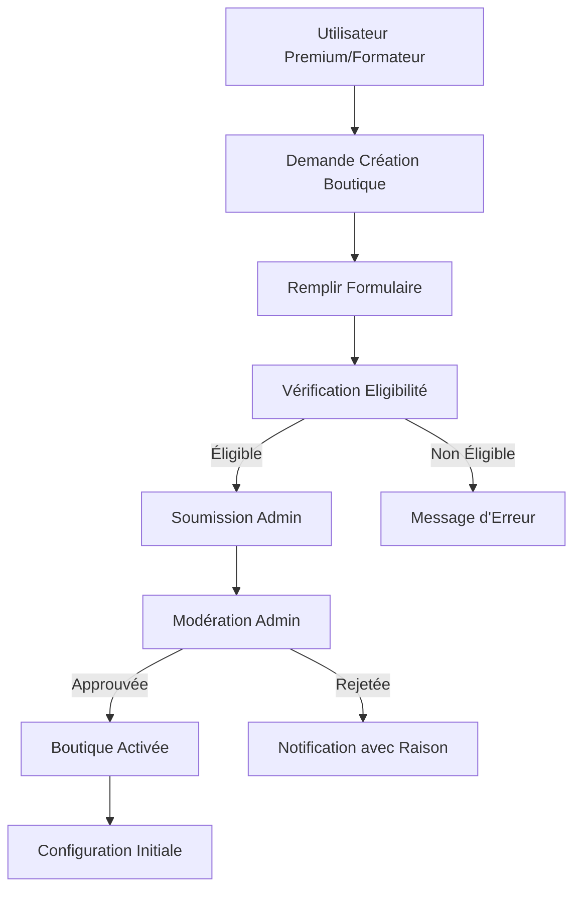
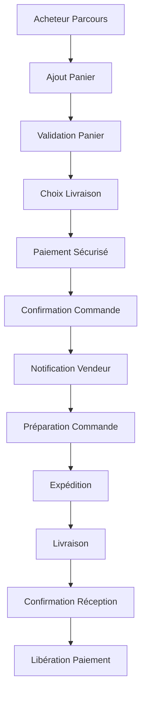
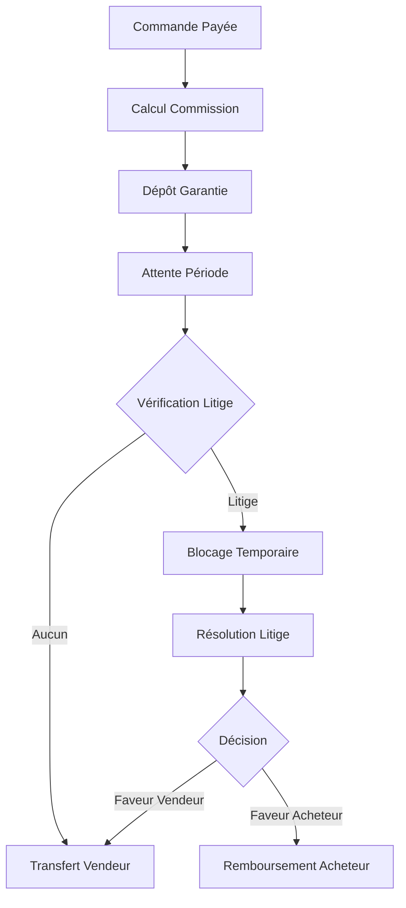

# Spécifications Fonctionnelles - Module Mini-Boutiques

## 1. Vue d'Ensemble du Produit

Le module Mini-Boutiques transforme MangooTech en une plateforme de marketplace multi-vendeurs permettant aux utilisateurs de créer et gérer leurs propres boutiques en ligne. Les vendeurs peuvent proposer des produits, gérer leurs stocks et commandes, tandis que les acheteurs bénéficient d'une expérience d'achat unifiée avec des fonctionnalités de recherche, filtrage et paiement sécurisé.

**Objectifs principaux :**
- Permettre aux utilisateurs Premium et Formateur de créer leur boutique personnelle
- Offrir une expérience d'achat fluide et sécurisée
- Gérer automatiquement les commissions et paiements
- Fournir des outils d'analyse et de gestion complets

## 2. Rôles Utilisateurs et Permissions

| Rôle | Méthode d'Accès | Permissions Principales |
|------|------------------|------------------------|
| Acheteur | Inscription gratuite | Parcourir, acheter, suivre commandes, laisser avis |
| Vendeur | Upgrade depuis Premium/Formateur | Créer boutique, gérer produits, voir commandes, analytics |
| Admin | Compte administrateur | Modérer boutiques, gérer litiges, voir toutes les données |
| Super Admin | Compte système | Configuration commission, paramètres globaux |

## 3. Modules Fonctionnels

### 3.1 Marketplace Public
**Pages principales :**
1. **Boutique du Marché** : Liste des boutiques, recherche, filtres
2. **Page Produit** : Détails produit, avis, suggestions
3. **Panier Multi-Boutiques** : Gestion panier avec plusieurs vendeurs
4. **Page de Paiement** : Checkout sécurisé avec séparation des commissions

### 3.2 Gestion Vendeur
**Pages principales :**
1. **Dashboard Vendeur** : Vue d'ensemble des ventes et analytics
2. **Gestion Boutique** : Configuration boutique, politiques, branding
3. **Gestion Produits** : CRUD produits, variants, images, stock
4. **Gestion Commandes** : Traitement commandes, statuts, expédition
5. **Analytics Vente** : Rapports détaillés, performance, tendances

### 3.3 Administration
**Pages principales :**
1. **Tableau de Bord Admin** : Vue globale marketplace
2. **Modération Boutiques** : Approvation, suspension, configuration
3. **Gestion Litiges** : Résolution des conflits
4. **Configuration Commission** : Taux commission par catégorie
5. **Analytics Global** : KPIs marketplace, tendances

## 4. Spécifications Détaillées par Page

### Marketplace Public

| Page | Module | Description Fonctionnelle |
|------|--------|--------------------------|
| Boutique du Marché | Recherche et Filtres | Permettre recherche par nom boutique, produit, catégorie. Filtres : prix, note, localisation, délai livraison |
| Boutique du Marché | Liste Boutiques | Afficher cartes boutiques avec logo, note moyenne, nombre produits, bannière promotionnelle |
| Page Produit | Galerie Images | Zoom produit, visionneuse 360°, vidéos démonstration. Maximum 10 images par produit |
| Page Produit | Variants Produit | Gestion tailles, couleurs, matériaux avec stocks individuels. Affichage dynamique prix selon variant |
| Page Produit | Avis Clients | Système notation 5 étoiles avec commentaires texte, photos. Modération avant publication |
| Panier Multi-Boutiques | Récapitulatif | Regroupement par vendeur avec sous-totaux. Calcul automatique frais livraison par boutique |
| Paiement | Multi-Paiement | Séparation automatique paiement : vendeur (prix - commission) + plateforme (commission) |

### Gestion Vendeur

| Page | Module | Description Fonctionnelle |
|------|--------|--------------------------|
| Dashboard Vendeur | Vue d'Ensemble | Chiffre d'affaires, nombre commandes, produits populaires, alertes stock faible |
| Gestion Boutique | Configuration | Nom boutique, description, logo, bannière, politiques retour, délais livraison |
| Gestion Produits | Ajout Produit | Formulaire multi-étapes : infos générales, variants, images, prix, stock, SEO |
| Gestion Produits | Gestion Stock | Inventaire en temps réel, alertes seuil minimum, historique mouvements |
| Gestion Commandes | Traitement | Workflow statuts : En attente → Confirmée → Préparée → Expédiée → Livrée |
| Analytics Vente | Performance | Ventes par période, produits top, panier moyen, taux conversion, clients récurrents |

### Administration

| Page | Module | Description Fonctionnelle |
|------|--------|--------------------------|
| Tableau Bord Admin | KPIs | Nombre boutiques actives, CA total, taux litige, satisfaction client |
| Modération Boutiques | Approbation | Workflow validation : Soumise → En relecture → Approuvée/Rejetée avec commentaires |
| Gestion Litiges | Résolution | Interface messagerie entre acheteur/vendeur/admin, preuves, décision finale |
| Configuration | Commission | Taux variable par catégorie produit (ex: 5% électronique, 8% mode, 10% artisanat) |

## 5. Processus Métiers Principaux

### Processus Création Boutique

### Processus Commande Complète

### Processus Gestion Commission

## 6. Design UI/UX

### Style de Design
- **Palette Couleurs** : Primary #3B82F6 (bleu), Secondary #10B981 (vert succès), Error #EF4444
- **Typographie** : Inter pour titres, Roboto pour corps texte
- **Boutons** : Style arrondi avec ombres subtiles, états hover/actif clairs
- **Layout** : Card-based avec grid responsive, navigation latérale pour vendeur
- **Icônes** : Heroicons outline, couleurs cohérentes avec états fonctionnels

### Spécifications par Type de Page

| Type Page | Layout Principal | Éléments Clés |
|-----------|------------------|---------------|
| Marketplace | Header fixe + Grid produits | Filtres latéraux, cartes produits, pagination |
| Produit | Image gauche + Détails droite | Galerie zoom, variants, bouton CTA prominent |
| Vendeur Dashboard | Sidebar + Content | Widgets KPI, graphiques, tableaux données |
| Admin | Top navigation + Sections | Tableaux modération, formulaires configuration |

### Responsive Design
- **Desktop-First** : Optimisation principale pour écrans 1280px+
- **Tablettes** : Adaptation grid 2 colonnes, sidebar devient drawer
- **Mobile** : Navigation bottom bar, filtres en modal plein écran
- **Touch** : Boutons minimum 44px, gestes swipe pour galerie images

## 7. Tests et Critères d'Acceptation

### Tests Fonctionnels
- ✅ Création boutique avec tous champs requis
- ✅ Ajout produit avec variants et stock
- ✅ Parcours commande complet multi-vendeur
- ✅ Calcul commission automatique
- ✅ Gestion litige avec preuves
- ✅ Performance : chargement page < 3 secondes

### Tests Sécurité
- ✅ Protection injection SQL via Supabase RLS
- ✅ Validation uploads images (type, taille, scan antivirus)
- ✅ Authentification 2FA pour vendeurs
- ✅ Chiffrement données sensibles
- ✅ Logs audit pour actions critiques

### Tests Performance
- ✅ Support 1000+ boutiques actives
- ✅ Temps réponse API < 200ms
- ✅ Chargement images optimisé (lazy loading, WebP)
- ✅ Cache Redis pour données fréquentes
- ✅ CDN pour assets statiques

## 8. Conformité et Sécurité

### RGPD
- Consentement explicite pour données marketing
- Droit à l'oubli avec suppression cascade
- Portabilité données vendeur/acheteur
- Registre traitement activités

### PCI-DSS
- Tokenisation numéros cartes via Stripe
- Aucun stockage données paiement
- Audit trimestriel sécurité
- Formation personnel habilité

### Protection Consommateur
- Garantie satisfait ou remboursé 14 jours
- Assurance livraison incluse
- Médiateur consommation disponible
- Procédure litige claire et documentée

Cette documentation constitue la base solide pour l'implémentation professionnelle du module Mini-Boutiques, avec toutes les spécifications nécessaires pour les business analystes et développeurs.