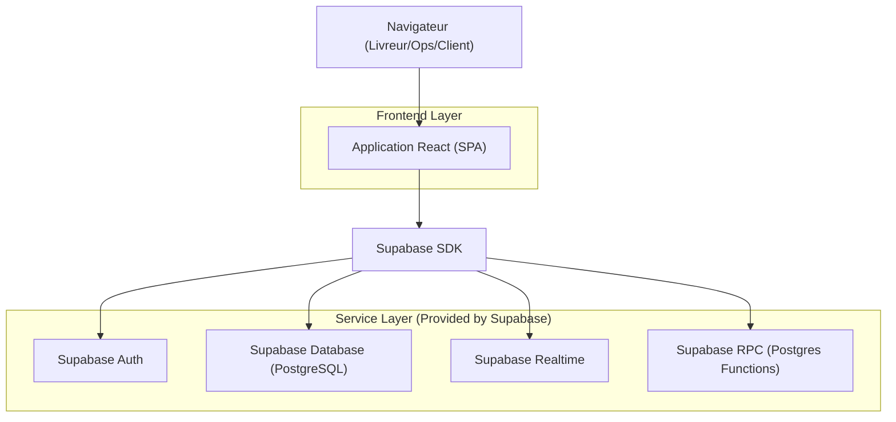
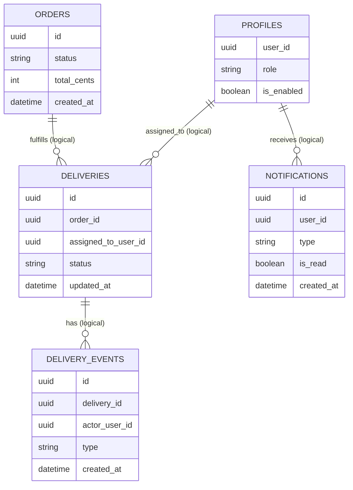

## 1.Architecture design


## 2.Technology Description
- Frontend: React@18 + TypeScript + react-router-dom + tailwindcss@3
- Backend: None (API via tables + RPC Supabase)
- Auth & Database: Supabase (Auth + PostgreSQL + Realtime)

## 3.Route definitions
| Route | Purpose |
|-------|---------|
| /login | Connexion livreur/ops |
| /register | Inscription livreur |
| /pending | Compte en attente d’activation |
| /livreur | Dashboard livreur (missions + notifications + états réseau) |
| /livreur/deliveries/:deliveryId | Détail livraison / commande + timeline + actions |
| /403 | Accès refusé |
| /checkout | Checkout (client) — crée la commande |

## 4.API definitions (Supabase : tables + Realtime + RPC)
### 4.1 Types TypeScript (front)
```ts
export type UserRole = "livreur" | "ops" | "admin";
export type DeliveryStatus = "a_faire" | "en_cours" | "livree" | "annulee";

export interface Delivery {
  id: string;
  order_id: string;
  assigned_to_user_id: string;
  status: DeliveryStatus;
  dropoff_address: string;
  contact_name?: string;
  contact_phone?: string;
  pickup_at?: string;
  delivered_at?: string;
  updated_at: string;
}

export interface DeliveryEvent {
  id: string;
  delivery_id: string;
  actor_user_id: string;
  type: string; // ex: status_changed
  note?: string;
  created_at: string;
}

export interface Notification {
  id: string;
  user_id: string;
  type: string;
  title: string;
  body?: string;
  is_read: boolean;
  created_at: string;
}
```

### 4.2 Accès données (via Supabase SDK)
- Lire les missions: `select * from deliveries where assigned_to_user_id = auth.uid()`
- Lire la timeline: `select * from delivery_events where delivery_id = :deliveryId order by created_at asc`
- Marquer notifications lues: `update notifications set is_read=true where user_id=auth.uid()`

### 4.3 Realtime (abonnements)
- `deliveries`: écouter `UPDATE` des lignes assignées au livreur connecté (apparition d’une mission, changement de statut, réassignation).
- `notifications`: écouter `INSERT` sur les notifications du livreur.
- `delivery_events`: écouter `INSERT` pour la livraison consultée afin d’actualiser la timeline.

### 4.4 RPC (sécuriser les transitions et éviter les conflits)
Dans un flux interconnecté, les actions critiques (prendre en charge, terminer, annuler) doivent être atomiques. Les RPC suivantes donnent un point d’entrée unique, renvoient une erreur claire si le statut a changé, et réduisent les races.

- `rpc_take_delivery(delivery_id)` : passe `a_faire → en_cours` uniquement si la livraison est assignée à `auth.uid()` et encore à l’état `a_faire`.
- `rpc_set_delivery_status(delivery_id, next_status, note)` : applique une transition autorisée depuis l’état courant et écrit l’événement correspondant.

## 6.Data model(if applicable)
### 6.1 Data model definition


### 6.2 Data Definition Language
Fonctions RPC (exemple minimal, compatible appel `supabase.rpc()`)
```sql
CREATE OR REPLACE FUNCTION rpc_take_delivery(p_delivery_id uuid)
RETURNS deliveries
LANGUAGE plpgsql
SECURITY DEFINER
AS $$
DECLARE
  v_row deliveries;
BEGIN
  UPDATE deliveries
  SET status = 'en_cours', updated_at = NOW()
  WHERE id = p_delivery_id
    AND assigned_to_user_id = auth.uid()
    AND status = 'a_faire'
  RETURNING * INTO v_row;

  IF v_row.id IS NULL THEN
    RAISE EXCEPTION 'DELIVERY_TAKE_CONFLICT';
  END IF;

  INSERT INTO delivery_events (delivery_id, actor_user_id, type, note)
  VALUES (p_delivery_id, auth.uid(), 'status_changed', 'a_faire→en_cours');

  RETURN v_row;
END;
$$;

CREATE OR REPLACE FUNCTION rpc_set_delivery_status(p_delivery_id uuid, p_next_status text, p_note text)
RETURNS deliveries
LANGUAGE plpgsql
SECURITY DEFINER
AS $$
DECLARE
  v_current deliveries;
  v_row deliveries;
BEGIN
  SELECT * INTO v_current FROM deliveries WHERE id = p_delivery_id;

  UPDATE deliveries
  SET status = p_next_status, updated_at = NOW(),
      delivered_at = CASE WHEN p_next_status = 'livree' THEN NOW() ELSE delivered_at END
  WHERE id = p_delivery_id
    AND assigned_to_user_id = auth.uid()
    AND (
      (v_current.status = 'en_cours' AND p_next_status IN ('livree','annulee')) OR
      (v_current.status = 'a_faire' AND p_next_status IN ('en_cours','annulee'))
    )
  RETURNING * INTO v_row;

  IF v_row.id IS NULL THEN
    RAISE EXCEPTION 'DELIVERY_STATUS_CONFLICT';
  END IF;

  INSERT INTO delivery_events (delivery_id, actor_user_id, type, note)
  VALUES (p_delivery_id, auth.uid(), 'status_changed', COALESCE(p_note, p_next_status));

  RETURN v_row;
END;
$$;
```

Notes RLS (principe)
Le livreur ne doit pouvoir lire/mettre à jour que les livraisons où `assigned_to_user_id = auth.uid()` ; Ops/Admin peuvent avoir des règles élargies. L’écriture des statuts côté livreur passe prioritairement par les RPC ci-dessus pour garantir l’atomicité et fournir des erreurs métier stables (conflit, réassignation, statut déjà changé).