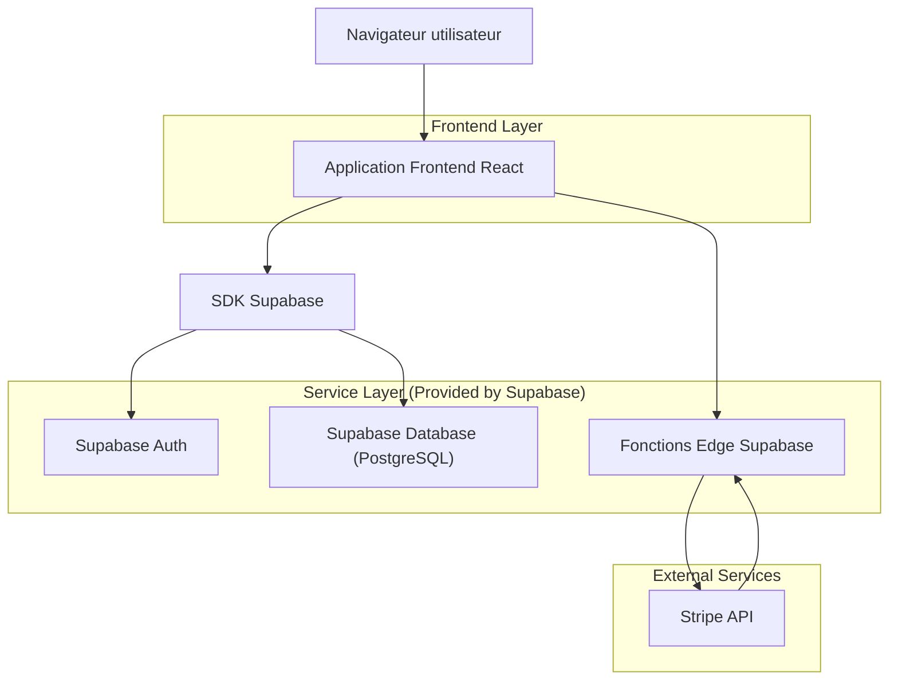
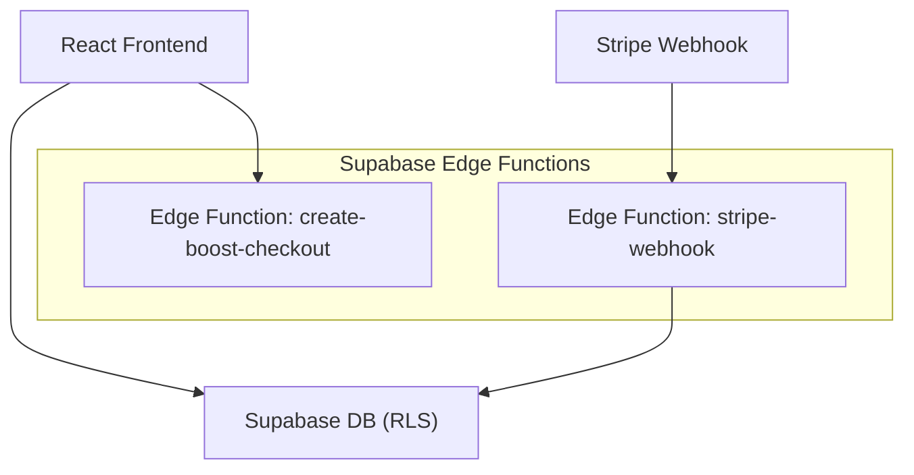
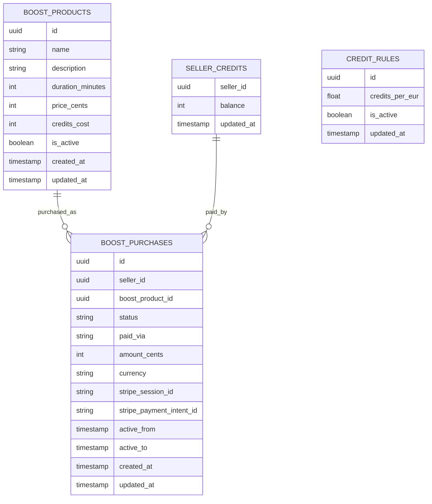

## 1.Architecture design


## 2.Technology Description
- Frontend: React@18 + vite + tailwindcss@3
- Backend: Supabase (Auth + Database + Edge Functions)
- Paiement: Stripe Checkout (création session + webhook)

## 3.Route definitions
| Route | Purpose |
|-------|---------|
| /login | Connexion et création de session |
| /vendeur/boost | Écran vendeur pour acheter/activer un boost |
| /admin/boost | Administration boosts (prix, crédits) |
| /paiement/success | Retour succès (affichage statut en attente de confirmation serveur) |
| /paiement/cancel | Retour annulation/échec |

## 4.API definitions (If it includes backend services)
### 4.1 Types partagés (TypeScript)
```ts
export type BoostProduct = {
  id: string;
  name: string;
  description?: string;
  duration_minutes: number;
  price_cents: number; // paiement carte
  credits_cost: number; // paiement crédits
  is_active: boolean;
  created_at: string;
  updated_at: string;
};

export type BoostPurchaseStatus = 'pending' | 'paid' | 'failed' | 'canceled' | 'refunded';

export type BoostPurchase = {
  id: string;
  seller_id: string; // logical FK
  boost_product_id: string; // logical FK
  status: BoostPurchaseStatus;
  amount_cents?: number;
  currency?: string;
  paid_via: 'credits' | 'card';
  stripe_session_id?: string;
  stripe_payment_intent_id?: string;
  active_from?: string;
  active_to?: string;
  created_at: string;
  updated_at: string;
};

export type SellerCredits = {
  seller_id: string; // logical FK
  balance: number;
  updated_at: string;
};

export type CreditRule = {
  id: string;
  credits_per_eur: number;
  is_active: boolean;
  updated_at: string;
};
```

### 4.2 Core API (Edge Functions)
Créer une session Stripe Checkout
```
POST /functions/v1/create-boost-checkout
```
Request:
| Param Name | Param Type | isRequired | Description |
|-----------|------------|------------|-------------|
| boostProductId | string | true | ID du boost choisi |

Response:
| Param Name | Param Type | Description |
|-----------|------------|-------------|
| checkoutUrl | string | URL Stripe Checkout |
| purchaseId | string | Achat créé en base (pending) |

Webhook Stripe (confirmation serveur)
```
POST /functions/v1/stripe-webhook
```
- Vérifie la signature Stripe.
- Met à jour le statut du paiement et déclenche l’activation (active_from/active_to).

## 5.Server architecture diagram (If it includes backend services)


## 6.Data model(if applicable)
### 6.1 Data model definition


### 6.2 Data Definition Language
Boost products (boost_products)
```sql
CREATE TABLE boost_products (
  id UUID PRIMARY KEY DEFAULT gen_random_uuid(),
  name TEXT NOT NULL,
  description TEXT,
  duration_minutes INTEGER NOT NULL,
  price_cents INTEGER NOT NULL,
  credits_cost INTEGER NOT NULL,
  is_active BOOLEAN NOT NULL DEFAULT TRUE,
  created_at TIMESTAMPTZ NOT NULL DEFAULT NOW(),
  updated_at TIMESTAMPTZ NOT NULL DEFAULT NOW()
);

CREATE TABLE seller_credits (
  seller_id UUID PRIMARY KEY,
  balance INTEGER NOT NULL DEFAULT 0,
  updated_at TIMESTAMPTZ NOT NULL DEFAULT NOW()
);

CREATE TABLE credit_rules (
  id UUID PRIMARY KEY DEFAULT gen_random_uuid(),
  credits_per_eur DOUBLE PRECISION NOT NULL,
  is_active BOOLEAN NOT NULL DEFAULT TRUE,
  updated_at TIMESTAMPTZ NOT NULL DEFAULT NOW()
);

CREATE TABLE boost_purchases (
  id UUID PRIMARY KEY DEFAULT gen_random_uuid(),
  seller_id UUID NOT NULL,
  boost_product_id UUID NOT NULL,
  status TEXT NOT NULL CHECK (status IN ('pending','paid','failed','canceled','refunded')),
  paid_via TEXT NOT NULL CHECK (paid_via IN ('credits','card')),
  amount_cents INTEGER,
  currency TEXT,
  stripe_session_id TEXT,
  stripe_payment_intent_id TEXT,
  active_from TIMESTAMPTZ,
  active_to TIMESTAMPTZ,
  created_at TIMESTAMPTZ NOT NULL DEFAULT NOW(),
  updated_at TIMESTAMPTZ NOT NULL DEFAULT NOW()
);

-- Permissions (guideline)
GRANT SELECT ON boost_products TO anon;
GRANT ALL PRIVILEGES ON boost_products TO authenticated;
GRANT ALL PRIVILEGES ON seller_credits TO authenticated;
GRANT ALL PRIVILEGES ON boost_purchases TO authenticated;
GRANT ALL PRIVILEGES ON credit_rules TO authenticated;
```

RLS (règles d’accès)
```sql
-- Activer RLS
ALTER TABLE boost_products ENABLE ROW LEVEL SECURITY;
ALTER TABLE seller_credits ENABLE ROW LEVEL SECURITY;
ALTER TABLE boost_purchases ENABLE ROW LEVEL SECURITY;
ALTER TABLE credit_rules ENABLE ROW LEVEL SECURITY;

-- Boosts: lecture publique des boosts actifs (pour affichage), écriture admin seulement
CREATE POLICY "boost_products_read_active_anon"
ON boost_products FOR SELECT TO anon
USING (is_active = TRUE);

CREATE POLICY "boost_products_read_all_auth"
ON boost_products FOR SELECT TO authenticated
USING (TRUE);

-- Exiger un claim admin, ex: auth.jwt()->>'role' = 'admin'
CREATE POLICY "boost_products_admin_write"
ON boost_products FOR ALL TO authenticated
USING ((auth.jwt() ->> 'role') = 'admin')
WITH CHECK ((auth.jwt() ->> 'role') = 'admin');

-- Crédit vendeur: un vendeur ne voit que son solde
CREATE POLICY "seller_credits_own"
ON seller_credits FOR SELECT TO authenticated
USING (seller_id = auth.uid());

CREATE POLICY "seller_credits_admin_all"
ON seller_credits FOR ALL TO authenticated
USING ((auth.jwt() ->> 'role') = 'admin')
WITH CHECK ((auth.jwt() ->> 'role') = 'admin');

-- Achats: vendeur voit ses achats; admin voit tout
CREATE POLICY "boost_purchases_own_read"
ON boost_purchases FOR SELECT TO authenticated
USING (seller_id = auth.uid());

CREATE POLICY "boost_purchases_admin_all"
ON boost_purchases FOR ALL TO authenticated
USING ((auth.jwt() ->> 'role') = 'admin')
WITH CHECK ((auth.jwt() ->> 'role') = 'admin');
```

Notes paiement/activation (source de vérité)
- La création checkout crée un enregistrement boost_purchases en status=pending.
- Le webhook Stripe met à jour status=paid (ou failed/canceled) et calcule active_from/active_to.
- Pour paiement par crédits, l’Edge Function (ou RPC SQL) effectue une transaction: vérifier solde, décrémenter, créer achat paid, activer.
