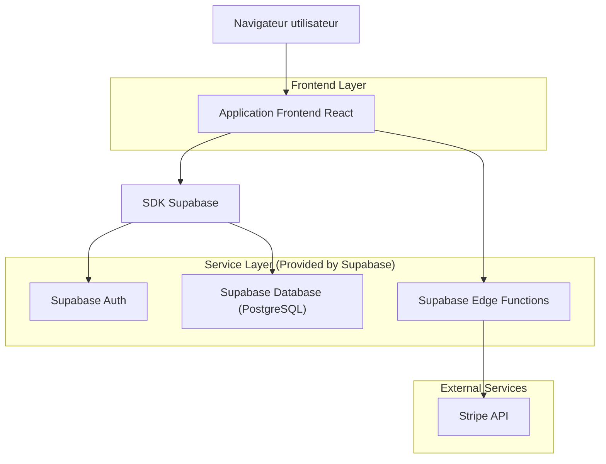
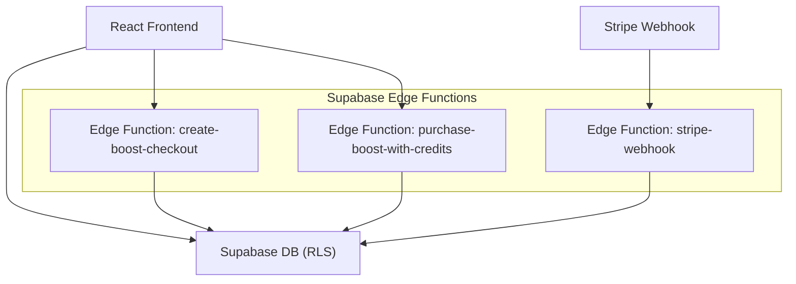
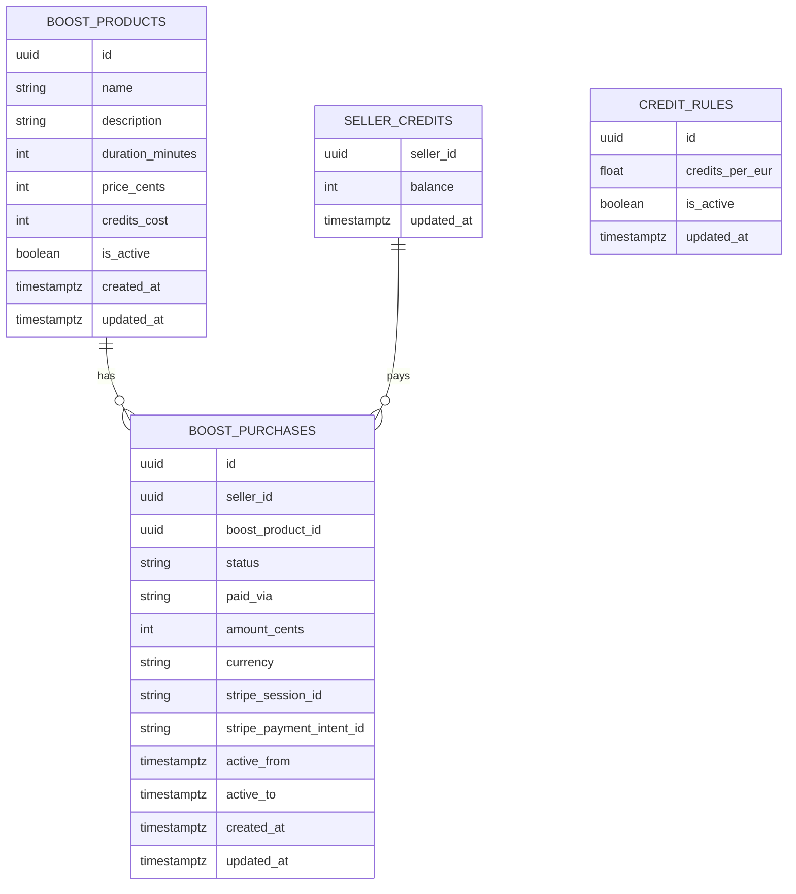

## 1.Architecture design


## 2.Technology Description
- Frontend: React@18 + vite + tailwindcss@3
- Backend: Supabase (Auth + Database + Edge Functions)
- Paiement: Stripe Checkout

## 3.Route definitions
| Route | Purpose |
|-------|---------|
| /login | Connexion et création de session |
| /vendeur/boost | Catalogue boosts + achat + statut + historique |
| /admin/boost | CRUD boosts + règle crédits + supervision achats |
| /paiement/success | Retour succès (affiche “confirmation en cours”) |
| /paiement/cancel | Retour annulation/échec |

## 4.API definitions (Edge Functions + Supabase REST)

### 4.1 Edge Functions (recommandé pour opérations sensibles)
Créer une session Stripe Checkout
```
POST /functions/v1/create-boost-checkout
```
Request:
| Param Name | Param Type | isRequired | Description |
|-----------|------------|------------|-------------|
| boostProductId | string(uuid) | true | ID du boost choisi |
Response:
| Param Name | Param Type | Description |
|-----------|------------|-------------|
| checkoutUrl | string | URL Stripe Checkout |
| purchaseId | string(uuid) | Achat créé en base (status=pending) |

Achat par crédits (transactionnel)
```
POST /functions/v1/purchase-boost-with-credits
```
Request:
| Param Name | Param Type | isRequired | Description |
|-----------|------------|------------|-------------|
| boostProductId | string(uuid) | true | ID du boost choisi |
Response:
| Param Name | Param Type | Description |
|-----------|------------|-------------|
| purchase | BoostPurchase | Achat créé (status=paid) avec `active_from/active_to` |

Webhook Stripe (confirmation serveur)
```
POST /functions/v1/stripe-webhook
```
- Vérifie la signature Stripe.
- Met à jour `boost_purchases.status` + `stripe_payment_intent_id`.
- Calcule `active_from/active_to` si paiement confirmé.

### 4.2 Supabase REST (lecture/CRUD sous RLS)
- Lister boosts actifs (vendeur, public):
  - `GET /rest/v1/boost_products?select=id,name,description,duration_minutes,price_cents,credits_cost,is_active&is_active=eq.true`
- Lire solde vendeur:
  - `GET /rest/v1/seller_credits?select=seller_id,balance,updated_at&seller_id=eq.<auth.uid>`
- Historique achats vendeur:
  - `GET /rest/v1/boost_purchases?select=*&seller_id=eq.<auth.uid>&order=created_at.desc`
- Admin CRUD boosts:
  - `POST|PATCH /rest/v1/boost_products` (RLS: admin)
- Admin règle crédits:
  - `POST|PATCH /rest/v1/credit_rules` (RLS: admin)
- Admin supervision achats:
  - `GET /rest/v1/boost_purchases?select=*` (RLS: admin)

## 5.Server architecture diagram (If it includes backend services)


## 6.Data model(if applicable)

### 6.1 Data model definition


### 6.2 Data Definition Language
```sql
CREATE TABLE boost_products (
  id UUID PRIMARY KEY DEFAULT gen_random_uuid(),
  name TEXT NOT NULL,
  description TEXT,
  duration_minutes INTEGER NOT NULL,
  price_cents INTEGER NOT NULL,
  credits_cost INTEGER NOT NULL,
  is_active BOOLEAN NOT NULL DEFAULT TRUE,
  created_at TIMESTAMPTZ NOT NULL DEFAULT NOW(),
  updated_at TIMESTAMPTZ NOT NULL DEFAULT NOW()
);

CREATE TABLE seller_credits (
  seller_id UUID PRIMARY KEY,
  balance INTEGER NOT NULL DEFAULT 0,
  updated_at TIMESTAMPTZ NOT NULL DEFAULT NOW()
);

CREATE TABLE credit_rules (
  id UUID PRIMARY KEY DEFAULT gen_random_uuid(),
  credits_per_eur DOUBLE PRECISION NOT NULL,
  is_active BOOLEAN NOT NULL DEFAULT TRUE,
  updated_at TIMESTAMPTZ NOT NULL DEFAULT NOW()
);

CREATE TABLE boost_purchases (
  id UUID PRIMARY KEY DEFAULT gen_random_uuid(),
  seller_id UUID NOT NULL,
  boost_product_id UUID NOT NULL,
  status TEXT NOT NULL CHECK (status IN ('pending','paid','failed','canceled','refunded')),
  paid_via TEXT NOT NULL CHECK (paid_via IN ('credits','card')),
  amount_cents INTEGER,
  currency TEXT,
  stripe_session_id TEXT,
  stripe_payment_intent_id TEXT,
  active_from TIMESTAMPTZ,
  active_to TIMESTAMPTZ,
  created_at TIMESTAMPTZ NOT NULL DEFAULT NOW(),
  updated_at TIMESTAMPTZ NOT NULL DEFAULT NOW()
);

GRANT SELECT ON boost_products TO anon;
GRANT ALL PRIVILEGES ON boost_products TO authenticated