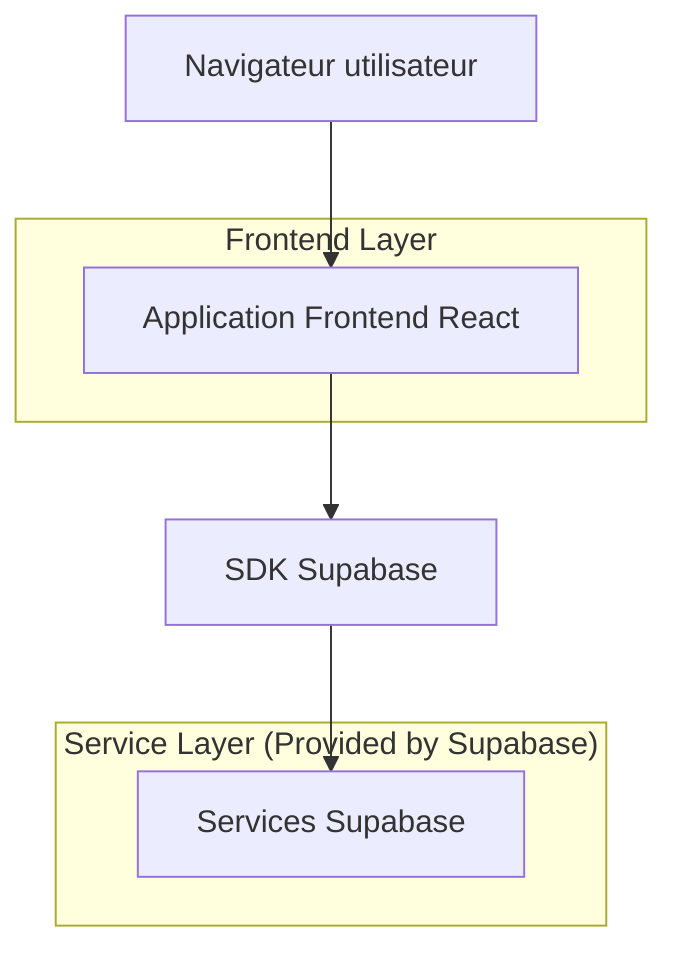
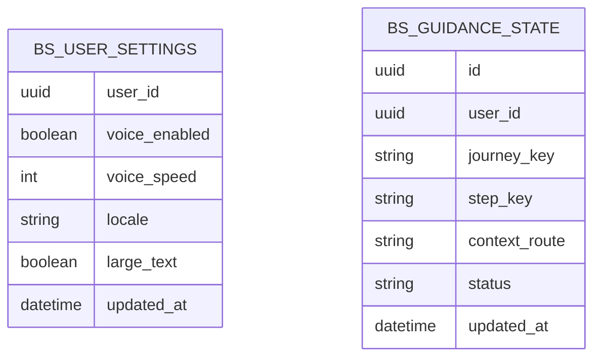

## 1.Architecture design


## 2.Technology Description
- Frontend: React@18 + vite + tailwindcss@3
- Backend: Supabase (Auth + Database)

## 3.Route definitions
| Route | Purpose |
|-------|---------|
| /login | Page Connexion avec déclenchement de la Boussole et aides contextuelles |
| /home | Accueil / Navigation (tuiles pictos + mode “Je veux…”) |
| /boussole | Hub Boussole (parcours pas-à-pas, reprise, réglages audio) |

## 6.Data model(if applicable)

### 6.1 Data model definition


### 6.2 Data Definition Language
User Settings (bs_user_settings)
```
CREATE TABLE bs_user_settings (
  user_id UUID PRIMARY KEY,
  voice_enabled BOOLEAN NOT NULL DEFAULT true,
  voice_speed INTEGER NOT NULL DEFAULT 1,
  locale VARCHAR(10) NOT NULL DEFAULT 'fr',
  large_text BOOLEAN NOT NULL DEFAULT false,
  updated_at TIMESTAMP WITH TIME ZONE DEFAULT NOW()
);

GRANT SELECT ON bs_user_settings TO anon;
GRANT ALL PRIVILEGES ON bs_user_settings TO authenticated;
```

Guidance State (bs_guidance_state)
```
CREATE TABLE bs_guidance_state (
  id UUID PRIMARY KEY DEFAULT gen_random_uuid(),
  user_id UUID NOT NULL,
  journey_key VARCHAR(80) NOT NULL,
  step_key VARCHAR(80) NOT NULL,
  context_route VARCHAR(120) NOT NULL,
  status VARCHAR(20) NOT NULL DEFAULT 'in_progress',
  updated_at TIMESTAMP WITH TIME ZONE DEFAULT NOW()
);

CREATE INDEX idx_bs_guidance_state_user_id ON bs_guidance_state(user_id);
CREATE INDEX idx_bs_guidance_state_updated_at ON bs_guidance_state(updated_at DESC);

GRANT SELECT ON bs_guidance_state TO anon;
GRANT ALL PRIVILEGES ON bs_guidance_state