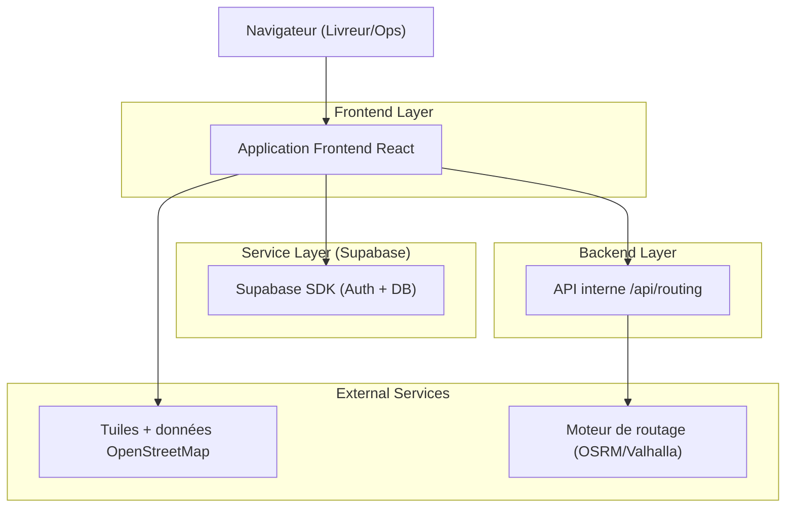
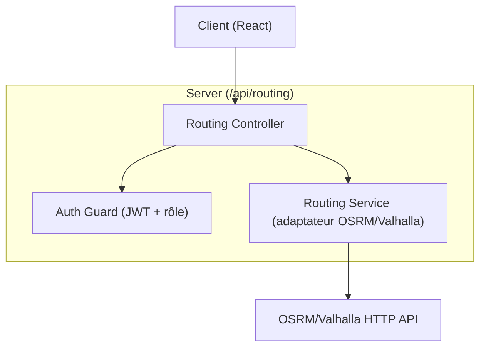
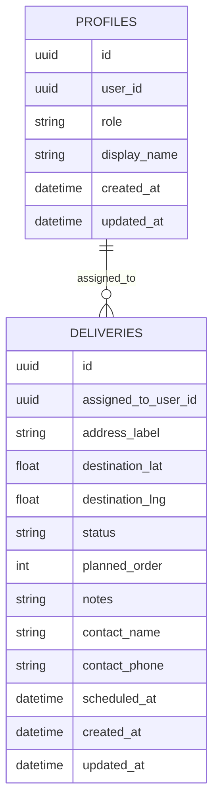

## 1.Architecture design


## 2.Technology Description
- Frontend: React@18 + vite + TypeScript + leaflet (carte) + tailwindcss@3
- Backend: Node.js (Express) pour exposer `/api/routing` (proxy + contrôle d’accès)
- Auth & Database: Supabase (Auth + PostgreSQL)

## 3.Route definitions
| Route | Purpose |
|-------|---------|
| /login | Connexion utilisateur (Livreur/Ops) |
| /livreur | Écran livreur (liste + carte + itinéraire) |
| /403 | Accès refusé (rôle insuffisant) |

## 4.API definitions (If it includes backend services)
### 4.1 Core API
#### Calcul d’itinéraire
```
GET /api/routing
```
Request:
| Param Name | Param Type | isRequired | Description |
|-----------|------------|------------|-------------|
| originLat | number | true | Latitude du point de départ |
| originLng | number | true | Longitude du point de départ |
| stops | string | true | Liste de points `lat,lng` séparés par `;` (ex: `48.85,2.35;48.86,2.34`) |
| profile | string | false | Profil de déplacement (ex: `driving`) |

Headers:
| Header | isRequired | Description |
|--------|------------|-------------|
| Authorization: Bearer <jwt> | true | JWT Supabase (session utilisateur) |

Response:
| Param Name | Param Type | Description |
|-----------|------------|-------------|
| distanceMeters | number | Distance totale |
| durationSeconds | number | Durée estimée |
| geometry | object | Géométrie du trajet (ex: GeoJSON LineString) |

Notes sécurité:
- Vérifier la signature du JWT Supabase côté serveur (via JWKS) et refuser si invalide.
- Contrôler le rôle (claim/metadata/profil) : autoriser au minimum `livreur` et `ops/admin`.
- Appliquer un rate-limit (anti-abus) par utilisateur.

TypeScript types (partagés côté front/back) :
```ts
export type UserRole = "livreur" | "ops" | "admin";

export type DeliveryStatus = "a_faire" | "en_cours" | "livree" | "annulee";

export interface Delivery {
  id: string;
  assignedToUserId: string;
  addressLabel: string;
  destinationLat: number;
  destinationLng: number;
  status: DeliveryStatus;
  plannedOrder?: number;
  notes?: string;
  contactName?: string;
  contactPhone?: string;
  scheduledAt?: string; // ISO
  createdAt: string; // ISO
  updatedAt: string; // ISO
}

export interface RoutingResponse {
  distanceMeters: number;
  durationSeconds: number;
  geometry: {
    type: "LineString";
    coordinates: [number, number][]; // [lng, lat]
  };
}
```

## 5.Server architecture diagram (If it includes backend services)


## 6.Data model(if applicable)
### 6.1 Data model definition


### 6.2 Data Definition Language
Profiles (profiles)
```
CREATE TABLE profiles (
  id UUID PRIMARY KEY DEFAULT gen_random_uuid(),
  user_id UUID UNIQUE NOT NULL,
  role TEXT NOT NULL CHECK (role IN ('livreur','ops','admin')),
  display_name TEXT,
  created_at TIMESTAMPTZ NOT NULL DEFAULT NOW(),
  updated_at TIMESTAMPTZ NOT NULL DEFAULT NOW()
);

-- Accès “basique”
GRANT SELECT ON profiles TO anon;
GRANT ALL PRIVILEGES ON profiles TO authenticated;

ALTER TABLE profiles ENABLE ROW LEVEL SECURITY;
```

Livraisons (deliveries)
```
CREATE TABLE deliveries (
  id UUID PRIMARY KEY DEFAULT gen_random_uuid(),
  assigned_to_user_id UUID NOT NULL,
  address_label TEXT NOT NULL,
  destination_lat DOUBLE PRECISION NOT NULL,
  destination_lng DOUBLE PRECISION NOT NULL,
  status TEXT NOT NULL CHECK (status IN ('a_faire','en_cours','livree','annulee')) DEFAULT 'a_faire',
  planned_order INT,
  notes TEXT,
  contact_name TEXT,
  contact_phone TEXT,
  scheduled_at TIMESTAMPTZ,
  created_at TIMESTAMPTZ NOT NULL DEFAULT NOW(),
  updated_at TIMESTAMPTZ NOT NULL DEFAULT NOW()
);

GRANT SELECT ON deliveries TO anon;
GRANT ALL PRIVILEGES ON deliveries TO authenticated;

ALTER TABLE deliveries ENABLE ROW LEVEL SECURITY;

-- Politiques RLS (exemples)
-- 1) Un livreur ne voit que ses livraisons
-- 2) Ops/Admin peuvent voir davantage (selon besoin)
-- NB: impl