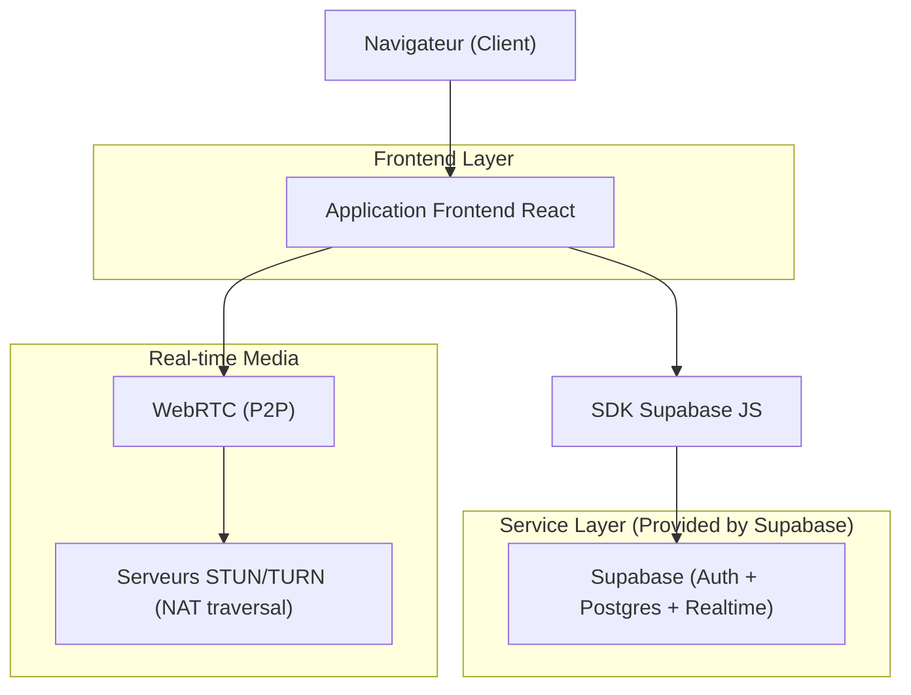
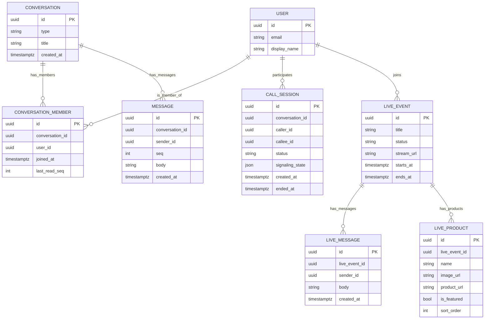

## 1.Architecture design


## 2.Technology Description
- Frontend: React@18 + TypeScript + vite + tailwindcss@3
- Backend: None (Supabase utilisé directement côté client)
- Realtime + Auth + Database: Supabase (PostgreSQL + Realtime + Auth)
- Vidéo: WebRTC (signalisation via Supabase Realtime)

## 3.Route definitions
| Route | Purpose |
|-------|---------|
| /login | Connexion (OTP / SSO si applicable), gestion d’erreurs, redirection |
| /app | Interface Communication en onglets (Chat / Appel vidéo / Live shopping) |

## 6.Data model(if applicable)

### 6.1 Data model definition


### 6.2 Data Definition Language
Remarques :
- Tables conçues pour être simples et pilotées par l’app (pas de contraintes FK physiques).
- Accès recommandé : uniquement pour le rôle `authenticated` (pas d’accès `anon` sur des données privées).

#### Conversations (conversations)
```sql
CREATE TABLE conversations (
  id UUID PRIMARY KEY DEFAULT gen_random_uuid(),
  type TEXT NOT NULL CHECK (type IN ('direct','group')),
  title TEXT,
  created_at TIMESTAMPTZ NOT NULL DEFAULT now()
);

CREATE INDEX idx_conversations_created_at ON conversations (created_at DESC);

GRANT ALL PRIVILEGES ON conversations TO authenticated;
```

#### Membres (conversation_members)
```sql
CREATE TABLE conversation_members (
  id UUID PRIMARY KEY DEFAULT gen_random_uuid(),
  conversation_id UUID NOT NULL,
  user_id UUID NOT NULL,
  joined_at TIMESTAMPTZ NOT NULL DEFAULT now(),
  last_read_seq INT NOT NULL DEFAULT 0
);

CREATE INDEX idx_conv_members_conversation_id ON conversation_members (conversation_id);
CREATE INDEX idx_conv_members_user_id ON conversation_members (user_id);

GRANT ALL PRIVILEGES ON conversation_members TO authenticated;
```

#### Messages (messages)
```sql
CREATE TABLE messages (
  id UUID PRIMARY KEY DEFAULT gen_random_uuid(),
  conversation_id UUID NOT NULL,
  sender_id UUID NOT NULL,
  seq INT NOT NULL,
  body TEXT NOT NULL,
  created_at TIMESTAMPTZ NOT NULL DEFAULT now()
);

CREATE UNIQUE INDEX uq_messages_conversation_seq ON messages (conversation_id, seq);
CREATE INDEX idx_messages_conversation_created_at ON messages (conversation_id, created_at DESC);

GRANT ALL PRIVILEGES ON messages TO authenticated;
```

#### Appels (call_sessions)
```sql
CREATE TABLE call_sessions (
  id UUID PRIMARY KEY DEFAULT gen_random_uuid(),
  conversation_id UUID,
  caller_id UUID NOT NULL,
  callee_id UUID NOT NULL,
  status TEXT NOT NULL CHECK (status IN ('ringing','accepted','rejected','ended','failed')),
  signaling_state JSONB NOT NULL DEFAULT '{}'::jsonb,
  created_at TIMESTAMPTZ NOT NULL DEFAULT now(),
  ended_at TIMESTAMPTZ
);

CREATE INDEX idx_call_sessions_created_at ON call_sessions (created_at DESC);
CREATE INDEX idx_call_sessions_callee_status ON call_sessions (callee_id, status);

GRANT ALL PRIVILEGES ON call_sessions TO authenticated;
```

#### Live shopping (live_events, live_messages, live_products)
```sql
CREATE TABLE live_events (
  id UUID PRIMARY KEY DEFAULT gen_random_uuid(),
  title TEXT NOT NULL,
  status TEXT NOT NULL CHECK (status IN ('scheduled','live','ended')),
  stream_url TEXT,
  starts_at TIMESTAMPTZ,
  ends_at TIMESTAMPTZ
);

CREATE INDEX idx_live_events_status ON live_events (status);

GRANT ALL PRIVILEGES ON live_events TO authenticated;

CREATE TABLE live_messages (
  id UUID PRIMARY KEY DEFAULT gen_random_uuid(),
  live_event_id UUID NOT NULL,
  sender_id UUID NOT NULL,
  body TEXT NOT NULL,
  created_at TIMESTAMPTZ NOT NULL DEFAULT now()
);

CREATE INDEX idx_live_messages_event_created_at ON live_messages (live_event_id, created_at DESC);

GRANT ALL PRIVILEGES ON live_messages TO authenticated;

CREATE TABLE live_products (
  id UUID PRIMARY KEY DEFAULT gen_random_uuid(),
  live_event_id UUID NOT NULL,
  name TEXT NOT NULL,
  image_url TEXT,
  product_url TEXT NOT NULL,
  is_featured BOOLEAN NOT NULL DEFAULT false,
  sort_order INT NOT NULL DEFAULT 0
);

CREATE INDEX idx_live_products_event_sort ON live_products (live_event_id, sort_order);

GRANT ALL PRIVILEGES ON live_products TO authenticated;
```

Notes d’implémentation (client) :
- Chat temps réel : abonnement Realtime sur `messages` filtré par `conversation_id` + mise à jour des non-lus via `last_read_seq`.
- Appel vidéo : WebRTC P2P (1:1) ; signalisation (offer/answer/ICE candidates) échangée via un channel Supabase Realtime et/ou via `call_sessions.signaling_state`.
- Live shopping : lecture du flux via `stream_url` (player) + chat live via `live_messages` en Realtime + produits via `live_products`.
