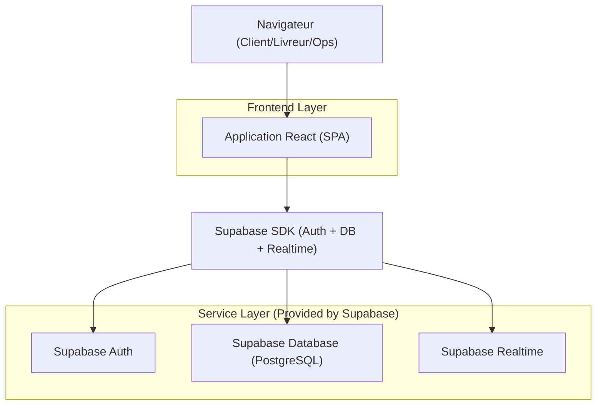
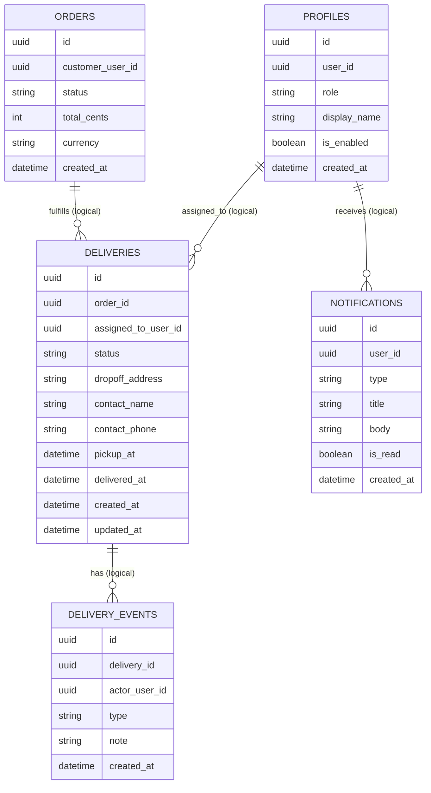

## 1.Architecture design


## 2.Technology Description
- Frontend: React@18 + TypeScript + react-router-dom + tailwindcss@3
- Backend: None (logique via DB + Realtime)
- Auth & Database: Supabase (Auth + PostgreSQL + Realtime)

## 3.Route definitions
| Route | Purpose |
|-------|---------|
| /login | Connexion (livreur/ops) |
| /register | Inscription livreur |
| /livreur | Tableau de bord livreur (missions + notifications + historique) |
| /livreur/deliveries/:deliveryId | Détail livraison / commande + actions |
| /403 | Accès refusé |
| /checkout | Checkout (client) — crée la commande |

## 6.Data model(if applicable)

### 6.1 Data model definition


### 6.2 Data Definition Language
Profiles (profiles)
```
CREATE TABLE profiles (
  id UUID PRIMARY KEY DEFAULT gen_random_uuid(),
  user_id UUID UNIQUE NOT NULL,
  role TEXT NOT NULL CHECK (role IN ('livreur','ops','admin')),
  display_name TEXT,
  is_enabled BOOLEAN NOT NULL DEFAULT FALSE,
  created_at TIMESTAMPTZ NOT NULL DEFAULT NOW()
);
GRANT SELECT ON profiles TO anon;
GRANT ALL PRIVILEGES ON profiles TO authenticated;
ALTER TABLE profiles ENABLE ROW LEVEL SECURITY;
```

Orders (orders)
```
CREATE TABLE orders (
  id UUID PRIMARY KEY DEFAULT gen_random_uuid(),
  customer_user_id UUID NOT NULL,
  status TEXT NOT NULL DEFAULT 'created',
  total_cents INT NOT NULL,
  currency TEXT NOT NULL DEFAULT 'XOF',
  created_at TIMESTAMPTZ NOT NULL DEFAULT NOW()
);
GRANT SELECT ON orders TO anon;
GRANT ALL PRIVILEGES ON orders TO authenticated;
ALTER TABLE orders ENABLE ROW LEVEL SECURITY;
```

Deliveries (deliveries)
```
CREATE TABLE deliveries (
  id UUID PRIMARY KEY DEFAULT gen_random_uuid(),
  order_id UUID NOT NULL,
  assigned_to_user_id UUID NOT NULL,
  status TEXT NOT NULL CHECK (status IN ('a_faire','en_cours','livree','annulee')) DEFAULT 'a_faire',
  dropoff_address TEXT NOT NULL,
  contact_name TEXT,
  contact_phone TEXT,
  pickup_at TIMESTAMPTZ,
  delivered_at TIMESTAMPTZ,
  created_at TIMESTAMPTZ NOT NULL DEFAULT NOW(),
  updated_at TIMESTAMPTZ NOT NULL DEFAULT NOW()
);
GRANT SELECT ON deliveries TO anon;
GRANT ALL PRIVILEGES ON deliveries TO authenticated;
ALTER TABLE deliveries ENABLE ROW LEVEL SECURITY;
```

Delivery events (delivery_events)
```
CREATE TABLE delivery_events (
  id UUID PRIMARY KEY DEFAULT gen_random_uuid(),
  delivery_id UUID NOT NULL,
  actor_user_id UUID NOT NULL,
  type TEXT NOT NULL,
  note TEXT,
  created_at TIMESTAMPTZ NOT NULL DEFAULT NOW()
);
GRANT SELECT ON delivery_events TO anon;
GRANT ALL PRIVILEGES ON delivery_events TO authenticated;
ALTER TABLE delivery_events ENABLE ROW LEVEL SECURITY;
```

Notifications (notifications)
```
CREATE TABLE notifications (
  id UUID PRIMARY KEY DEFAULT gen_random_uuid(),
  user_id UUID NOT NULL,
  type TEXT NOT NULL,
  title TEXT NOT NULL,
  body TEXT,
  is_read BOOLEAN NOT NULL DEFAULT FALSE,
  created_at TIMESTAMPTZ NOT NULL DEFAULT NOW()
);
GRANT SELECT ON notifications TO anon;
GRANT ALL PRIVILEGES ON notifications TO authenticated;
ALTER TABLE notifications ENABLE ROW LEVEL SECURITY;
```

Realtime (principe)
- Le dashboard livreur s’abonne en temps réel aux changements sur `deliveries` (assignées) et aux insertions sur `notifications`.
- Les changements de statut écrivent un `delivery_events` puis mettent à jour `deliveries.status` (décl