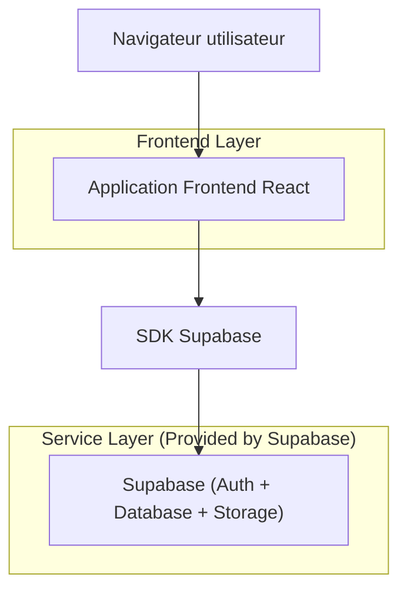
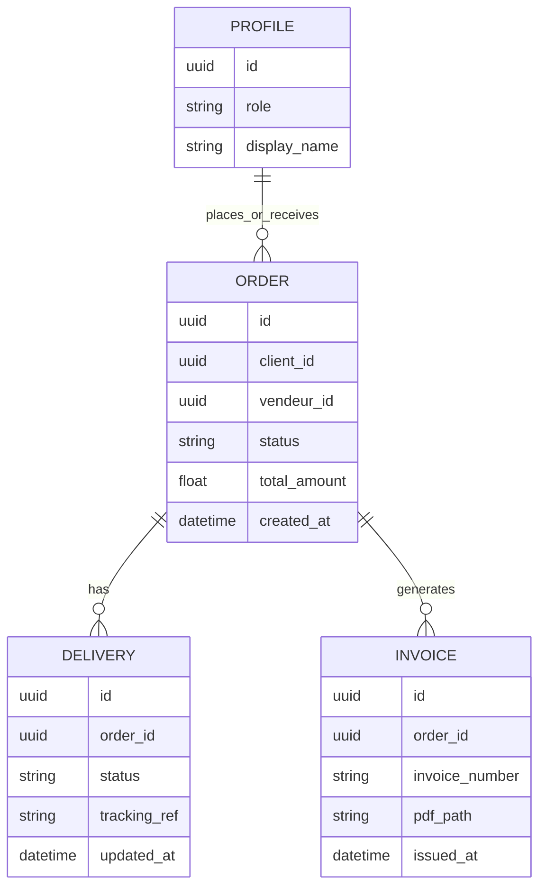

## 1.Architecture design


## 2.Technology Description
- Frontend: React@18 + vite + tailwindcss@3
- Backend: Supabase (Auth + PostgreSQL + Storage)

## 3.Route definitions
| Route | Purpose |
|-------|---------|
| /login | Connexion et redirection vers l’espace Client/Vendeur |
| /compte/client | Espace compte Client (boussole + modules) |
| /compte/vendeur | Espace compte Vendeur (boussole + modules) |

## 6.Data model(if applicable)

### 6.1 Data model definition


### 6.2 Data Definition Language
Profile (profiles)
```sql
CREATE TABLE profiles (
  id UUID PRIMARY KEY,
  role VARCHAR(20) NOT NULL CHECK (role IN ('client','vendeur')),
  display_name VARCHAR(120),
  created_at TIMESTAMPTZ DEFAULT NOW()
);

GRANT SELECT ON profiles TO anon;
GRANT ALL PRIVILEGES ON profiles TO authenticated;
```

Commandes (orders)
```sql
CREATE TABLE orders (
  id UUID PRIMARY KEY DEFAULT gen_random_uuid(),
  client_id UUID NOT NULL,
  vendeur_id UUID NOT NULL,
  status VARCHAR(30) NOT NULL,
  total_amount NUMERIC(12,2) NOT NULL DEFAULT 0,
  created_at TIMESTAMPTZ DEFAULT NOW()
);

CREATE INDEX idx_orders_client_id ON orders(client_id);
CREATE INDEX idx_orders_vendeur_id ON orders(vendeur_id);

GRANT SELECT ON orders TO anon;
GRANT ALL PRIVILEGES ON orders TO authenticated;
```

Livraisons (deliveries)
```sql
CREATE TABLE deliveries (
  id UUID PRIMARY KEY DEFAULT gen_random_uuid(),
  order_id UUID NOT NULL,
  status VARCHAR(30) NOT NULL,
  tracking_ref VARCHAR(80),
  updated_at TIMESTAMPTZ DEFAULT NOW()
);

CREATE INDEX idx_deliveries_order_id ON deliveries(order_id);

GRANT SELECT ON deliveries TO anon;
GRANT ALL PRIVILEGES ON deliveries TO authenticated;
```

Factures (invoices)
```sql
CREATE TABLE invoices (
  id UUID PRIMARY KEY DEFAULT gen_random_uuid(),
  order_id UUID NOT NULL,
  invoice_number VARCHAR(40) NOT NULL