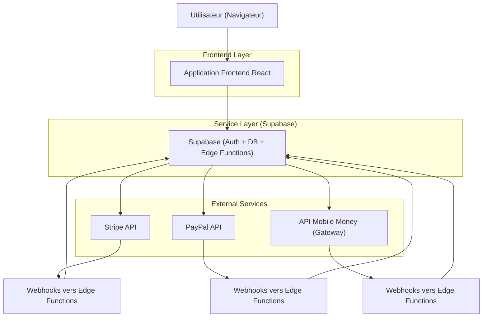
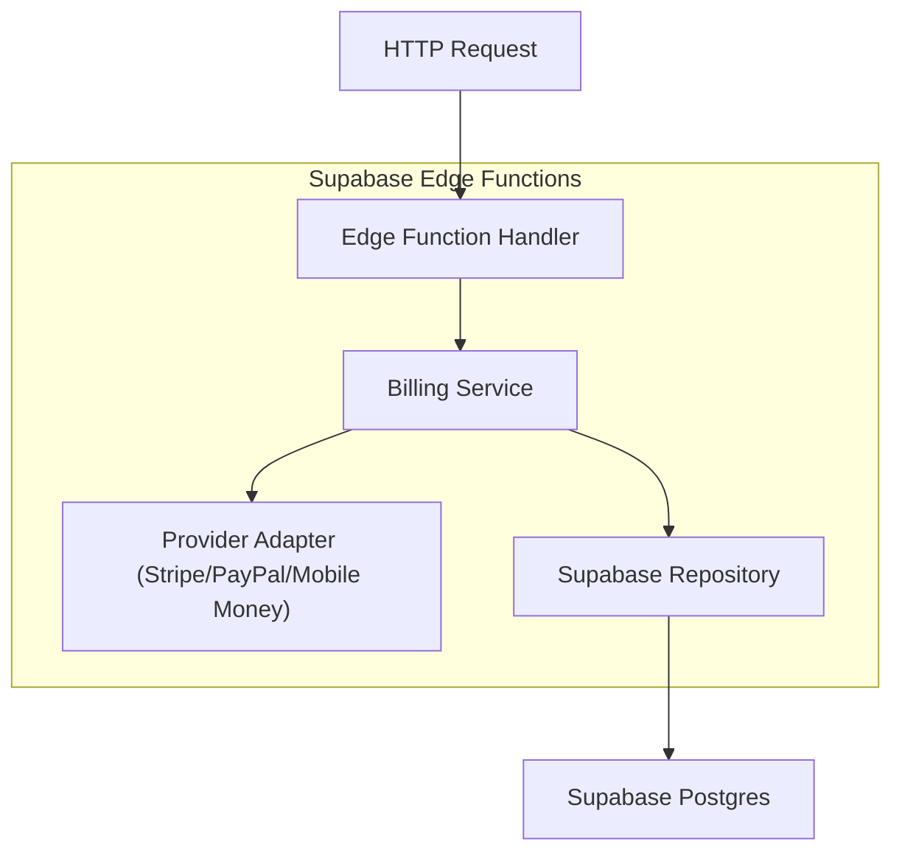
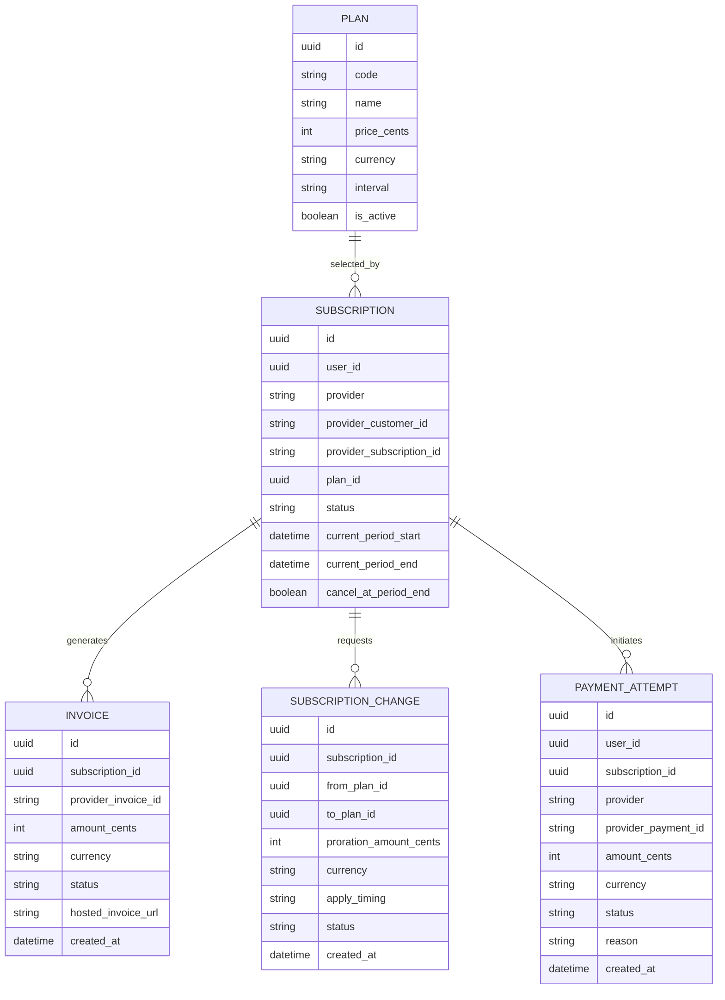

## 1.Architecture design


## 2.Technology Description
- Frontend: React@18 + TypeScript + vite + tailwindcss@3
- Backend: Supabase (Auth, PostgreSQL, Edge Functions)
- Paiements: Stripe (Billing/Checkout), PayPal (Orders/Subscriptions), Mobile Money via Gateway API

## 3.Route definitions
| Route | Purpose |
|-------|---------|
| /auth | Inscription, connexion, reset mot de passe |
| /plans | Choix et comparaison des plans |
| /checkout | Choix du moyen de paiement + lancement paiement |
| /checkout/success | Retour succès après paiement |
| /checkout/cancel | Retour annulation/échec |
| /account/subscription | Gestion abonnement (statuts, upgrade/downgrade prorata, annulation, factures) |

## 4.API definitions (If it includes backend services)

### 4.1 Edge Functions (HTTP)
Paiement (init / retour)
- POST /functions/v1/billing/create-checkout-session (Stripe)
- POST /functions/v1/billing/create-paypal-order
- POST /functions/v1/billing/capture-paypal-order
- POST /functions/v1/billing/init-mobile-money

Gestion d’abonnement
- POST /functions/v1/billing/proration-quote (calcul/preview)
- POST /functions/v1/billing/change-plan (upgrade/downgrade)
- POST /functions/v1/billing/cancel-subscription
- POST /functions/v1/billing/reactivate-subscription

Webhooks (confirmation asynchrone)
- POST /functions/v1/webhooks/stripe
- POST /functions/v1/webhooks/paypal
- POST /functions/v1/webhooks/mobile-money

Lecture (front)
- GET /functions/v1/billing/me (abonnement + statut)
- GET /functions/v1/billing/invoices (factures/reçus)

### 4.2 Types TypeScript partagés
```ts
export type PlanInterval = "month" | "year";

export type PaymentProvider = "stripe" | "paypal" | "mobile_money";

export type Plan = {
  id: string;
  code: string; // ex: "basic", "pro"
  name: string;
  price_cents: number;
  currency: string; // ex: "XOF", "EUR"
  interval: PlanInterval;
  is_active: boolean;
};

// Statuts côté produit (unifiés) — indépendants des statuts natifs des prestataires
export type SubscriptionStatus =
  | "none"                 // pas d’abonnement
  | "pending_payment"      // paiement initié, non confirmé
  | "active"               // accès OK
  | "past_due"             // échec renouvellement récent
  | "canceling"            // annulation à fin de période (cancel_at_period_end)
  | "canceled"             // fin effective
  | "unpaid";              // accès coupé après échecs répétés

export type Subscription = {
  id: string;
  user_id: string;
  provider: PaymentProvider;
  provider_customer_id: string | null;
  provider_subscription_id: string | null;
  plan_id: string | null;
  status: SubscriptionStatus;
  current_period_start: string | null; // ISO
  current_period_end: string | null;   // ISO
  cancel_at_period_end: boolean;
};

export type PaymentAttemptStatus = "created" | "pending" | "succeeded" | "failed" | "canceled";

export type PaymentAttempt = {
  id: string;
  user_id: string;
  provider: PaymentProvider;
  provider_payment_id: string | null; // checkout_session_id / paypal_order_id / gateway_tx_id
  amount_cents: number;
  currency: string;
  status: PaymentAttemptStatus;
  reason: string | null; // message échec/cancel
  created_at: string;
};

export type ChangePlanRequest = {
  subscription_id: string;
  target_plan_id: string;
  apply_timing: "immediate" | "period_end";
};

export type ProrationQuote = {
  currency: string;
  amount_cents: number; // positif = à payer, négatif = crédit
  description: string;
};
```

## 5.Server architecture diagram (If it includes backend services)


## 6.Data model(if applicable)

### 6.1 Data model definition


### 6.2 Data Definition Language
Plans (plans) — lecture publique possible
```sql
CREATE TABLE plans (
  id UUID PRIMARY KEY DEFAULT gen_random_uuid(),
  code TEXT UNIQUE NOT NULL,
  name TEXT NOT NULL,
  price_cents INTEGER NOT NULL,
  currency TEXT NOT NULL,
  interval TEXT NOT NULL CHECK (interval IN ('month','year')),
  is_active BOOLEAN NOT NULL DEFAULT TRUE,
  created_at TIMESTAMPTZ NOT NULL DEFAULT NOW()
);

-- lecture anonyme OK pour afficher les plans
GRANT SELECT ON plans TO anon;
GRANT ALL PRIVILEGES ON plans TO authenticated;
```

Abonnements & paiement — données sensibles
```sql
CREATE TABLE subscriptions (
  id UUID PRIMARY KEY DEFAULT gen_random_uuid(),
  user_id UUID NOT NULL,
  provider TEXT NOT NULL CHECK (provider IN ('stripe','paypal','mobile_money')),
  provider_customer_id TEXT,
  provider_subscription_id TEXT,
  plan_id UUID,
  status TEXT NOT NULL CHECK (status IN ('none','pending_payment','active','past_due','canceling','canceled','unpaid')),
  current_period_start TIMESTAMPTZ,
  current_period_end TIMESTAMPTZ,
  cancel_at_period_end BOOLEAN NOT NULL DEFAULT FALSE,
  created_at TIMESTAMPTZ NOT NULL DEFAULT NOW(),
  updated_at TIMESTAMPTZ NOT NULL DEFAULT NOW()
);

CREATE TABLE payment_attempts (
  id UUID PRIMARY KEY DEFAULT gen_random_uuid(),
  user_id UUID NOT NULL,
  subscription_id UUID,
  provider TEXT NOT NULL CHECK (provider IN ('stripe','paypal','mobile_money')),
  provider_payment_id TEXT,
  amount_cents INTEGER NOT NULL,
  currency TEXT NOT NULL,
  status TEXT NOT NULL CHECK (status IN ('created','pending','succeeded','failed','canceled')),
  reason TEXT,
  created_at TIMESTAMPTZ NOT NULL DEFAULT NOW()
);

CREATE TABLE invoices (
  id UUID PRIMARY KEY DEFAULT gen_random_uuid(),
  subscription_id UUID NOT NULL,
  provider_invoice_id TEXT,
  amount_cents INTEGER NOT NULL,
  currency TEXT NOT NULL,
  status TEXT NOT NULL,
  hosted_invoice_url TEXT,
  created_at TIMESTAMPTZ NOT NULL DEFAULT NOW()
);

CREATE TABLE subscription_changes (
  id UUID PRIMARY KEY DEFAULT gen_random_uuid(),
  subscription_id UUID NOT NULL,
  from_plan_id UUID NOT NULL,
  to_plan_id UUID NOT NULL,
  proration_amount_cents INTEGER NOT NULL,
  currency TEXT NOT NULL,
  apply_timing TEXT NOT NULL CHECK (apply_timing IN ('immediate','period_end')),
  status TEXT NOT NULL,
  created_at TIMESTAMPTZ NOT NULL DEFAULT NOW()
);

CREATE INDEX idx_subscriptions_user_id ON subscriptions(user_id);
CREATE INDEX idx_payment_attempts_user_id ON payment_attempts(user_id);
CREATE INDEX idx_invoices_subscription_id ON invoices(subscription_id);

-- pas d’accès anon sur ces tables
REVOKE ALL ON subscriptions FROM anon;
REVOKE ALL ON payment_attempts FROM anon;
REVOKE ALL ON invoices FROM anon;
REVOKE ALL ON subscription_changes FROM anon;
GRANT ALL PRIVILEGES ON subscriptions TO authenticated;
GRANT ALL PRIVILEGES ON payment_attempts TO authenticated;
GRANT ALL PRIVILEGES ON invoices TO authenticated;
GRANT ALL PRIVILEGES ON subscription_changes TO authenticated;
```

### 6.3 Politique statuts & transitions (produit)
- La **source de vérité** de l’activation/cycle est la confirmation asynchrone (webhooks).
- Le front peut afficher “en attente” après redirection, puis basculer après webhook.

Table de transitions (simplifiée)
- none → pending_payment : après init paiement
- pending_payment → active : après webhook succès / capture confirmé
- pending_payment → failed/canceled (au niveau payment_attempt) : si abandon/échec
- active → past_due : renouvellement échoué (selon prestataire)
- past_due → active : paiement régularisé
- active → canceling : annulation à fin de période
- canceling → canceled : échéance atteinte
- past_due → unpaid : échecs répétés + accès coupé

### Notes sécurité (essentielles)
- Utiliser RLS pour limiter subscriptions/payment_attempts/invoices/subscription_changes à `auth.uid() = user_id`.
- Vérifier la signature des webhooks (Stripe/PayPal/Mobile Money) avant toute mise à jour.
- Stocker les secrets (clés API, secrets webhook) uniquement côté Edge Functions (variables d’environnement Supabase).
- Rendre les handlers idempotents (même événement webhook reçu plusieurs fois).
