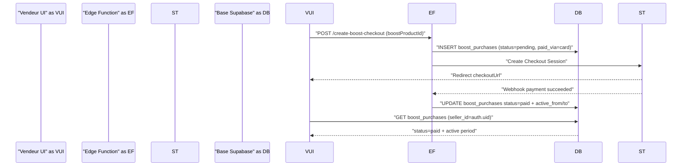

# Design des pages — Boost (Admin ↔ Vendeur) v2
Approche desktop-first.

## Global (toutes les pages)
### Layout
- Structure: CSS Grid (header / content), composants internes en Flexbox.
- Conteneur: 1200px max, centré, padding 24px.
- Breakpoints: 1200 / 992 / 768 / 480 (mobile: empilement, tables → cartes).

### Meta
- Title pattern: "{Page} | Boost"
- Description: "Configurer et acheter des boosts de visibilité."

### Global styles (tokens)
- Background #0B0F17, Surface #111827, Texte #E5E7EB
- Primaire #6366F1, Succès #22C55E, Danger #EF4444, Warning #F59E0B
- Typo: Inter (ou system-ui), 14/16/20/24/32
- Boutons: radius 10px; hover +6% luminosité; disabled opacity 40%

---

## Page: Connexion (/login)
### Page structure
- Grid 2 colonnes (60/40) desktop: branding à gauche, carte formulaire à droite.

### Sections & components
- Carte “Connexion”
  - Champs: identifiant (email/téléphone) + mot de passe/OTP
  - CTA: “Se connecter”
  - Zone erreur
- Post-login routing
  - Loader court puis redirection selon `role`.

---

## Page: Écran vendeur — Acheter un boost (/vendeur/boost)
### Page structure
- 2 colonnes: catalogue (70%) + panneau “Crédits & Statut” (30%).

### Sections & components
- Bandeau “Boost actif” (si achat `paid` actif)
  - Badge + `active_from`/`active_to` + compteur temps restant

- Catalogue Boosts (cards) — source `boost_products`
  - Affiche: `name`, `description`, `duration_minutes`, `price_cents`, `credits_cost`
  - États:
    - `is_active=false`: carte grisée + CTA désactivé

- Modal “Confirmer l’achat”
  - Récap: boost + durée + prix
  - Choix mode:
    - “Payer par crédits” (affiche `seller_credits.balance` + warning insuffisant)
    - “Payer par carte”
  - CTA primaire: “Continuer” (crédits: exécute /purchase-boost-with-credits ; carte: /create-boost-checkout)

- Panneau “Crédits & Statut”
  - Solde: `balance`
  - Statut dernier achat: `status` (pending/paid/failed/canceled/refunded)
  - Si pending: message “confirmation en cours” + bouton “Rafraîchir”

- Historique (table)
  - Colonnes: `created_at`, boost, `paid_via`, `amount_cents`/`credits_cost`, `status`, `stripe_session_id`

---

## Page: Admin Boost (/admin/boost)
### Page structure
- Header admin + Tabs: “Boosts” | “Règles crédits” | “Achats”.
- Desktop: table + drawer d’édition à droite.

### Sections & components
- Tab “Boosts” (table `boost_products`)
  - Table: `name`, `duration_minutes`, `price_cents`, `credits_cost`, `is_active`
  - Actions: éditer, activer/désactiver
  - Drawer “Créer/Éditer” (mapping exact champs)
    - `name` (texte, requis)
    - `description` (texte)
    - `duration_minutes` (entier, requis)
    - `price_cents` (input € → converti en cents)
    - `credits_cost` (entier)
    - `is_active` (switch)

- Tab “Règles crédits” (table `credit_rules`)
  - Champ: `credits_per_eur` (+ switch `is_active` si plusieurs règles)
  - CTA: “Mettre à jour”

- Tab “Achats” (table `boost_purchases`)
  - Filtres: `status`, période, `seller_id`
  - Table: `seller_id`, `boost_product_id`, `paid_via`, `amount_cents`, `currency`, `status`, `created_at`, `stripe_session_id`
  - Drawer détail:
    - Timeline: `pending → paid` (ou `failed/canceled/refunded`)
    - Champs: `stripe_payment_intent_id`, `active_from`, `active_to`

---

## Maquettes d’interactions Admin Boost ↔ Vendeur Boost

### Contrat d’interaction (ce que l’admin change et ce que le vendeur voit)
| Action admin | Donnée modifiée | Impact visible côté vendeur |
|------------|------------------|----------------------------|
| Créer un boost | `boost_products.*` | Nouvelle carte dans le catalogue |
| Désactiver un boost | `boost_products.is_active=false` | Carte grisée + CTA indisponible |
| Modifier prix / coût crédits | `price_cents`, `credits_cost` | Prix/Crédits mis à jour dans cartes + modal |
| Changer équivalence crédits | `credit_rules.credits_per_eur` | Texte d’aide dans modal (ex: “≈ X€” pour Y crédits) |
| Suivre un achat | `boost_purchases.status` | Statut vendeur synchronisé (pending/paid/échec) |

### Wireframes (desktop, texte)
**Vendeur /vendeur/boost**
- [Header] Logo | Nom vendeur | Déconnexion
- [Bandeau] “Boost actif” (si actif) | dates | compteur
- [Colonne gauche] Cartes boosts (grid 2 colonnes)
  - Carte: Titre | durée | prix | crédits | [Acheter]
- [Colonne droite] Solde crédits (grand) | Dernier statut | [Rafraîchir]
- [Bas] Historique (table)

**Admin /admin/boost**
- [Header] Logo | Badge Admin | Déconnexion
- [Tabs] Boosts | Règles crédits | Achats
- [Boosts] Table + [Nouveau boost] | Drawer édition
- [Achats] Table + filtres | Drawer détail achat

### Séquences d’interaction (statuts d’achat)

### États UI obligatoires
- Pending: CTA achat bloqué si un `boost_purchases.status=pending` existe (anti double achat).
- Insufficient credits: option “Payer par crédits” désactivée + message.
- Paid: affichage période `active_from/active_to` + toast “Boost activé”.
- Failed/Canceled: message +