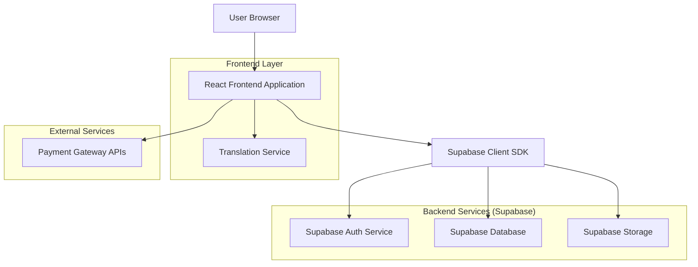
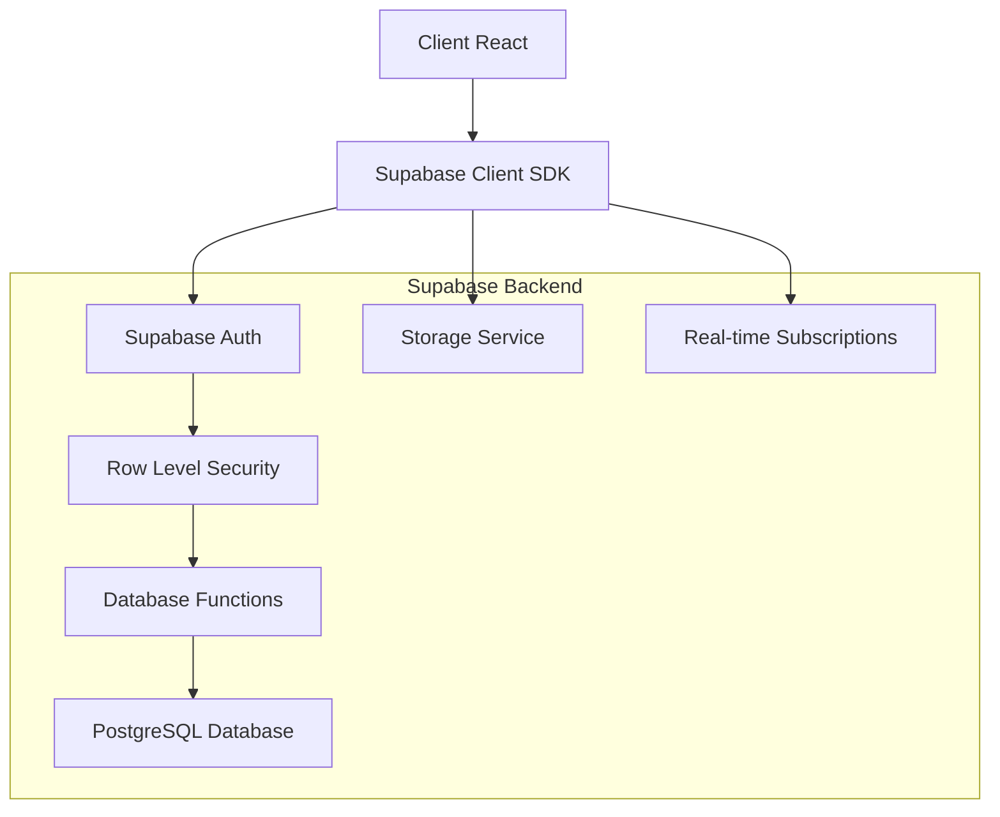
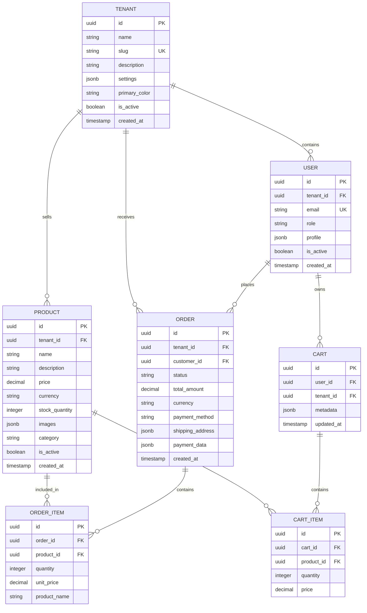

## 1. Architecture design



## 2. Technology Description

- **Frontend**: React@18 + TypeScript@5 + Vite@4 + TailwindCSS@3
- **Backend**: Supabase (PostgreSQL, Auth, Storage, Real-time)
- **État global**: Zustand@4
- **Routing**: React Router@6
- **Formulaires**: React Hook Form + Zod
- **UI Components**: HeadlessUI + Heroicons
- **Paiements**: Intégration APIs locales (MTN Money, Orange Money, Wave)
- **Internationalisation**: i18next@23

## 3. Route definitions

| Route | Purpose |
|-------|---------|
| / | Landing page principale avec sélection tenant |
| /:tenantSlug | Homepage du tenant spécifique |
| /:tenantSlug/shop | Catalogue produits du tenant |
| /:tenantSlug/product/:id | Détails produit |
| /:tenantSlug/cart | Panier client |
| /:tenantSlug/checkout | Processus de commande et paiement |
| /:tenantSlug/order/:id | Confirmation et suivi commande |
| /seller/dashboard | Dashboard vendeur principal |
| /seller/products | Gestion des produits |
| /seller/orders | Gestion des commandes |
| /seller/analytics | Statistiques et rapports |
| /customer/profile | Profil client |
| /customer/orders | Historique des commandes |
| /auth/login | Page de connexion |
| /auth/register | Page d'inscription |
| /admin/tenants | Gestion des tenants |
| /admin/analytics | Vue d'ensemble plateforme |

## 4. API definitions

### 4.1 Authentication APIs

```
POST /auth/v1/token
```

Request:
| Param Name | Param Type | isRequired | Description |
|------------|------------|------------|-------------|
| email | string | true | Email de l'utilisateur |
| password | string | true | Mot de passe |

Response:
| Param Name | Param Type | Description |
|------------|------------|-------------|
| access_token | string | JWT token pour l'authentification |
| user | object | Données utilisateur |
| tenant_id | string | ID du tenant associé (si applicable) |

### 4.2 Tenant Management APIs

```
GET /rest/v1/tenants
```

Headers: `Authorization: Bearer {token}`

Response:
```json
{
  "id": "uuid",
  "name": "string",
  "slug": "string",
  "description": "string",
  "primary_color": "string",
  "logo_url": "string",
  "owner_id": "uuid",
  "is_active": "boolean"
}
```

### 4.3 Product APIs

```
GET /rest/v1/products?tenant_id=eq.{id}
```

Response:
```json
{
  "id": "uuid",
  "tenant_id": "uuid",
  "name": "string",
  "description": "string",
  "price": "number",
  "currency": "string",
  "stock_quantity": "number",
  "images": "array",
  "category": "string",
  "is_active": "boolean"
}
```

### 4.4 Order APIs

```
POST /rest/v1/orders
```

Request:
| Param Name | Param Type | isRequired | Description |
|------------|------------|------------|-------------|
| tenant_id | uuid | true | ID du tenant |
| customer_id | uuid | true | ID du client |
| items | array | true | Liste des produits |
| total_amount | number | true | Montant total |
| payment_method | string | true | Méthode de paiement |
| shipping_address | object | true | Adresse de livraison |

## 5. Server architecture diagram



## 6. Data model

### 6.1 Modèle de données



### 6.2 Langage de définition des données

```sql
-- Table des tenants
CREATE TABLE tenants (
    id UUID PRIMARY KEY DEFAULT gen_random_uuid(),
    name VARCHAR(255) NOT NULL,
    slug VARCHAR(255) UNIQUE NOT NULL,
    description TEXT,
    settings JSONB DEFAULT '{}',
    primary_color VARCHAR(7) DEFAULT '#FF6B35',
    logo_url TEXT,
    owner_id UUID REFERENCES auth.users(id),
    is_active BOOLEAN DEFAULT true,
    created_at TIMESTAMP WITH TIME ZONE DEFAULT NOW()
);

-- Table des utilisateurs (extension de auth.users)
CREATE TABLE users (
    id UUID PRIMARY KEY DEFAULT gen_random_uuid(),
    tenant_id UUID REFERENCES tenants(id) ON DELETE CASCADE,
    email VARCHAR(255) UNIQUE NOT NULL,
    role VARCHAR(20) DEFAULT 'customer' CHECK (role IN ('admin', 'seller', 'customer')),
    profile JSONB DEFAULT '{}',
    is_active BOOLEAN DEFAULT true,
    created_at TIMESTAMP WITH TIME ZONE DEFAULT NOW()
);

-- Table des produits
CREATE TABLE products (
    id UUID PRIMARY KEY DEFAULT gen_random_uuid(),
    tenant_id UUID REFERENCES tenants(id) ON DELETE CASCADE,
    name VARCHAR(255) NOT NULL,
    description TEXT,
    price DECIMAL(10,2) NOT NULL,
    currency VARCHAR(3) DEFAULT 'XOF',
    stock_quantity INTEGER DEFAULT 0,
    images JSONB DEFAULT '[]',
    category VARCHAR(100),
    is_active BOOLEAN DEFAULT true,
    created_at TIMESTAMP WITH TIME ZONE DEFAULT NOW()
);

-- Table des commandes
CREATE TABLE orders (
    id UUID PRIMARY KEY DEFAULT gen_random_uuid(),
    tenant_id UUID REFERENCES tenants(id) ON DELETE CASCADE,
    customer_id UUID REFERENCES users(id),
    status VARCHAR(20) DEFAULT 'pending' CHECK (status IN ('pending', 'confirmed', 'shipped', 'delivered', 'cancelled')),
    total_amount DECIMAL(10,2) NOT NULL,
    currency VARCHAR(3) DEFAULT 'XOF',
    payment_method VARCHAR(50),
    shipping_address JSONB,
    payment_data JSONB,
    created_at TIMESTAMP WITH TIME ZONE DEFAULT NOW()
);

-- Table des lignes de commande
CREATE TABLE order_items (
    id UUID PRIMARY KEY DEFAULT gen_random_uuid(),
    order_id UUID REFERENCES orders(id) ON DELETE CASCADE,
    product_id UUID REFERENCES products(id),
    quantity INTEGER NOT NULL,
    unit_price DECIMAL(10,2) NOT NULL,
    product_name VARCHAR(255) NOT NULL
);

-- Index pour performances
CREATE INDEX idx_tenants_slug ON tenants(slug);
CREATE INDEX idx_products_tenant ON products(tenant_id);
CREATE INDEX idx_products_category ON products(category);
CREATE INDEX idx_orders_tenant ON orders(tenant_id);
CREATE INDEX idx_orders_customer ON orders(customer_id);
CREATE INDEX idx_orders_status ON orders(status);

-- Politiques RLS (Row Level Security)
ALTER TABLE tenants ENABLE ROW LEVEL SECURITY;
ALTER TABLE users ENABLE ROW LEVEL SECURITY;
ALTER TABLE products ENABLE ROW LEVEL SECURITY;
ALTER TABLE orders ENABLE ROW LEVEL SECURITY;
ALTER TABLE order_items ENABLE ROW LEVEL SECURITY;

-- Politiques d'accès
CREATE POLICY "Tenants are viewable by everyone" ON tenants FOR SELECT USING (is_active = true);
CREATE POLICY "Users can view their own data" ON users FOR SELECT USING (auth.uid() = id);
CREATE POLICY "Products are viewable by tenant" ON products FOR SELECT USING (is_active = true);
CREATE POLICY "Users can manage their orders" ON orders FOR ALL USING (auth.uid() = customer_id);

-- Permissions
GRANT SELECT ON tenants TO anon;
GRANT SELECT ON products TO anon;
GRANT ALL ON users TO authenticated;
GRANT ALL ON orders TO authenticated;
GRANT ALL ON order_items TO authenticated;