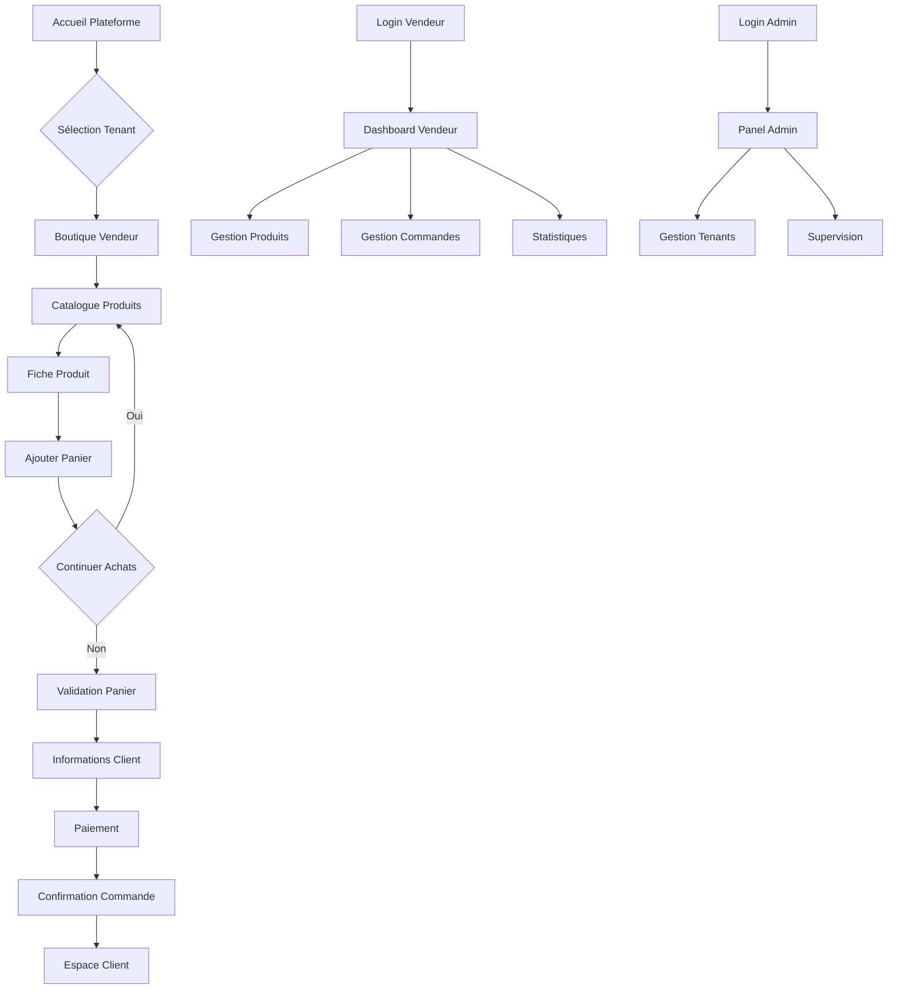

## 1. Vue d'ensemble du produit

MangooTech est une plateforme e-commerce multi-tenant qui permet aux vendeurs de créer leur propre boutique en ligne personnalisée. La plateforme offre une solution complète de gestion de vente avec support multilingue et paiements locaux adaptés aux marchés africains.

- **Problème résolu** : Manque de solutions e-commerce adaptées aux spécificités locales (paiements, langues, logistique)
- **Utilisateurs** : Administrateurs système, vendeurs/commerçants, clients/acheteurs
- **Valeur marché** : Plateforme SaaS de e-commerce localisée pour le marché africain

## 2. Fonctionnalités principales

### 2.1 Rôles utilisateurs

| Rôle | Méthode d'inscription | Permissions principales |
|------|----------------------|------------------------|
| Administrateur | Création manuelle par le système | Gestion complète de la plateforme, création/suppression de tenants, accès à toutes les données |
| Vendeur | Inscription libre + validation | Gestion de sa boutique, produits, commandes, statistiques de vente |
| Client | Inscription libre | Parcourir les boutiques, passer commandes, suivre les livraisons |

### 2.2 Modules de fonctionnalités

La plateforme MangooTech comprend les pages suivantes :

1. **Page d'accueil générale** : Présentation de la plateforme, sélection du tenant/boutique
2. **Boutique vendeur** : Catalogue produits, recherche, filtrage, fiche produit
3. **Panier et paiement** : Gestion du panier, processus de commande, paiement local
4. **Espace vendeur** : Dashboard, gestion produits, commandes, statistiques
5. **Espace client** : Historique commandes, profil, suivre livraison
6. **Administration système** : Gestion tenants, supervision, configuration
7. **Pages authentification** : Login, inscription, récupération mot de passe

### 2.3 Détails des pages

| Page | Module | Description fonctionnalité |
|------|--------|---------------------------|
| Page d'accueil | Sélection tenant | Afficher la liste des boutiques disponibles avec recherche et filtrage |
| Page d'accueil | Présentation | Présenter la plateforme avec statistiques générales et témoignages |
| Boutique vendeur | Header | Logo tenant, navigation, sélecteur langue, panier client |
| Boutique vendeur | Catalogue | Grille produits avec pagination, tri, filtres par catégorie/prix |
| Boutique vendeur | Fiche produit | Images zoom, description détaillée, prix, stock, bouton ajouter panier |
| Panier | Vue d'ensemble | Liste produits avec quantités modifiables, total calculé en temps réel |
| Panier | Paiement | Formulaire coordonnées, méthodes paiement local (Mobile Money, carte), validation |
| Dashboard vendeur | Vue générale | Chiffre clés du jour, graphiques ventes, alertes stock faible |
| Dashboard vendeur | Gestion produits | CRUD produits avec images, catégories, prix, stock |
| Dashboard vendeur | Commandes | Liste commandes avec statuts, détails, mise à jour statut livraison |
| Espace client | Profil | Informations personnelles, adresses de livraison sauvegardées |
| Espace client | Commandes | Historique avec filtres, détails commande, suivi livraison |
| Admin système | Tenants | Créer/modifier/supprimer des tenants, configurer domaines |
| Admin système | Supervision | Vue d'ensemble activité plateforme, logs, statistiques globales |
| Authentification | Login/Inscription | Formulaires multilingues avec validation, OAuth optionnel |

## 3. Processus principaux

### Flux Administrateur
L'administrateur accède au panel d'administration via une URL spéciale. Il peut créer de nouveaux tenants (vendeurs), configurer leurs paramètres, superviser l'activité globale et gérer les incidents.

### Flux Vendeur
Le vendeur s'inscrit sur la plateforme, configure sa boutique (nom, logo, couleurs), ajoute ses produits, définit ses méthodes de paiement et peut ensuite gérer ses commandes et suivre ses performances.

### Flux Client
Le client choisit une boutique, parcourt le catalogue, ajoute des produits à son panier, passe commande en choisissant sa méthode de paiement locale préférée, et peut suivre l'état de sa commande.

## 4. Interface utilisateur

### 4.1 Style de design

- **Couleurs principales** : Orange (#FF6B35) pour les actions principales, Vert (#4CAF50) pour les validations/succès, Blanc (#FFFFFF) pour le fond
- **Couleurs secondaires** : Gris clair (#F5F5F5) pour les fonds de cartes, Orange foncé (#E55A2B) pour les survols
- **Boutons** : Style arrondi avec ombres subtiles, effet hover avec changement de teinte
- **Typographie** : Inter pour les titres (24px, 18px, 16px), Roboto pour le corps (14px)
- **Layout** : Design card-based avec espacement généreux, navigation top-bar fixe
- **Icônes** : Style Material Design avec couleurs adaptées à la charte

### 4.2 Vue d'ensemble des pages

| Page | Module | Éléments UI |
|------|--------|-------------|
| Accueil | Hero section | Bannière orange avec titre blanc, CTA vert, animations subtiles |
| Accueil | Grille tenants | Cards 3 colonnes avec logo, nom, description, bouton "Visiter" |
| Boutique | Header | Logo tenant à gauche, menu navigation centre, panier droite |
| Boutique | Catalogue | Grille responsive produits, cards avec image 16:9, prix orange |
| Produit | Galerie | Carousel images avec zoom au survol, miniatures en bas |
| Produit | Info produit | Titre vert, prix orange en gras, sélecteur quantité, CTA orange |
| Panier | Résumé | Table produits avec images miniatures, totaux à droite |
| Paiement | Formulaire | Champs groupés par section, boutons radio méthodes paiement |
| Dashboard | Sidebar | Navigation latérale verte, icônes blanches, active state orange |
| Dashboard | Widgets | Cards avec bordures oranges, graphiques en couleurs de la charte |

### 4.3 Responsive design

- **Desktop-first** : Design optimisé pour écrans 1200px+
- **Mobile adaptatif** : Breakpoints à 768px et 480px
- **Touch optimisé** : Boutons minimum 44px, espacement adapté pour le tactile
- **Navigation mobile** : Menu hamburger avec drawer latéral, barre inférieure pour actions rapides