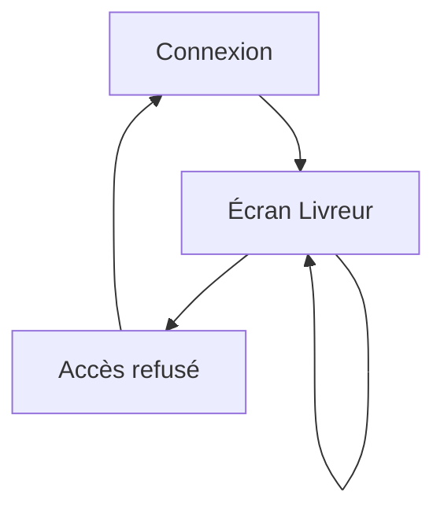

## 1. Product Overview
Écran web “Livreur” pour consulter tes livraisons du jour, les visualiser sur une carte OpenStreetMap et obtenir un itinéraire sans Google.
Le produit sécurise l’accès par rôle et limite chaque livreur à ses propres livraisons.

## 2. Core Features

### 2.1 User Roles
| Rôle | Méthode d’inscription | Permissions cœur |
|------|------------------------|------------------|
| Livreur | Compte créé par un admin/ops (email + mot de passe) | Accéder à l’écran livreur, voir uniquement ses livraisons, afficher la carte/itinéraire, mettre à jour le statut (ex: “En cours”, “Livré”) |
| Ops / Admin | Compte interne (email + mot de passe) | Accéder à l’écran livreur à des fins de contrôle, voir les livraisons (selon règles internes), gérer les rôles |

### 2.2 Feature Module
Les exigences se composent des pages principales suivantes :
1. **Connexion** : saisie identifiants, ouverture de session, gestion erreurs.
2. **Écran Livreur** : liste des livraisons, carte OSM, itinéraire via `/api/routing`, mise à jour statut, contrôles d’accès.
3. **Accès refusé** : message clair quand ton rôle ne permet pas l’accès.

### 2.3 Page Details
| Page Name | Module Name | Feature description |
|-----------|-------------|---------------------|
| Connexion | Authentification | Se connecter via email/mot de passe, afficher les erreurs, rediriger vers l’écran livreur après succès |
| Connexion | Session | Maintenir la session, proposer “se déconnecter” une fois connecté |
| Écran Livreur | Contrôle d’accès | Vérifier que ton rôle autorise la page, sinon rediriger vers “Accès refusé” |
| Écran Livreur | Liste livraisons | Afficher tes livraisons assignées (ex: du jour), trier par ordre/heure, filtrer par statut |
| Écran Livreur | Détail livraison | Ouvrir un panneau (ou section) avec adresse, consignes, contact, statut actuel |
| Écran Livreur | Carte OSM | Afficher une carte OpenStreetMap avec marqueurs pour les points de livraison + ta position (si autorisée) |
| Écran Livreur | Itinéraire | Calculer et afficher le trajet (polyligne) via `/api/routing` à partir d’un départ (ta position ou dépôt) vers une ou plusieurs livraisons sélectionnées |
| Écran Livreur | Mise à jour statut | Changer le statut d’une livraison (ex: “En cours”, “Livré”), refléter la mise à jour en liste et carte |
| Accès refusé | Information | Expliquer l’interdiction d’accès et proposer retour vers connexion / déconnexion |

## 3. Core Process
**Flux Livreur**
1. Tu te connectes.
2. Le système vérifie ton rôle.
3. Tu vois la liste de tes livraisons assignées et la carte OSM.
4. Tu sélectionnes une livraison (ou plusieurs) pour afficher le détail.
5. Tu demandes un itinéraire : l’application appelle `/api/routing` et affiche le tracé sur la carte.
6. Tu mets à jour le statut des livraisons au fil de la tournée.

**Flux Ops/Admin**
1. Tu te connectes.
2. Tu accèdes à l’écran livreur si ton rôle l’autorise.
3. Tu consultes les livraisons selon les règles d’accès.

