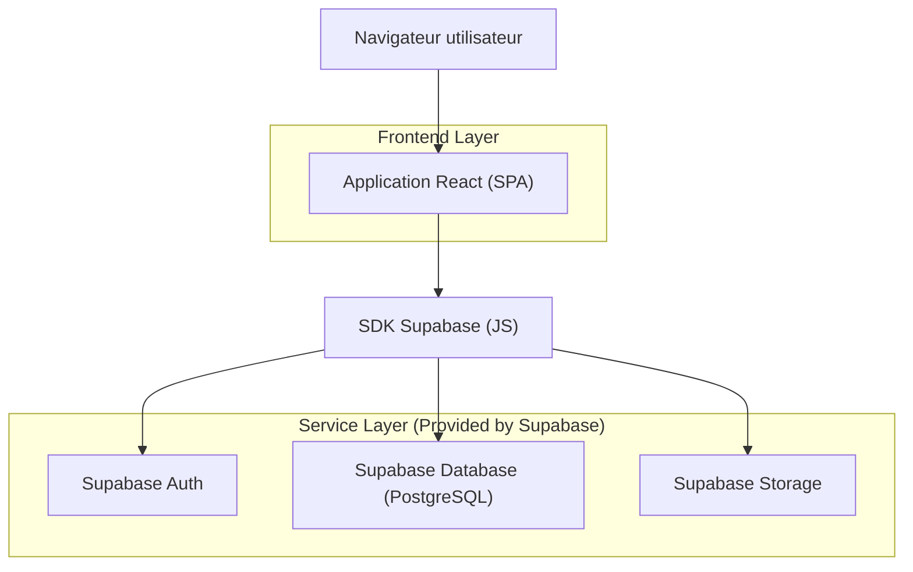
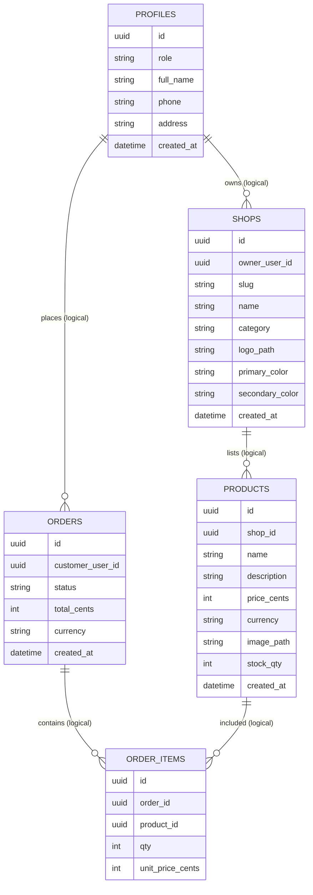

## 1.Architecture design



## 2.Technology Description

* Frontend: React\@18 + react-router-dom + tailwindcss + zustand (état panier/filtres)

* Backend: Supabase (Auth + PostgreSQL + Storage)

## 3.Route definitions

| Route           | Purpose                                                           |
| --------------- | ----------------------------------------------------------------- |
| /               | Marketplace client (mode invité ou connecté)                      |
| /shop/:shopSlug | Page boutique publique (produits d’une boutique)                  |
| /login          | Connexion (client/vendeur)                                        |
| /register       | Création de compte (client/vendeur)                               |
| /dashboard      | Tableau de bord (redirige selon rôle: client vs vendeur vs admin) |

## 6.Data model(if applicable)

### 6.1 Data model definition



### 6.2 Data Definition Language

PROFILES (profiles)

```
CREATE TABLE profiles (
  id UUID PRIMARY KEY,
  role TEXT NOT NULL CHECK (role IN ('client','vendor','admin')),
  full_name TEXT,
  phone TEXT,
  address TEXT,
  created_at TIMESTAMPTZ DEFAULT NOW()
);

GRANT SELECT ON profiles TO anon;
GRANT ALL PRIVILEGES ON profiles TO authenticated;
```

SHOPS (shops)

```
CREATE TABLE shops (
  id UUID PRIMARY KEY DEFAULT gen_random_uuid(),
  owner_user_id UUID NOT NULL,
  slug TEXT UNIQUE NOT NULL,
  name TEXT NOT NULL,
  category TEXT,
  logo_path TEXT,
  primary_color TEXT,
  secondary_color TEXT,
  created_at TIMESTAMPTZ DEFAULT NOW()
);

GRANT SELECT ON shops TO anon;
GRANT ALL PRIVILEGES ON shops TO authenticated;
```

PRODUCTS (products)

```
CREATE TABLE products (
  id UUID PRIMARY KEY DEFAULT gen_random_uuid(),
  shop_id UUID NOT NULL,
  name TEXT NOT NULL,
  description TEXT,
  price_cents INT NOT NULL,
  currency TEXT DEFAULT 'XOF',
  image_path TEXT,
  stock_qty INT DEFAULT 0,
  created_at TIMESTAMPTZ DEFAULT NOW()
);

GRANT SELECT ON products TO anon;
GRANT ALL PRIVILEGES ON products TO authenticated;
```

ORDERS / ORDER\_ITEMS (orders, order\_items)

```
CREATE TABLE orders (
  id UUID PRIMARY KEY DEFAULT gen_random_uuid(),
  customer_user_id UUID NOT NULL,
  status TEXT NOT NULL DEFAULT 'pending',
  total_cents INT NOT NULL,
  currency TEXT DEFAULT 'XOF',
  created_at TIMESTAMPTZ DEFAULT NOW()
);

CREATE TABLE order_items (
  id UUID PRIMARY KEY DEFAULT gen_random_uuid(),
  order_id UUID NOT NULL,
  product_id UUID NOT NULL,
  qty INT NOT NULL,
  unit_price_cents INT NOT NULL
);

GRANT SELECT ON orders TO anon;
GRANT SELECT ON order_items TO anon;
GRANT ALL PRIVILEGES ON orders
```

