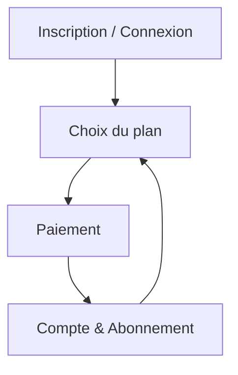

## 1. Product Overview
Parcours complet d’abonnement : inscription → choix du plan → paiement (Stripe, PayPal, Mobile Money) → gestion d’abonnement.
Objectif : permettre l’upgrade/downgrade avec prorata, des statuts d’abonnement clairs et une gestion self-service fiable.

## 2. Core Features

### 2.1 Feature Module
Le produit se compose des pages essentielles suivantes :
1. **Inscription / Connexion** : création de compte, connexion, récupération de mot de passe, vérification email.
2. **Choix du plan** : liste et comparaison des plans, sélection d’un plan, affichage prix et périodicité.
3. **Paiement** : choix du moyen de paiement (Stripe, PayPal, Mobile Money), récapitulatif, redirection/confirmation, gestion du retour succès/échec.
4. **Compte & Abonnement** : statut abonnement, upgrade/downgrade avec prorata, annulation/réactivation, historique factures/reçus.

### 2.2 Page Details
| Page Name | Module Name | Feature description |
|-----------|-------------|---------------------|
| Inscription / Connexion | Inscription | Créer un compte (email + mot de passe) et déclencher la vérification email. |
| Inscription / Connexion | Connexion | Se connecter, gérer l’expiration de session, se déconnecter. |
| Inscription / Connexion | Mot de passe oublié | Demander et appliquer une réinitialisation de mot de passe. |
| Choix du plan | Catalogue de plans | Afficher les plans (nom, prix, période, limites) et permettre la sélection. |
| Choix du plan | État actuel | Indiquer le plan actuel (si existant), le statut, et l’éligibilité à upgrade/downgrade. |
| Paiement | Sélection moyen de paiement | Choisir Stripe / PayPal / Mobile Money et afficher les champs requis. |
| Paiement | Lancement paiement | Créer une transaction côté serveur (session/ordre/intent), rediriger/afficher instructions, bloquer les doubles soumissions. |
| Paiement | Retour & confirmation | Afficher l’état de paiement (succès/échec/annulé/en attente) au retour, et guider vers “Compte & Abonnement”. |
| Compte & Abonnement | Vue abonnement | Afficher plan, statut, dates de période, actions disponibles selon statut (payer, changer, annuler, réactiver). |
| Compte & Abonnement | États d’abonnement | Expliquer l’état courant (badge + texte) et les transitions possibles (ex: “paiement en attente”, “paiement en échec”). |
| Compte & Abonnement | Quote prorata | Calculer/afficher le prorata (à payer ou crédit) avant confirmation d’un changement de plan. |
| Compte & Abonnement | Upgrade / Downgrade | Confirmer le changement, appliquer immédiatement ou à fin de période selon règles, et refléter le résultat après confirmation prestataire. |
| Compte & Abonnement | Annulation / Réactivation | Annuler à fin de période (par défaut) et réactiver tant que possible avant échéance. |
| Compte & Abonnement | Factures / reçus | Lister et télécharger les reçus/factures (si fournis par le prestataire). |

## 3. Core Process

### Règles de prorata (upgrade / downgrade)
- **Upgrade (plan plus cher)**
  - Par défaut : **application immédiate**.
  - Calcul : montant restant de la période courante (ancienne offre) crédité, puis différence facturée pour le temps restant.
  - Si le prestataire le permet : facturation immédiate du **delta proratisé** ; sinon : création d’un “paiement ponctuel” (ou facture) et activation après paiement.
- **Downgrade (plan moins cher)**
  - Par défaut : **application à la fin de la période** (pas de remboursement cash).
  - Optionnel (si autorisé produit) : application immédiate avec **crédit** reporté sur la prochaine échéance (jamais de remboursement manuel côté produit).
- **Changement de périodicité (mensuel ↔ annuel)**
  - Si mensuel → annuel : traité comme upgrade, application immédiate avec prorata.
  - Si annuel → mensuel : application à fin de période (pour éviter les remboursements).
- **Garde-fous**
  - Un seul changement en cours à la fois (pas de double changement tant qu’un paiement/confirmation est “en attente”).
  - Les montants affichés sont des estimations jusqu’à la confirmation prestataire (webhook).

### États d’abonnement (principaux)
- **Aucun abonnement** : utilisateur sans plan payant.
- **Paiement en attente** : transaction initiée (Stripe/PayPal/Mobile Money) mais non confirmée.
- **Actif** : accès accordé jusqu’à `current_period_end`.
- **Paiement en échec / Past due** : renouvellement échoué, accès potentiellement limité selon politique.
- **Annulé (fin de période)** : `cancel_at_period_end=true`, accès maintenu jusqu’à fin de période.
- **Annulé (immédiat)** : accès retiré immédiatement (cas exceptionnel, ex: fraude/admin).
- **Impayé / Unpaid** : échecs répétés, accès coupé.

### Parcours de paiement (par prestataire)
- **Stripe (Checkout/Billing)**
  1) Tu sélectionnes un plan et “Payer par carte”.
  2) Le serveur crée une session Checkout et te redirige vers Stripe.
  3) Stripe confirme le paiement puis redirige vers la page de retour.
  4) Le webhook Stripe confirme l’abonnement/facture ; l’app met à jour le statut dans “Compte & Abonnement”.
- **PayPal (Orders/Subscriptions)**
  1) Tu sélectionnes PayPal.
  2) Le serveur crée un ordre (ou une souscription) et renvoie une URL d’approbation.
  3) Tu approuves sur PayPal, puis retour à l’app.
  4) Le serveur capture/active et attend confirmation webhook ; l’abonnement passe à “Actif”.
- **Mobile Money (Gateway)**
  1) Tu sélectionnes Mobile Money, saisis téléphone/opérateur si requis.
  2) Le serveur initie le paiement et l’état devient “Paiement en attente”.
  3) Tu confirmes sur ton téléphone (USSD/STK Push selon pays/gateway).
  4) La gateway notifie via webhook (succès/échec) ; l’app active l’abonnement ou affiche l’échec.

### Navigation (pages)

