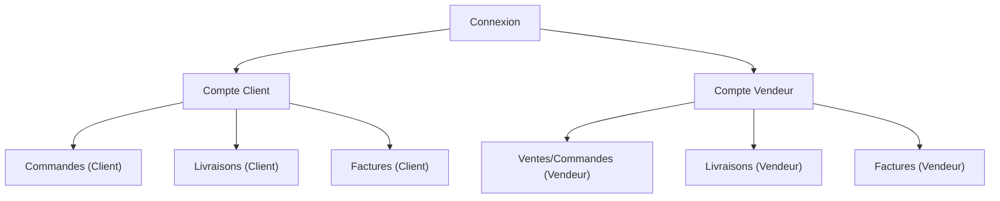

## 1. Product Overview
Refondre les comptes **Client** et **Vendeur** de Local+ pour adopter une **même charte graphique** et la **boussole** comme navigation principale.
Intégrer les modules **Livraisons** et **Factures** au même niveau de qualité/structure que la « version formelle ».

## 2. Core Features

### 2.1 User Roles
| Rôle | Méthode d’inscription/connexion | Permissions principales |
|------|----------------------------------|--------------------------|
| Client | Connexion (email + mot de passe / SSO si existant) | Consulter ses commandes, suivre ses livraisons, consulter/télécharger ses factures |
| Vendeur | Connexion (compte vendeur) | Consulter ses ventes/commandes, gérer le suivi de livraison, consulter/télécharger ses factures |

### 2.2 Feature Module
Les exigences se composent des pages essentielles suivantes :
1. **Connexion** : authentification, choix/accès au compte Client ou Vendeur.
2. **Compte Client** : boussole, synthèse, commandes, livraisons, factures.
3. **Compte Vendeur** : boussole, synthèse, ventes/commandes, livraisons, factures.

### 2.3 Page Details
| Page Name | Module Name | Feature description |
|-----------|-------------|---------------------|
| Connexion | Authentification | Permettre de se connecter et rediriger vers l’espace correspondant (Client/Vendeur). |
| Connexion | Alignement charte + boussole (état réduit) | Appliquer la charte graphique commune ; afficher une version compacte de la boussole (ou un point d’entrée) pour cohérence. |
| Compte Client | En-tête & boussole | Afficher l’en-tête Local+ et la boussole comme navigation principale vers Commandes / Livraisons / Factures. |
| Compte Client | Vue synthèse | Afficher un résumé (ex : commandes récentes, livraisons en cours, dernières factures) avec liens d’accès rapides. |
| Compte Client | Commandes | Lister les commandes, accéder au détail minimal (statut, montant, date, vendeur). |
| Compte Client | Livraisons | Afficher le suivi de livraison lié aux commandes (statut, étapes, ETA si disponible). |
| Compte Client | Factures | Lister les factures, consulter et télécharger la facture (PDF ou équivalent). |
| Compte Vendeur | En-tête & boussole | Afficher l’en-tête Local+ et la boussole comme navigation principale vers Ventes/Commandes / Livraisons / Factures. |
| Compte Vendeur | Vue synthèse | Afficher un résumé (commandes à préparer, livraisons à suivre, dernières factures) avec liens d’accès rapides. |
| Compte Vendeur | Ventes/Commandes | Lister les commandes reçues, accéder au détail minimal (client, statut, montant, date). |
| Compte Vendeur | Livraisons | Permettre de consulter/mettre à jour les informations de suivi liées à une commande (statuts et événements). |
| Compte Vendeur | Factures | Lister les factures vendeur, consulter et télécharger la facture (PDF ou équivalent). |

## 3. Core Process
**Flux Client** : vous vous connectez → vous arrivez sur votre Compte Client → vous utilisez la boussole pour naviguer entre Commandes, Livraisons et Factures → vous consultez et téléchargez une facture si besoin.

**Flux Vendeur** : vous vous connectez → vous arrivez sur votre Compte Vendeur → vous utilisez la boussole pour naviguer entre Ventes/Commandes, Livraisons et Factures → vous suivez/actualisez une livraison et récupérez les factures associées.

