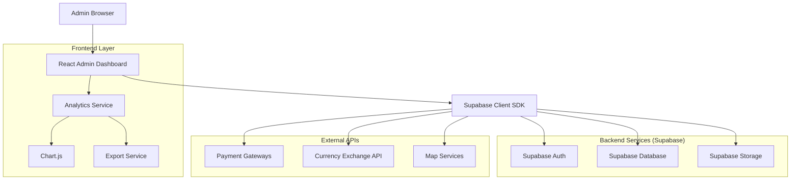
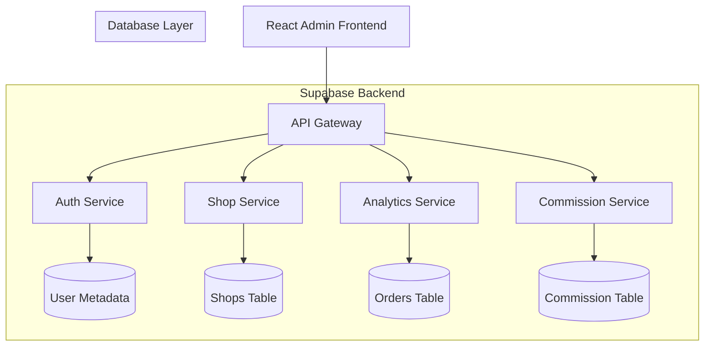
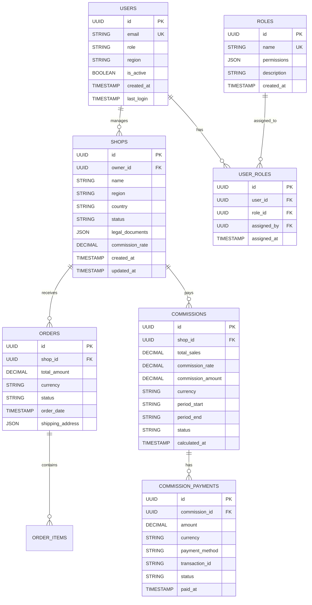

## 1. Architecture design



## 2. Technology Description

- **Frontend**: React@18 + TypeScript + TailwindCSS@3 + Vite
- **Backend**: Supabase (PostgreSQL, Auth, Storage, Real-time)
- **UI Components**: HeadlessUI + Heroicons + Chart.js
- **State Management**: React Context + Supabase Real-time
- **Data Visualization**: Chart.js + Google Maps API
- **Export**: jsPDF + SheetJS (Excel)

## 3. Route definitions

| Route | Purpose |
|-------|---------|
| /admin/login | Page d'authentification admin |
| /admin/dashboard | Vue d'ensemble avec KPI et graphiques |
| /admin/shops | Gestion complète des shops (liste, détails, validation) |
| /admin/shops/:id | Détails d'un shop spécifique |
| /admin/analytics | Tableau de bord analytics avec filtres |
| /admin/commissions | Configuration et suivi des commissions |
| /admin/commissions/history | Historique des paiements de commission |
| /admin/users | Gestion des utilisateurs et rôles |
| /admin/users/roles | Configuration des permissions par rôle |
| /admin/settings | Paramètres régionaux et configuration |
| /admin/settings/currencies | Gestion des devises et taux de change |
| /admin/settings/payments | Configuration des méthodes de paiement |
| /admin/reports | Génération de rapports personnalisés |

## 4. API definitions

### 4.1 Authentification Admin

```
POST /auth/v1/token?grant_type=password
```

Request:
```json
{
  "email": "admin@example.com",
  "password": "secure_password"
}
```

Response:
```json
{
  "access_token": "eyJhbGciOiJIUzI1NiIsInR5cCI6IkpXVCJ9...",
  "token_type": "bearer",
  "expires_in": 3600,
  "refresh_token": "-4FP4OaM2yJ0z",
  "user": {
    "id": "admin_user_id",
    "email": "admin@example.com",
    "role": "super_admin"
  }
}
```

### 4.2 Shops Management API

```
GET /rest/v1/shops
```

Query Parameters:
| Param | Type | Required | Description |
|-------|------|----------|-------------|
| region | string | false | Filter by region (west, east, central, south) |
| status | string | false | Filter by status (pending, active, suspended) |
| search | string | false | Search by shop name or owner |
| limit | number | false | Number of results (default: 50) |
| offset | number | false | Pagination offset |

Response:
```json
{
  "data": [
    {
      "id": "shop_123",
      "name": "Boutique Dakar",
      "owner_name": "Mamadou Diop",
      "region": "west",
      "country": "Senegal",
      "status": "active",
      "created_at": "2024-01-15T10:30:00Z",
      "total_sales": 1250000,
      "commission_rate": 0.05,
      "last_activity": "2024-02-03T14:20:00Z"
    }
  ],
  "count": 1
}
```

### 4.3 Analytics API

```
GET /rest/v1/analytics/sales-by-region
```

Query Parameters:
| Param | Type | Required | Description |
|-------|------|----------|-------------|
| start_date | string | true | Start date (YYYY-MM-DD) |
| end_date | string | true | End date (YYYY-MM-DD) |
| currency | string | false | Currency code (XOF, NGN, GHS) |

Response:
```json
{
  "data": [
    {
      "region": "west",
      "total_sales": 45600000,
      "order_count": 1234,
      "avg_order_value": 36984,
      "top_category": "Electronics",
      "growth_rate": 0.15
    }
  ]
}
```

### 4.4 Commission API

```
POST /rest/v1/commissions/calculate
```

Request:
```json
{
  "shop_id": "shop_123",
  "period_start": "2024-01-01",
  "period_end": "2024-01-31"
}
```

Response:
```json
{
  "data": {
    "shop_id": "shop_123",
    "total_sales": 1250000,
    "commission_rate": 0.05,
    "commission_amount": 62500,
    "currency": "XOF",
    "status": "pending",
    "invoice_url": "/storage/v1/invoice/inv_123.pdf"
  }
}
```

## 5. Server architecture diagram



## 6. Data model

### 6.1 Modèle de données



### 6.2 Langage de définition des données

```sql
-- Table des utilisateurs
CREATE TABLE users (
  id UUID PRIMARY KEY DEFAULT gen_random_uuid(),
  email VARCHAR(255) UNIQUE NOT NULL,
  encrypted_password VARCHAR(255) NOT NULL,
  role VARCHAR(50) NOT NULL DEFAULT 'admin',
  region VARCHAR(50),
  is_active BOOLEAN DEFAULT true,
  created_at TIMESTAMP WITH TIME ZONE DEFAULT NOW(),
  last_login TIMESTAMP WITH TIME ZONE,
  CONSTRAINT chk_role CHECK (role IN ('super_admin', 'regional_admin', 'shop_manager', 'financial_analyst', 'moderator'))
);

-- Table des rôles
CREATE TABLE roles (
  id UUID PRIMARY KEY DEFAULT gen_random_uuid(),
  name VARCHAR(100) UNIQUE NOT NULL,
  permissions JSONB NOT NULL DEFAULT '{}',
  description TEXT,
  created_at TIMESTAMP WITH TIME ZONE DEFAULT NOW()
);

-- Table des attributions de rôles
CREATE TABLE user_roles (
  id UUID PRIMARY KEY DEFAULT gen_random_uuid(),
  user_id UUID REFERENCES users(id) ON DELETE CASCADE,
  role_id UUID REFERENCES roles(id) ON DELETE CASCADE,
  assigned_by UUID REFERENCES users(id),
  assigned_at TIMESTAMP WITH TIME ZONE DEFAULT NOW(),
  UNIQUE(user_id, role_id)
);

-- Table des shops
CREATE TABLE shops (
  id UUID PRIMARY KEY DEFAULT gen_random_uuid(),
  owner_id UUID REFERENCES users(id),
  name VARCHAR(255) NOT NULL,
  region VARCHAR(50) NOT NULL,
  country VARCHAR(100) NOT NULL,
  status VARCHAR(50) DEFAULT 'pending',
  legal_documents JSONB DEFAULT '{}',
  commission_rate DECIMAL(5,4) DEFAULT 0.0500,
  created_at TIMESTAMP WITH TIME ZONE DEFAULT NOW(),
  updated_at TIMESTAMP WITH TIME ZONE DEFAULT NOW(),
  CONSTRAINT chk_status CHECK (status IN ('pending', 'active', 'suspended', 'rejected'))
);

-- Table des commandes
CREATE TABLE orders (
  id UUID PRIMARY KEY DEFAULT gen_random_uuid(),
  shop_id UUID REFERENCES shops(id),
  total_amount DECIMAL(10,2) NOT NULL,
  currency VARCHAR(3) NOT NULL DEFAULT 'XOF',
  status VARCHAR(50) NOT NULL,
  order_date TIMESTAMP WITH TIME ZONE DEFAULT NOW(),
  shipping_address JSONB,
  created_at TIMESTAMP WITH TIME ZONE DEFAULT NOW()
);

-- Table des commissions
CREATE TABLE commissions (
  id UUID PRIMARY KEY DEFAULT gen_random_uuid(),
  shop_id UUID REFERENCES shops(id),
  total_sales DECIMAL(12,2) NOT NULL,
  commission_rate DECIMAL(5,4) NOT NULL,
  commission_amount DECIMAL(10,2) NOT NULL,
  currency VARCHAR(3) NOT NULL,
  period_start DATE NOT NULL,
  period_end DATE NOT NULL,
  status VARCHAR(50) DEFAULT 'pending',
  calculated_at TIMESTAMP WITH TIME ZONE DEFAULT NOW(),
  CONSTRAINT chk_period CHECK (period_end >= period_start)
);

-- Table des paiements de commission
CREATE TABLE commission_payments (
  id UUID PRIMARY KEY DEFAULT gen_random_uuid(),
  commission_id UUID REFERENCES commissions(id),
  amount DECIMAL(10,2) NOT NULL,
  currency VARCHAR(3) NOT NULL,
  payment_method VARCHAR(100),
  transaction_id VARCHAR(255),
  status VARCHAR(50) DEFAULT 'pending',
  paid_at TIMESTAMP WITH TIME ZONE,
  created_at TIMESTAMP WITH TIME ZONE DEFAULT NOW()
);

-- Indexes pour performance
CREATE INDEX idx_users_email ON users(email);
CREATE INDEX idx_users_role ON users(role);
CREATE INDEX idx_users_region ON users(region);
CREATE INDEX idx_shops_owner ON shops(owner_id);
CREATE INDEX idx_shops_region ON shops(region);
CREATE INDEX idx_shops_status ON shops(status);
CREATE INDEX idx_orders_shop ON orders(shop_id);
CREATE INDEX idx_orders_date ON orders(order_date);
CREATE INDEX idx_commissions_shop ON commissions(shop_id);
CREATE INDEX idx_commissions_period ON commissions(period_start, period_end);

-- RLS (Row Level Security) Policies
ALTER TABLE users ENABLE ROW LEVEL SECURITY;
ALTER TABLE shops ENABLE ROW LEVEL SECURITY;
ALTER TABLE orders ENABLE ROW LEVEL SECURITY;
ALTER TABLE commissions ENABLE ROW LEVEL SECURITY;

-- Politiques d'accès
CREATE POLICY "Users can view their own profile" ON users
  FOR SELECT USING (auth.uid() = id);

CREATE POLICY "Super admin can view all users" ON users
  FOR SELECT USING (EXISTS (
    SELECT 1 FROM users WHERE id = auth.uid() AND role = 'super_admin'
  ));

CREATE POLICY "Regional admin can view shops in their region" ON shops
  FOR SELECT USING (
    region = (SELECT region FROM users WHERE id = auth.uid()) OR
    EXISTS (SELECT 1 FROM users WHERE id = auth.uid() AND role = 'super_admin')
  );

-- Insert default roles
INSERT INTO roles (name, permissions, description) VALUES
('super_admin', '{"all": true}', 'Full system access'),
('regional_admin', '{"shops": {"read": true, "update": true}, "analytics": {"read": true}, "users": {"read": true}}', 'Regional management'),
('shop_manager', '{"shops": {"read": true, "update": true}, "analytics": {"read": true}}', 'Shop management'),
('financial_analyst', '{"commissions": {"read": true, "update": true}, "analytics": {"read": true}}', 'Financial analysis'),
('moderator', '{"shops": {"read": true}, "analytics": {"read": true}}', 'Content moderation');

-- Grant permissions
GRANT SELECT ON users TO anon;
GRANT ALL PRIVILEGES ON users TO authenticated;
GRANT SELECT ON shops TO anon;
GRANT ALL PRIVILEGES ON shops TO authenticated;
GRANT SELECT ON orders TO anon;
GRANT ALL PRIVILEGES ON orders TO authenticated;
GRANT SELECT ON commissions TO anon;
GRANT ALL PRIVILEGES ON commissions TO authenticated;