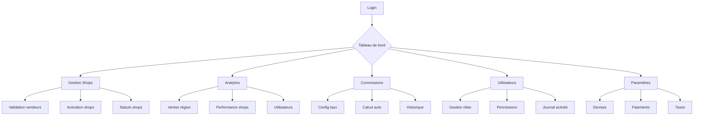

## 1. Vue d'ensemble du produit

Tableau de bord administratif complet pour la gestion de plateforme e-commerce destinée au marché africain. Permet aux administrateurs de gérer les shops, analyser les performances, configurer les commissions et contrôler les accès utilisateurs.

Solution adaptée aux spécificités du marché africain avec support des paiements mobiles, gestion multi-devises et optimisation pour connexions faibles bande passante.

## 2. Fonctionnalités principales

### 2.1 Rôles utilisateurs

| Rôle | Méthode d'inscription | Permissions principales |
|------|----------------------|------------------------|
| Super Admin | Création manuelle par système | Accès complet à toutes les fonctionnalités, gestion des admins |
| Admin Régional | Invitation par Super Admin | Gestion des shops dans sa région, analytics locale |
| Gestionnaire Shops | Invitation par Admin Régional | CRUD shops, validation des vendeurs |
| Analyste Financier | Invitation par Super Admin | Accès aux commissions, rapports financiers |
| Modérateur | Invitation par Admin Régional | Gestion des contentieux, moderation avis |

### 2.2 Module des fonctionnalités

Le tableau de bord admin comprend les pages suivantes :

1. **Dashboard principal**: vue d'ensemble KPI, graphiques tendances, alertes importantes
2. **Gestion des shops**: liste des shops, détails shop, validation vendeurs, statut shops
3. **Analytics**: ventes par région, performance des shops, comportement utilisateurs
4. **Commissions**: configuration des taux, calcul automatique, historique des paiements
5. **Utilisateurs et permissions**: gestion des rôles, attribution des droits, journal des activités
6. **Paramètres régionaux**: devises, méthodes de paiement, taxes locales

### 2.3 Détail des pages

| Page | Module | Description fonctionnalité |
|------|--------|---------------------------|
| Dashboard principal | KPI globaux | Affiche le CA total, nombre de shops actifs, commandes du jour, taux de conversion |
| Dashboard principal | Graphiques tendances | Visualise l'évolution des ventes, top 5 shops, répartition géographique |
| Dashboard principal | Alertes | Notifie les shops en attente, problèmes de paiement, stocks critiques |
| Gestion des shops | Liste des shops | Filtre par statut, région, date d'inscription. Export CSV disponible |
| Gestion des shops | Détails shop | Visualise infos vendeur, historique ventes, documents légaux, bouton activation/suspension |
| Gestion des shops | Validation vendeurs | Interface pour examiner et approuver les documents d'identité et licences commerciales |
| Analytics | Ventes par région | Carte interactive avec codeurs de densité, filtres par période et catégorie |
| Analytics | Performance shops | Classement par CA, taux de satisfaction, temps de livraison moyen |
| Analytics | Comportement utilisateurs | Statistiques de navigation, panier moyen, fréquence d'achat |
| Commissions | Configuration taux | Définit les pourcentages par catégorie produit, volume de ventes, région |
| Commissions | Calcul automatique | Génère les factures de commission mensuelles, calcule les montants dus |
| Commissions | Historique paiements | Liste tous les paiements effectués, statuts, téléchargement des justificatifs |
| Utilisateurs permissions | Gestion rôles | Crée/modifie les rôles personnalisés avec granularité des permissions |
| Utilisateurs permissions | Attribution droits | Assigne des rôles aux utilisateurs, révoque l'accès, historique des modifications |
| Paramètres régionaux | Devises | Configure le Franc CFA, Naira, Cedi, autres devises locales avec taux de change |
| Paramètres régionaux | Paiements mobiles | Intégration MTN Money, Orange Money, M-Pesa avec paramètres API |

## 3. Processus principaux

### Flux Super Admin
Le Super Admin accède au tableau de bord complet avec toutes les fonctionnalités. Il peut créer des admins régionaux, configurer les taux de commission globaux, superviser l'ensemble de la plateforme et générer des rapports consolidés.

### Flux Admin Régional
L'Admin Régional gère uniquement les shops de sa zone géographique. Il valide les nouveaux vendeurs, suit les performances locales, et peut ajuster certains paramètres régionaux comme les taux de commission spécifiques à sa région.

### Flux Gestionnaire Shops
Le Gestionnaire Shops examine les demandes d'inscription des vendeurs, vérifie la conformité des documents, active ou suspend les shops selon leur activité et respect des règles de la plateforme.

### Flux Analyste Financier
L'Analyste accède aux données financières, configure les règles de commission, génère les factures automatiques et suit les paiements des commissions auprès des shops.

## 4. Interface utilisateur

### 4.1 Style de design

- **Couleurs principales**: Orange vif (#FF6B35) pour les actions principales, Bleu nuit (#1A1A2E) pour l'arrière-plan, Blanc cassé (#FAFAFA) pour les zones de contenu
- **Couleurs secondaires**: Vert succès (#4CAF50), Rouge erreur (#F44336), Jaune attention (#FFC107)
- **Boutons**: Style arrondi avec ombres subtiles, effet hover avec changement de teinte
- **Typographie**: Inter pour titres (18-24px), Roboto pour corps de texte (14-16px)
- **Layout**: Navigation latérale rétractable, cartes pour les données, grille responsive
- **Icônes**: Style outline minimaliste, emoji locaux pour les devises et régions

### 4.2 Aperçu du design des pages

| Page | Module | Éléments UI |
|------|--------|-------------|
| Dashboard | KPI | Cartes colorées avec icônes, chiffres en gras, variation en pourcentage |
| Dashboard | Graphiques | Graphiques en ligne interactifs, légendes claires, tooltips au survol |
| Gestion Shops | Liste | Table avec tri, filtres en ligne, badges couleur pour statuts |
| Gestion Shops | Détails | Formulaire en sections, aperçu documents, boutons action groupés |
| Analytics | Carte | Carte Google Maps personnalisée, clusters pour densité, popup d'info |
| Analytics | Tableaux | Datatables responsive, export rapide, graphiques intégrés |
| Commissions | Config | Sliders pour taux, aperçu calcul en temps réel, validation visuelle |
| Commissions | Historique | Timeline des paiements, filtres date, téléchargement PDF |

### 4.3 Responsive design

Design **mobile-first** avec breakpoints :
- Mobile (< 768px): Navigation en bas d'écran, cartes empilées verticalement
- Tablette (768px - 1024px): Navigation latérale réduite, grille 2 colonnes
- Desktop (> 1024px): Navigation complète, grille multi-colonnes

Optimisation pour connexions lentes : chargement paresseux des images, compression des données, cache navigateur intelligent.